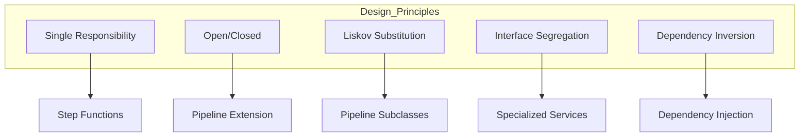
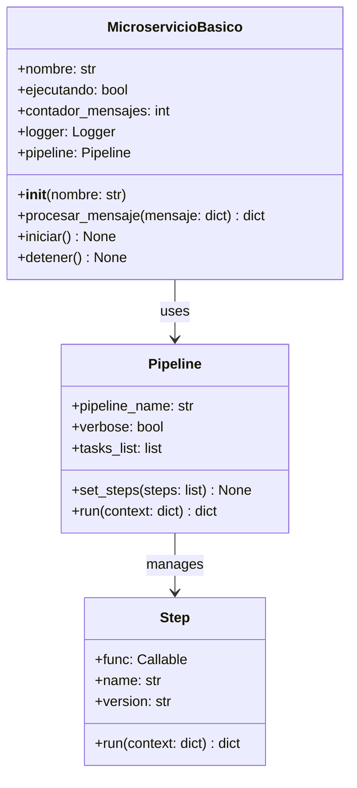
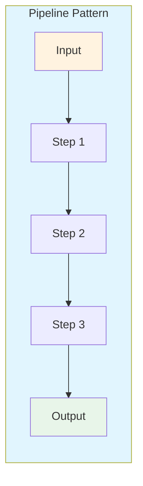
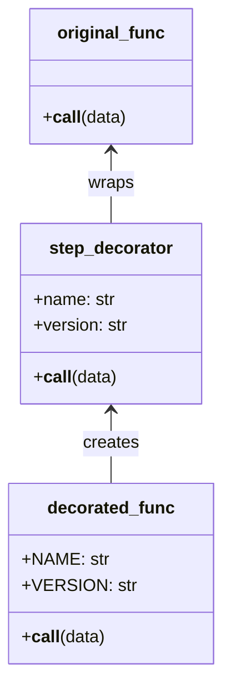
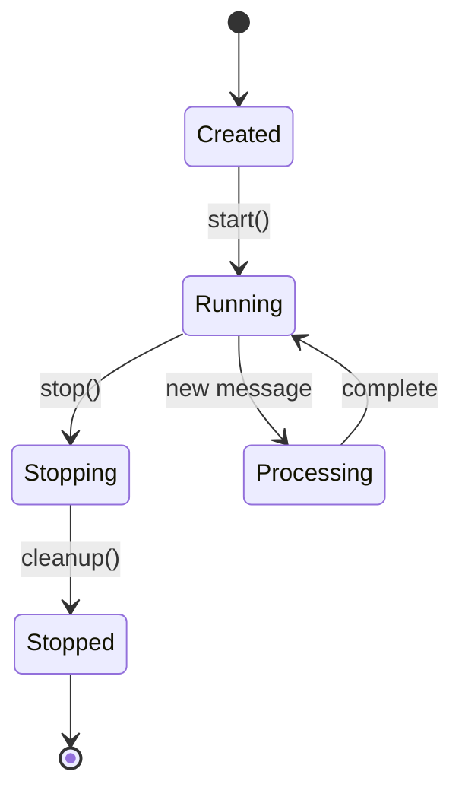
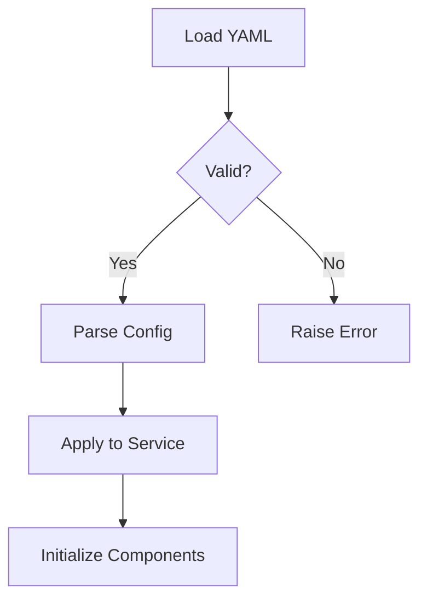
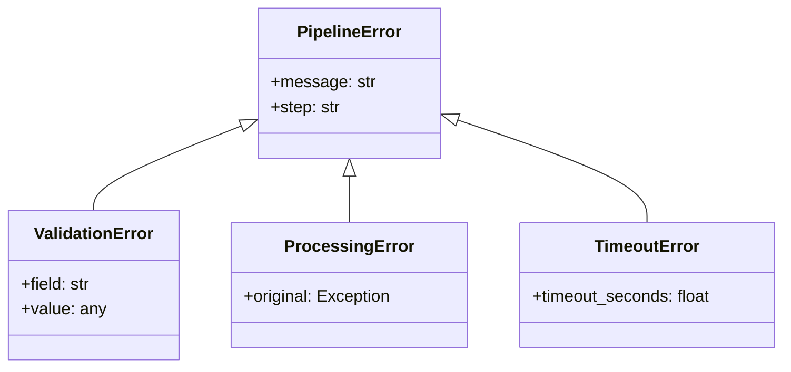
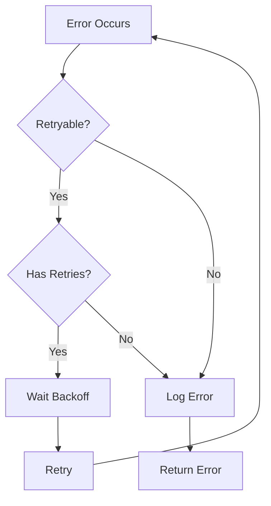
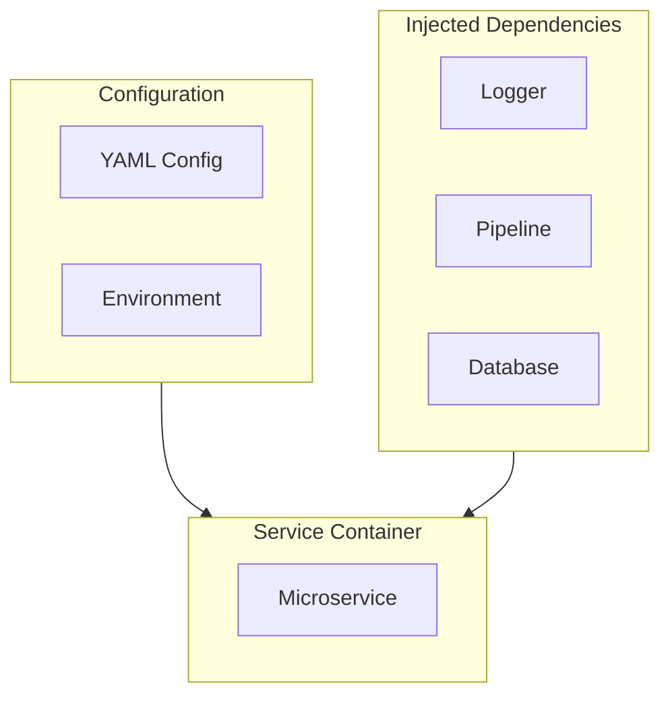
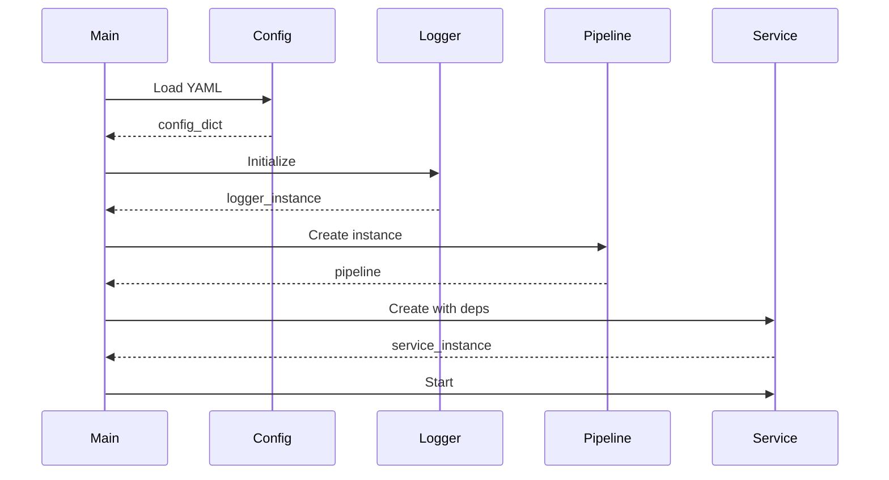

# Microservice Design

## 1. Design Principles

### 1.1 Core Design Tenets

| Principle | Implementation |
|-----------|----------------|
| Single Responsibility | Each step in pipeline performs one transformation |
| Loose Coupling | Steps communicate via dictionaries |
| High Cohesion | Related transformations grouped in pipeline |
| Fault Tolerance | Retry logic and error handling per step |

### 1.2 Architecture Decisions



## 2. Service Structure

### 2.1 Class Diagram



### 2.2 Component Responsibilities

| Component | Responsibility | Public API |
|-----------|----------------|------------|
| `MicroservicioBasico` | Main service orchestrator | `procesar_mensaje()`, `iniciar()`, `detener()` |
| `Pipeline` | Step execution engine | `set_steps()`, `run()` |
| `Logger` | Structured logging | `info()`, `error()`, `debug()` |
| Step Functions | Data transformation | `func(data) -> dict` |

## 3. Design Patterns

### 3.1 Pipeline Pattern



**Implementation:**
```python
@step(name="step_1")
def transform_1(data):
    return {"transformed": data["value"] * 2}

pipeline.set_steps([
    (transform_1, "Transform1", "v1.0"),
    (transform_2, "Transform2", "v1.0"),
])
```

### 3.2 Decorator Pattern



### 3.3 State Pattern



## 4. Interface Design

### 4.1 Service Interface

```python
class MicroserviceInterface(ABC):
    """Abstract interface for all microservices."""
    
    @abstractmethod
    def procesar_mensaje(self, mensaje: dict) -> dict:
        """Process a single message."""
        pass
    
    @abstractmethod
    def iniciar(self) -> None:
        """Start the service."""
        pass
    
    @abstractmethod
    def detener(self) -> None:
        """Stop the service gracefully."""
        pass
    
    @abstractmethod
    def health_check(self) -> dict:
        """Return service health status."""
        pass
```

### 4.2 Pipeline Step Interface

```python
class PipelineStep(Protocol):
    """Protocol for pipeline steps."""
    
    def __call__(self, data: dict) -> dict:
        """Process input data and return transformed data."""
        ...
    
    @property
    def NAME(self) -> str:
        """Step name identifier."""
        ...
    
    @property
    def VERSION(self) -> str:
        """Step version."""
        ...
```

## 5. Configuration Design

### 5.1 YAML Configuration Schema

```yaml
service:
  name: string
  version: string
  log_level: INFO | DEBUG | WARNING | ERROR
  db_path: string (file path)

pipeline:
  retry_count: integer
  retry_delay: float (seconds)
  timeout: integer (seconds)
  verbose: boolean

queue:
  bootstrap_servers: string[]
  topic: string
  group_id: string
  auto_offset_reset: earliest | latest
```

### 5.2 Configuration Loading



## 6. Error Handling Design

### 6.1 Exception Hierarchy



### 6.2 Error Recovery Strategy



## 7. Data Models

### 7.1 Message Format

```python
from typing import TypedDict

class InputMessage(TypedDict, total=False):
    """Standard input message format."""
    message: str
    correlation_id: str
    timestamp: str
    metadata: dict

class ProcessingResult(TypedDict, total=False):
    """Standard processing result format."""
    processed: bool
    result: dict
    error: str | None
    timestamp: str
```

### 7.2 Service State

```python
class ServiceState(TypedDict):
    """Service runtime state."""
    nombre: str
    ejecutando: bool
    contador_mensajes: int
    mensajes_exitosos: int
    mensajes_fallidos: int
    uptime_seconds: float
```

## 8. Component Wiring

### 8.1 Dependency Injection



### 8.2 Initialization Sequence



## 9. Extensibility Points

### 9.1 Custom Step Types

```python
# Extend with custom validation
@step(name="custom_validation")
def custom_validator(data):
    # Custom logic
    return validated_data

# Extend with external calls
@step(name="external_api")
def call_external_api(data):
    response = requests.post(API_URL, json=data)
    return response.json()
```

### 9.2 Pipeline Composition

```python
# Nested pipelines
sub_pipeline = Pipeline("sub_processing")
sub_pipeline.set_steps([step_a, step_b])

main_pipeline = Pipeline("main")
main_pipeline.set_steps([
    step_1,
    sub_pipeline,  # Include as step
    step_3
])
```

## 10. Quality Attributes

### 10.1 Non-Functional Requirements

| Attribute | Target | Verification |
|-----------|--------|--------------|
| Performance | < 10ms avg latency | Load testing |
| Availability | 99.9% | Uptime monitoring |
| Scalability | 1000 msg/sec | Stress testing |
| Maintainability | < 5 min MTTR | Incident logs |

### 10.2 Code Quality Metrics

| Metric | Target | Tool |
|--------|--------|------|
| Cyclomatic Complexity | < 10 | SonarQube |
| Coupling | Low | CodeScene |
| Cohesion | High | CodeScene |
| Test Coverage | > 80% | pytest-cov |