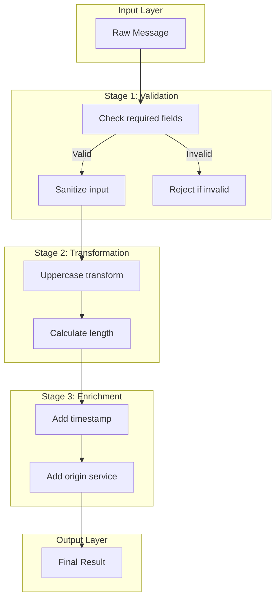
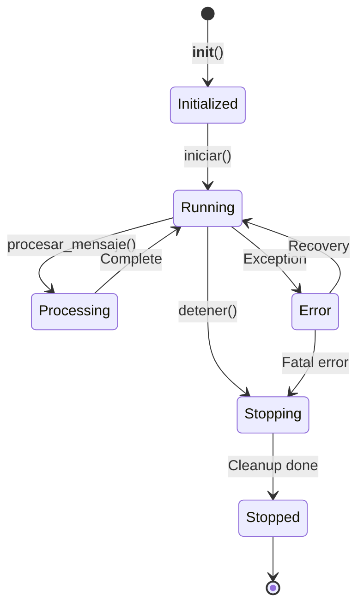
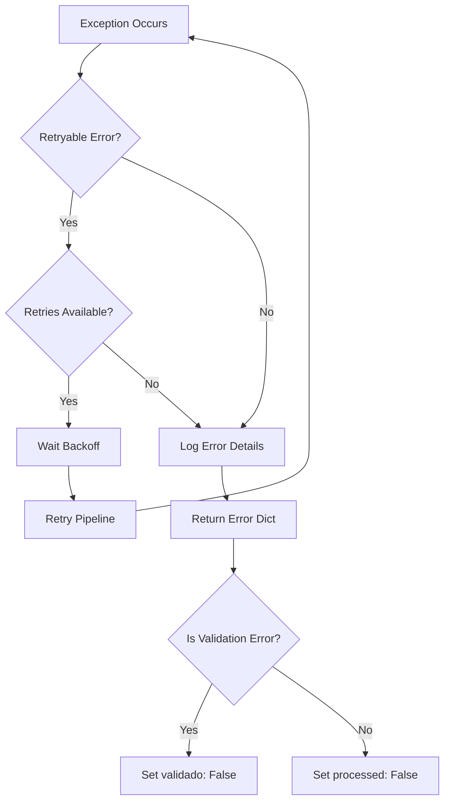
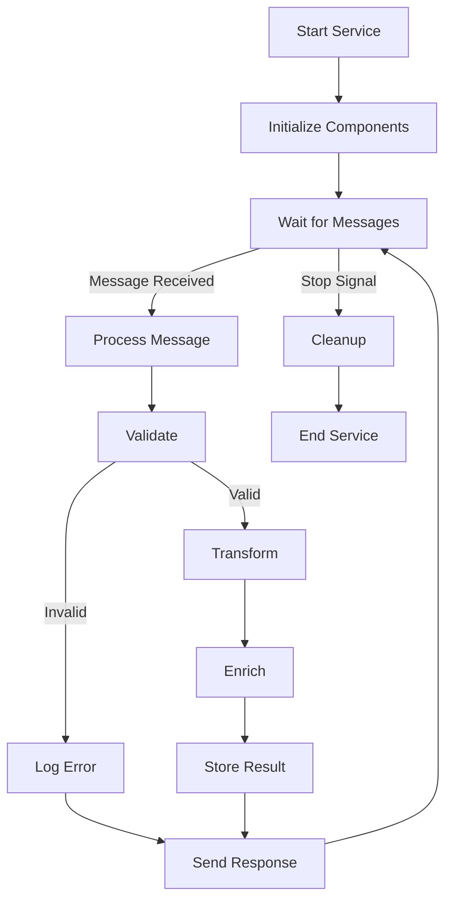
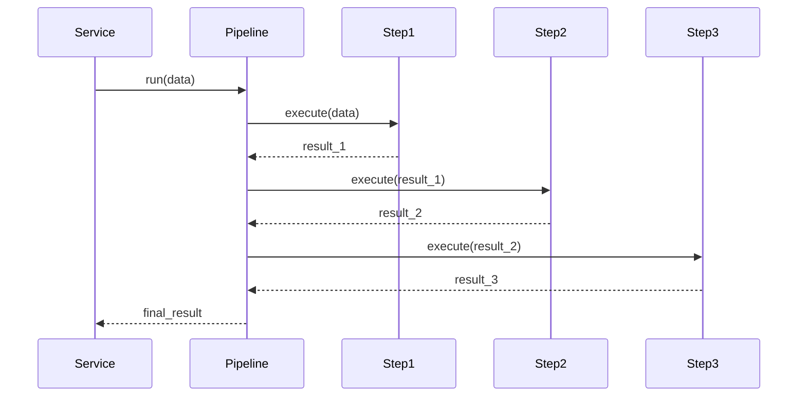
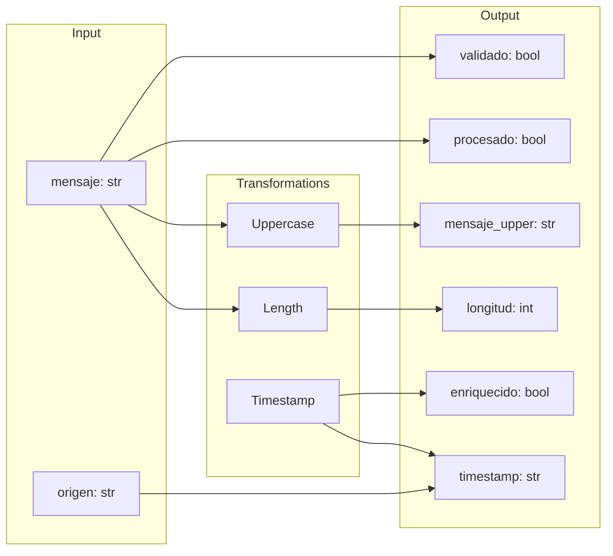

# Logic Design

## 1. Business Logic Overview

### 1.1 Core Processing Logic

The microservice implements a message processing pipeline with three main stages:

1. **Validation**: Ensure incoming message has required fields
2. **Transformation**: Process and transform the message data
3. **Enrichment**: Add metadata and contextual information

### 1.2 Processing Flow



## 2. Algorithm Specifications

### 2.1 Message Validation Algorithm

```
ALGORITHM: validate_message
INPUT: message_data (dict)
OUTPUT: validated_data (dict)

1. IF "mensaje" NOT IN message_data THEN
2.     RAISE ValueError("Campo 'mensaje' requerido")
3. END IF
4. RETURN message_data
```

**Complexity:** O(1) - Single field check

### 2.2 Data Transformation Algorithm

```
ALGORITHM: transform_data
INPUT: data (dict)
OUTPUT: transformed_data (dict)

1. Extract mensaje FROM data
2. transformed_mensaje = UPPERCASE(mensaje)
3. length = LENGTH(mensaje)
4. RETURN {
    "procesado": TRUE,
    "mensaje_upper": transformed_mensaje,
    "longitud": length
   }
```

**Complexity:** O(n) - Where n = message length

### 2.3 Data Enrichment Algorithm

```
ALGORITHM: enrich_data
INPUT: data (dict)
OUTPUT: enriched_data (dict)

1. current_time = NOW().ISO_FORMAT()
2. origin = data.get("origen", "unknown")
3. RETURN {
    "enriquecido": TRUE,
    "timestamp": current_time,
    "origen": origin
   }
```

**Complexity:** O(1) - Constant time operations

## 3. State Management Logic

### 3.1 Service State Machine



### 3.2 Message Counter Logic

```python
def procesar_mensaje(self, mensaje: dict) -> dict:
    # Atomic increment
    self.contador_mensajes += 1
    mensaje_id = self.contador_mensajes
    
    # Process with context
    self.logger.info(f"[MSG-{mensaje_id}] Processing...")
    
    # Execute pipeline
    resultado = self.pipeline.run(mensaje)
    
    self.logger.info(f"[MSG-{mensaje_id}] Completed")
    return resultado
```

## 4. Decision Logic

### 4.1 Error Handling Decisions



### 4.2 Pipeline Execution Decisions

```
DECISION: Should execute step?

1. IF step IS callable THEN
2.     IF step HAS __call__ METHOD THEN
3.         EXECUTE step with context
4.         RETURN result
5.     ELSE
6.         RAISE TypeError("Step not callable")
7.     END IF
8. ELSE
9.     RAISE TypeError("Invalid step type")
10. END IF
```

## 5. Business Rules

### 5.1 Input Validation Rules

| Rule | Condition | Action |
|------|-----------|--------|
| Required Field | `mensaje` not in data | Reject with error |
| Type Check | `mensaje` must be string | Reject with error |
| Empty Check | `mensaje` must not be empty | Allow empty |

### 5.2 Processing Rules

| Rule | Input | Output |
|------|-------|--------|
| Uppercase | Any string | Uppercase version |
| Length | Any string | Character count |
| Timestamp | Any | ISO 8601 format |
| Origin | Any | Service name |

### 5.3 Output Rules

| Field | Always Present | Type |
|-------|----------------|------|
| `processed` | Yes | bool |
| `validado` | If validation step | bool |
| `error` | On failure | str |
| `timestamp` | If enrichment step | str |

## 6. Control Flow

### 6.1 Main Processing Loop



### 6.2 Pipeline Execution Flow



## 7. Data Transformation Logic

### 7.1 Input → Output Mapping



### 7.2 Transformation Functions

```python
# Validation
def paso_validacion(data: dict) -> dict:
    if "mensaje" not in data:
        raise ValueError("Campo 'mensaje' requerido")
    return {"validado": True, "mensaje": data["mensaje"]}

# Transformation  
def paso_procesamiento(data: dict) -> dict:
    mensaje = data.get("mensaje", "")
    return {
        "procesado": True,
        "mensaje_upper": mensaje.upper(),
        "longitud": len(mensaje),
    }

# Enrichment
def paso_enriquecimiento(data: dict) -> dict:
    return {
        "enriquecido": True,
        "timestamp": datetime.now().isoformat(),
        "origen": data.get("origen", "unknown"),
    }
```

## 8. Concurrency Logic

### 8.1 Thread Safety Considerations

```python
# Non-thread-safe counter
self.contador_mensajes += 1

# For production, use threading.Lock:
import threading

class MicroservicioThreadSafe:
    def __init__(self):
        self._lock = threading.Lock()
        self._counter = 0
    
    def procesar(self, mensaje):
        with self._lock:
            self._counter += 1
            msg_id = self._counter
```

### 8.2 Parallel Processing

```python
from wpipe import Parallel

# Execute independent steps concurrently
pipeline.set_steps([
    Parallel(
        steps=[
            (step_a, "StepA", "v1.0"),
            (step_b, "StepB", "v1.0"),
            (step_c, "StepC", "v1.0"),
        ],
        max_workers=3
    )
])
```

## 9. Recovery Logic

### 9.1 Error Recovery

```
RECOVERY STRATEGY:

1. ON Exception:
   a. Log error with full context
   b. IF retryable:
      i.   Increment retry counter
      ii.  Wait exponential backoff
      iii. Re-execute pipeline
   c. ELSE:
      i.   Return error dict
      ii.  Continue to next message

2. ON Recovery Success:
   a. Continue normal flow
   b. Log recovery

3. ON Recovery Failure:
   a. Mark message as failed
   b. Send to dead letter queue (if configured)
   c. Continue processing
```

### 9.2 Graceful Shutdown

```python
def detener(self):
    # 1. Stop accepting new messages
    self.ejecutando = False
    
    # 2. Wait for current processing (optional)
    # time.sleep(1)
    
    # 3. Cleanup resources
    self.logger.info(f"[STOP] {self.nombre} detenido")
    
    # 4. Final metrics
    print(f"Total mensajes procesados: {self.contador_mensajes}")
```

## 10. Business Metrics

### 10.1 Calculated Metrics

| Metric | Formula | Description |
|--------|---------|-------------|
| Success Rate | `success / total * 100` | % of successful messages |
| Avg Latency | `sum(latencies) / count` | Average processing time |
| Error Rate | `errors / total * 100` | % of failed messages |
| Throughput | `total / time_window` | Messages per second |

### 10.2 Logging Metrics

```python
# At message completion
self.logger.info(f"[MSG-{msg_id}] Completed in {duration}ms")
self.logger.info(f"Total processed: {self.contador_mensajes}")
```