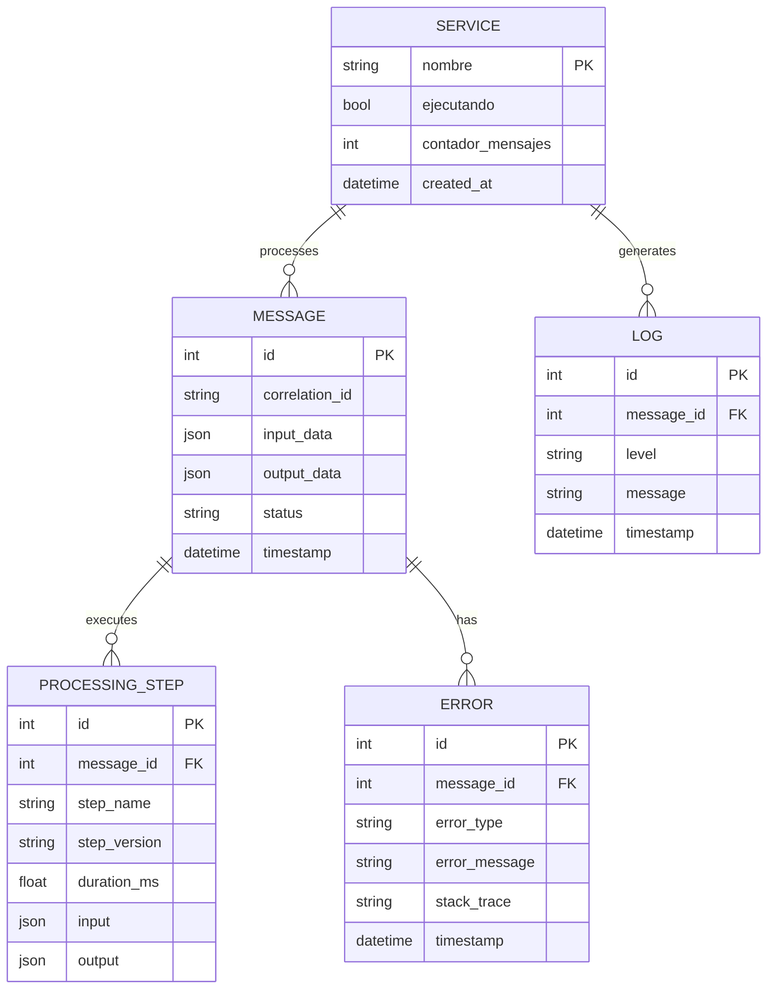
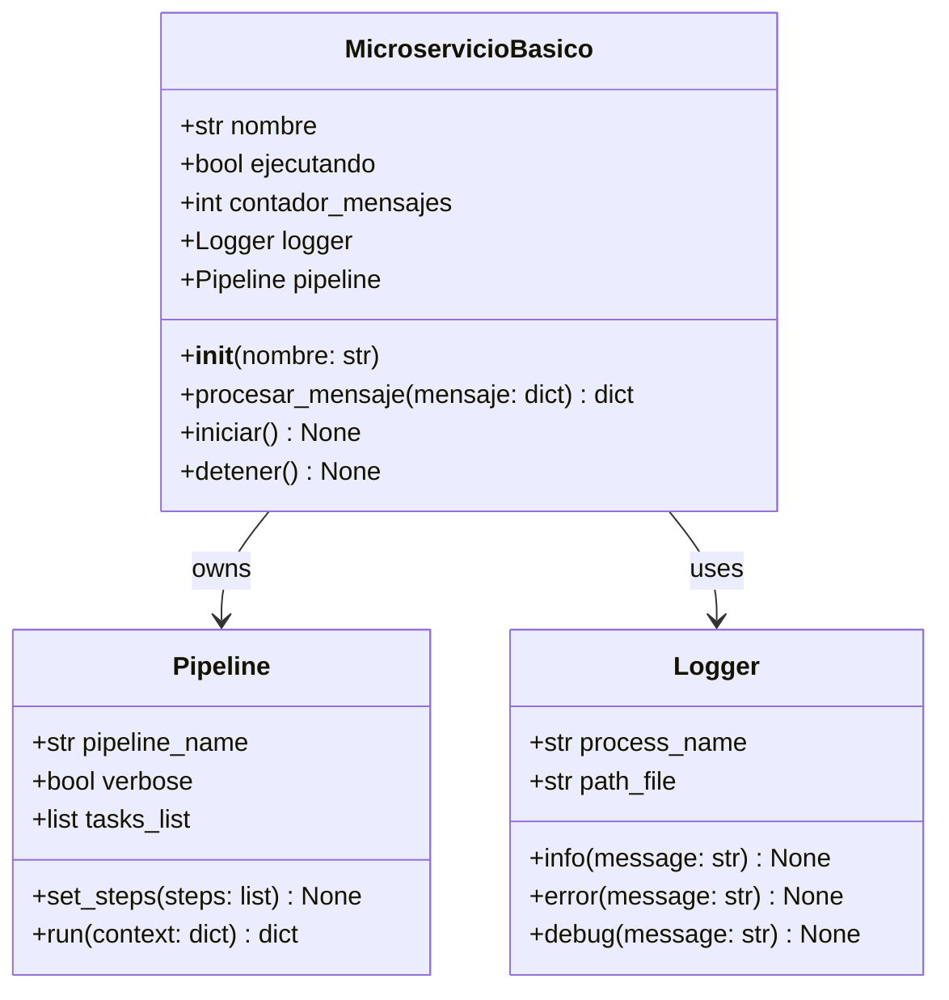
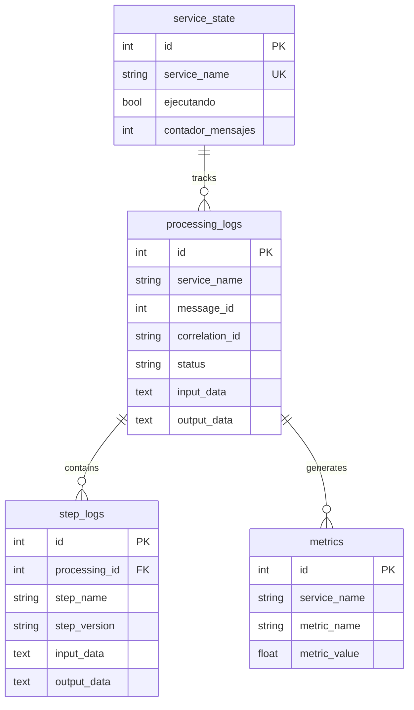
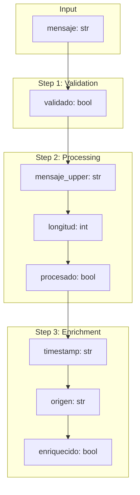

# Data Diagrams & Models

## 1. Data Models Overview

### 1.1 Entity Relationship Diagram



### 1.2 Class Diagram



## 2. Data Schemas

### 2.1 Input Message Schema

```typescript
interface InputMessage {
    // Required fields
    mensaje: string;
    
    // Optional fields
    correlation_id?: string;
    timestamp?: string;
    metadata?: Record<string, any>;
    prioridad?: "baja" | "normal" | "alta";
}
```

**JSON Example:**
```json
{
    "mensaje": "hello world",
    "correlation_id": "msg-12345",
    "timestamp": "2026-04-20T10:00:00Z",
    "metadata": {
        "source": "api",
        "user_id": "user-001"
    },
    "prioridad": "normal"
}
```

### 2.2 Processing Result Schema

```typescript
interface ProcessingResult {
    // Processing status
    procesado: boolean;
    validado: boolean;
    
    // Transformed data
    mensaje: string;
    mensaje_upper: string;
    longitud: number;
    
    // Enriched data
    enriquecido: boolean;
    timestamp: string;
    origen: string;
    
    // Optional fields
    error?: string;
    correlation_id?: string;
}
```

**JSON Example:**
```json
{
    "procesado": true,
    "validado": true,
    "mensaje": "hello world",
    "mensaje_upper": "HELLO WORLD",
    "longitud": 11,
    "enriquecido": true,
    "timestamp": "2026-04-20T10:00:00.123456",
    "origen": "servicio_prueba"
}
```

### 2.3 Error Result Schema

```typescript
interface ErrorResult {
    procesado: boolean;
    validacion: boolean;
    enriquecido: boolean;
    error: string;
    error_type?: string;
    error_step?: string;
}
```

## 3. Database Schema

### 3.1 SQLite Tables

```sql
-- Service state table
CREATE TABLE IF NOT EXISTS service_state (
    id INTEGER PRIMARY KEY AUTOINCREMENT,
    service_name TEXT NOT NULL UNIQUE,
    ejecutando INTEGER DEFAULT 0,
    contador_mensajes INTEGER DEFAULT 0,
    created_at TIMESTAMP DEFAULT CURRENT_TIMESTAMP,
    updated_at TIMESTAMP DEFAULT CURRENT_TIMESTAMP
);

-- Processing logs table
CREATE TABLE IF NOT EXISTS processing_logs (
    id INTEGER PRIMARY KEY AUTOINCREMENT,
    service_name TEXT NOT NULL,
    message_id INTEGER,
    correlation_id TEXT,
    status TEXT NOT NULL,
    input_data TEXT,
    output_data TEXT,
    error_message TEXT,
    error_step TEXT,
    duration_ms REAL,
    timestamp TIMESTAMP DEFAULT CURRENT_TIMESTAMP
);

-- Step execution logs
CREATE TABLE IF NOT EXISTS step_logs (
    id INTEGER PRIMARY KEY AUTOINCREMENT,
    processing_id INTEGER REFERENCES processing_logs(id),
    step_name TEXT NOT NULL,
    step_version TEXT,
    input_data TEXT,
    output_data TEXT,
    duration_ms REAL,
    status TEXT,
    timestamp TIMESTAMP DEFAULT CURRENT_TIMESTAMP
);

-- Metrics aggregation table
CREATE TABLE IF NOT EXISTS metrics (
    id INTEGER PRIMARY KEY AUTOINCREMENT,
    service_name TEXT NOT NULL,
    metric_name TEXT NOT NULL,
    metric_value REAL NOT NULL,
    timestamp TIMESTAMP DEFAULT CURRENT_TIMESTAMP
);
```

### 3.2 Schema Relationships



## 4. Data Flow Diagrams

### 4.1 Message Data Flow

```mermaid
flowchart LR
    subgraph Input_Json["JSON Input"]
        J1["{ \"mensaje\": \"hello\" }"]
    end
    
    subgraph Python_Dict["Python Dictionary"]
        D1["{ 'mensaje': 'hello' }"]
    end
    
    subgraph Validation["Validation Layer"]
        D2["{ 'validado': True, ... }"]
    end
    
    subgraph Transform["Transformation"]
        D3["{ 'mensaje_upper': 'HELLO', ... }"]
    end
    
    subgraph Enrich["Enrichment"]
        D4["{ 'timestamp': '2026-04-20...', ... }"]
    end
    
    subgraph Output_Json["JSON Output"]
        J2["{ \"mensaje_upper\": \"HELLO\", ... }"]
    end
    
    J1 --> D1
    D1 --> D2
    D2 --> D3
    D3 --> D4
    D4 --> J2
```

### 4.2 Data Transformation Map



## 5. Data Models (Python)

### 5.1 Service State Model

```python
from dataclasses import dataclass, field
from datetime import datetime
from typing import TypedDict

class ServiceState(TypedDict):
    """Runtime state of the microservice."""
    nombre: str
    ejecutando: bool
    contador_mensajes: int
    mensajes_exitosos: int
    mensajes_fallidos: int
    uptime_seconds: float

@dataclass
class MicroserviceConfig:
    """Configuration for microservice."""
    nombre: str = "default_service"
    log_level: str = "INFO"
    db_path: str = "service.db"
    max_retries: int = 3
    retry_delay: float = 1.0
```

### 5.2 Message Models

```python
from typing import TypedDict, Optional
from datetime import datetime

class InputMessage(TypedDict, total=False):
    """Input message format."""
    mensaje: str
    correlation_id: Optional[str]
    timestamp: Optional[str]
    metadata: Optional[dict]

class ProcessingResult(TypedDict, total=False):
    """Processing result format."""
    procesado: bool
    validado: bool
    enriquecido: bool
    mensaje_upper: Optional[str]
    longitud: Optional[int]
    timestamp: Optional[str]
    origen: Optional[str]
    error: Optional[str]
```

### 5.3 Metrics Models

```python
from dataclasses import dataclass
from datetime import datetime

@dataclass
class ServiceMetrics:
    """Service metrics snapshot."""
    requests_total: int = 0
    requests_success: int = 0
    requests_failed: int = 0
    avg_latency_ms: float = 0.0
    last_updated: datetime = None
    
    def __post_init__(self):
        if self.last_updated is None:
            self.last_updated = datetime.now()
    
    @property
    def success_rate(self) -> float:
        if self.requests_total == 0:
            return 0.0
        return (self.requests_success / self.requests_total) * 100
```

## 6. API Data Models

### 6.1 Health Check Response

```typescript
interface HealthCheckResponse {
    service: string;
    status: "healthy" | "degraded" | "unhealthy";
    pipeline_ready: boolean;
    uptime_seconds: number;
    messages_processed: number;
}
```

### 6.2 Metrics Response

```typescript
interface MetricsResponse {
    requests: number;
    avg_time: number;
    success_rate?: number;
    p50_latency?: number;
    p99_latency?: number;
}
```

### 6.3 Error Response

```typescript
interface ErrorResponse {
    error: string;
    error_type?: string;
    error_step?: string;
    timestamp: string;
}
```

## 7. Serialization Formats

### 7.1 JSON Serialization

```python
import json
from datetime import datetime

def serialize_result(data: dict) -> str:
    """Serialize processing result to JSON."""
    return json.dumps({
        **data,
        "timestamp": datetime.now().isoformat()
    })

def deserialize_message(json_str: str) -> dict:
    """Deserialize input message from JSON."""
    return json.loads(json_str)
```

### 7.2 Database Serialization

```python
import sqlite3
import json

def serialize_for_db(data: dict) -> str:
    """Serialize dict to JSON string for database storage."""
    return json.dumps(data)

def deserialize_from_db(json_str: str) -> dict:
    """Deserialize JSON string from database."""
    return json.loads(json_str)
```