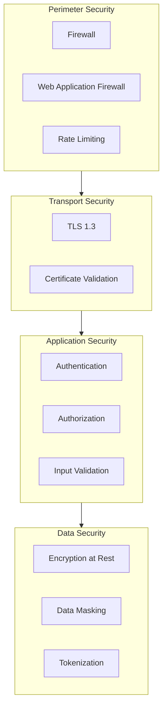
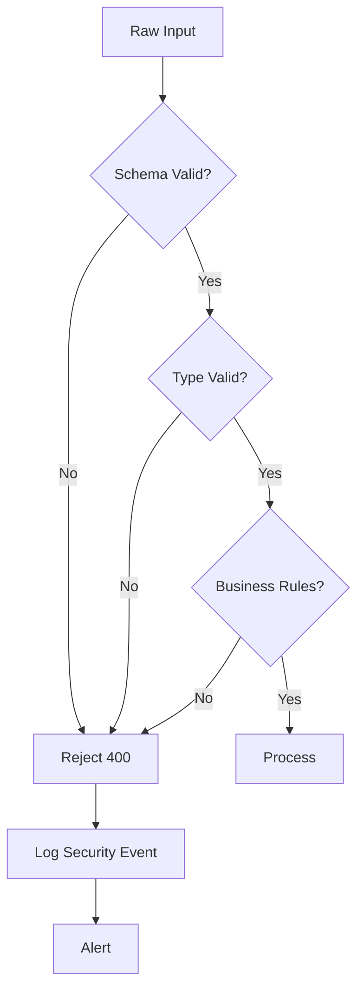

# Security, Hardening & Resiliency

## 1. Security Architecture

### 1.1 Security Layers



### 1.2 Security Checklist

| Layer | Security Measure | Implementation |
|-------|-----------------|----------------|
| Network | Firewall rules | Restrict ports |
| Network | VPN/Private network | Isolate services |
| Transport | TLS encryption | HTTPS only |
| Application | Input validation | Schema validation |
| Application | Output sanitization | Escape HTML/JSON |
| Data | Encryption at rest | AES-256 |
| Data | Secrets management | Environment variables |

## 2. Input Validation

### 2.1 Validation Strategy



### 2.2 Input Validation Code

```python
from typing import TypedDict
import re

class InputSchema(TypedDict, total=True):
    mensaje: str
    correlation_id: str | None
    prioridad: str | None

class InputValidator:
    """Input validation with security measures."""
    
    SCHEMA = {
        "mensaje": {"type": "string", "min_length": 1, "max_length": 10000},
        "correlation_id": {"type": "string", "pattern": r"^[a-zA-Z0-9-_]+$"},
        "prioridad": {"type": "enum", "values": ["baja", "normal", "alta"]},
    }
    
    @classmethod
    def validate(cls, data: dict) -> tuple[bool, str | None]:
        """Validate input data against schema."""
        
        # Check required fields
        for field, spec in cls.SCHEMA.items():
            if spec.get("required", False) and field not in data:
                return False, f"Missing required field: {field}"
        
        # Validate types and constraints
        for field, value in data.items():
            if field not in cls.SCHEMA:
                continue
            
            spec = cls.SCHEMA[field]
            
            # Type check
            expected_type = spec["type"]
            if expected_type == "string" and not isinstance(value, str):
                return False, f"Invalid type for {field}"
            
            # Length check
            if "min_length" in spec and len(value) < spec["min_length"]:
                return False, f"{field} too short"
            
            if "max_length" in spec and len(value) > spec["max_length"]:
                return False, f"{field} too long"
            
            # Pattern check
            if "pattern" in spec and not re.match(spec["pattern"], value):
                return False, f"Invalid format for {field}"
            
            # Enum check
            if expected_type == "enum" and value not in spec["values"]:
                return False, f"Invalid value for {field}"
        
        return True, None
```

### 2.3 SQL Injection Prevention

```python
# BAD: SQL injection vulnerable
query = f"SELECT * FROM users WHERE id = {user_id}"

# GOOD: Parameterized query
query = "SELECT * FROM users WHERE id = ?"
cursor.execute(query, (user_id,))

# GOOD: ORM usage
result = db.query(User).filter(User.id == user_id).first()
```

### 2.4 Input Sanitization

```python
import html
import json

def sanitize_input(data: dict) -> dict:
    """Sanitize input data."""
    sanitized = {}
    for key, value in data.items():
        if isinstance(value, str):
            # Escape HTML entities
            sanitized[key] = html.escape(value)
        elif isinstance(value, dict):
            sanitized[key] = sanitize_input(value)
        else:
            sanitized[key] = value
    return sanitized

def sanitize_output(data: dict) -> dict:
    """Sanitize output data."""
    # Remove sensitive fields
    sensitive_fields = ["password", "token", "secret", "api_key"]
    return {k: v for k, v in data.items() if k.lower() not in sensitive_fields}
```

## 3. Secrets Management

### 3.1 Environment Variables

```python
import os

# Access secrets from environment
API_KEY = os.environ.get("API_KEY")
DATABASE_URL = os.environ.get("DATABASE_URL")
JWT_SECRET = os.environ.get("JWT_SECRET")

# Validate required secrets on startup
REQUIRED_SECRETS = ["DATABASE_URL", "JWT_SECRET"]
missing = [s for s in REQUIRED_SECRETS if not os.environ.get(s)]
if missing:
    raise RuntimeError(f"Missing required secrets: {missing}")
```

### 3.2 Secrets Configuration

```yaml
# config.yaml - NEVER commit this file
secrets:
  api_key: ${API_KEY}
  database_url: ${DATABASE_URL}
  jwt_secret: ${JWT_SECRET}
```

## 4. Logging Security

### 4.1 Loguru Configuration

```python
from loguru import logger
import sys

# Configure secure logging
logger.remove()

# Log to file with rotation
logger.add(
    "logs/app_{time}.log",
    rotation="500 MB",
    retention="30 days",
    level="INFO",
    format="{time:YYYY-MM-DD HH:mm:ss} | {level} | {name}:{function}:{line} - {message}",
    backtrace=True,
    diagnose=True,
)

# Sensitive data masking
SENSITIVE_KEYS = ["password", "token", "secret", "api_key", "key"]

def mask_sensitive(data: dict) -> dict:
    """Mask sensitive information in logs."""
    masked = {}
    for key, value in data.items():
        if any(s in key.lower() for s in SENSITIVE_KEYS):
            masked[key] = "***REDACTED***"
        elif isinstance(value, dict):
            masked[key] = mask_sensitive(value)
        else:
            masked[key] = value
    return masked
```

### 4.2 Audit Logging

```python
import logging
from datetime import datetime

class AuditLogger:
    """Audit logging for compliance."""
    
    def __init__(self):
        self.logger = logging.getLogger("audit")
        self.logger.setLevel(logging.INFO)
        
        # Separate audit log file
        handler = logging.FileHandler("logs/audit.log")
        handler.setFormatter(
            logging.Formatter(
                "%(asctime)s | %(message)s",
                style="%"
            )
        )
        self.logger.addHandler(handler)
    
    def log_event(self, event_type: str, user: str, action: str, details: dict):
        """Log audit event."""
        self.logger.info(
            f"type={event_type} | user={user} | action={action} | "
            f"details={json.dumps(mask_sensitive(details))}"
        )
    
    def log_access(self, user: str, resource: str, result: str):
        """Log access attempt."""
        self.log_event("ACCESS", user, resource, {"result": result})
    
    def log_data_access(self, user: str, table: str, operation: str):
        """Log data access."""
        self.log_event("DATA_ACCESS", user, operation, {"table": table})
```

## 5. Resiliency Patterns

### 5.1 Circuit Breaker

```python
import time
from enum import Enum

class CircuitState(Enum):
    CLOSED = "closed"
    OPEN = "open"
    HALF_OPEN = "half_open"

class CircuitBreaker:
    """Circuit breaker pattern implementation."""
    
    def __init__(self, failure_threshold: int = 5, timeout: float = 60.0):
        self.failure_threshold = failure_threshold
        self.timeout = timeout
        self.state = CircuitState.CLOSED
        self.failures = 0
        self.last_failure_time = None
    
    def call(self, func, *args, **kwargs):
        """Execute function with circuit breaker."""
        if self.state == CircuitState.OPEN:
            if time.time() - self.last_failure_time > self.timeout:
                self.state = CircuitState.HALF_OPEN
            else:
                raise CircuitBreakerOpenError()
        
        try:
            result = func(*args, **kwargs)
            self.on_success()
            return result
        except Exception as e:
            self.on_failure()
            raise
    
    def on_success(self):
        """Handle successful call."""
        self.failures = 0
        self.state = CircuitState.CLOSED
    
    def on_failure(self):
        """Handle failed call."""
        self.failures += 1
        self.last_failure_time = time.time()
        if self.failures >= self.failure_threshold:
            self.state = CircuitState.OPEN
```

### 5.2 Rate Limiting

```python
import time
from collections import defaultdict

class RateLimiter:
    """Token bucket rate limiter."""
    
    def __init__(self, rate: int, per: float):
        self.rate = rate  # tokens per time period
        self.per = per    # time period in seconds
        self.tokens = defaultdict(lambda: rate)
        self.last = defaultdict(time.time)
    
    def allow(self, key: str) -> bool:
        """Check if request is allowed."""
        now = time.time()
        
        # Refill tokens
        elapsed = now - self.last[key]
        self.tokens[key] = min(
            self.rate,
            self.tokens[key] + elapsed * (self.rate / self.per)
        )
        self.last[key] = now
        
        if self.tokens[key] >= 1:
            self.tokens[key] -= 1
            return True
        return False
    
    def get_remaining(self, key: str) -> int:
        """Get remaining tokens."""
        return int(self.tokens[key])
```

### 5.3 Graceful Degradation

```python
class ServiceWithFallback:
    """Service with fallback behavior."""
    
    def __init__(self, primary_func, fallback_func):
        self.primary = primary_func
        self.fallback = fallback_func
    
    def execute(self, *args, **kwargs):
        """Execute with fallback on failure."""
        try:
            return self.primary(*args, **kwargs)
        except Exception as e:
            # Log error
            logger.error(f"Primary failed: {e}, using fallback")
            # Return fallback result
            return self.fallback(*args, **kwargs)
```

## 6. Error Handling Security

### 6.1 Secure Error Responses

```python
# BAD: Information leakage
def bad_handler(request):
    try:
        return process(request)
    except DatabaseError as e:
        return {"error": f"Database error: {e}"}, 500  # Leaks DB info

# GOOD: Generic error messages
def good_handler(request):
    try:
        return process(request)
    except Exception as e:
        logger.exception("Unexpected error")
        return {"error": "An unexpected error occurred"}, 500
```

### 6.2 Error Response Schema

```python
class SecureErrorResponse:
    """Secure error response format."""
    
    PUBLIC_MESSAGES = {
        "VALIDATION_ERROR": "Invalid input provided",
        "AUTH_ERROR": "Authentication failed",
        "RATE_LIMIT": "Rate limit exceeded",
        "INTERNAL_ERROR": "An unexpected error occurred",
    }
    
    @classmethod
    def create(cls, error_type: str, status_code: int):
        """Create secure error response."""
        return {
            "error": cls.PUBLIC_MESSAGES.get(
                error_type, 
                cls.PUBLIC_MESSAGES["INTERNAL_ERROR"]
            ),
            "code": error_type,
        }, status_code
```

## 7. TLS/SSL Configuration

### 7.1 HTTPS Configuration

```python
# SSL context configuration
import ssl

ssl_context = ssl.SSLContext(ssl.PROTOCOL_TLS_SERVER)

# Load certificate and key
ssl_context.load_cert_chain(
    certfile="path/to/cert.pem",
    keyfile="path/to/key.pem"
)

# Enforce strong protocols
ssl_context.minimum_version = ssl.TLSVersion.TLSv1_2

# Configure ciphers
ssl_context.set_ciphers('ECDHE+AESGCM:ECDHE+CHACHA20:DHE+AESGCM:DHE+CHACHA20')
```

### 7.2 Client Certificate Validation

```python
# Verify server certificates
import urllib3

http = urllib3.PoolManager(
    cert_reqs='CERT_REQUIRED',
    ca_certs='/path/to/ca-bundle.crt'
)
```

## 8. Monitoring & Alerting

### 8.1 Security Metrics

```python
SECURITY_METRICS = {
    "failed_auth_attempts": Counter("auth_failures"),
    "rate_limit_hits": Counter("rate_limit_exceeded"),
    "sql_injection_attempts": Counter("sql_injection_attempts"),
    "invalid_inputs": Counter("invalid_input_total"),
    "certificate_errors": Counter("cert_errors"),
}
```

### 8.2 Alert Rules

| Alert | Condition | Severity |
|-------|-----------|----------|
| Multiple failed auth | > 10 in 5 min | Critical |
| Rate limit exceeded | > 100 in 1 min | Warning |
| Invalid input spike | > 50% increase | Warning |
| Certificate expiring | < 7 days | Warning |