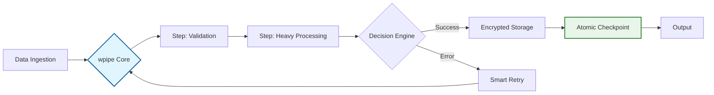

# 🚀 LinkedIn Post: wpipe — The Natural Evolution from No-Code to Engineering Excellence

## 📌 Post Draft

**Headline: Cuando tu automatización deja de ser un prototipo y empieza a ser Infraestructura. 🐍**

Seamos honestos: **n8n** es una maravilla para validar ideas en minutos. Es visual, es rápido y cumple su función. Pero hay un punto de inflexión en todo proyecto serio donde el "drag-and-drop" se convierte en un techo de cristal.

Si te has encontrado en estas situaciones, ya sabes de qué hablo:
🔹 Intentar hacer un `diff` de un JSON de 5.000 líneas en un Pull Request.
🔹 Rezar para que el nodo de JS no falle porque el debugging es una caja negra.
🔹 Sentir que tu lógica de negocio está "atrapada" en una base de datos de terceros.

No es que n8n sea malo; es que tu proyecto ha **madurado**. Y la madurez exige **wpipe**.

### 🔄 El Siguiente Nivel: De n8n a wpipe

| Desafío | La Experiencia No-Code | La Experiencia wpipe |
| :--- | :--- | :--- |
| **Arquitectura** | Visual (Canvas) | **Code-First (Python/YAML)** |
| **Ciclo de Vida** | Exportar/Importar JSON | **Git Flow Nativo (CI/CD)** |
| **Resiliencia** | Reintentos genéricos | **Checkpoints de Estado Real** |
| **Observabilidad** | Logs en UI propietaria | **Tracker SQL (Transparencia Total)** |
| **Ecosistema** | Nodos predefinidos | **Cualquier librería de PyPI** |

### 🛠️ ¿Por qué los equipos de ingeniería están mirando hacia wpipe?

1. **Soberanía del Dato:** No dependes de un servidor pesado. Con un SQLite local y una arquitectura ligera, tienes un orquestador industrial que corre hasta en una Raspberry Pi.
2. **Resiliencia Determinística:** ¿Fallo en el paso 80 de 100? No pasa nada. `wpipe` conoce el estado exacto de cada variable y retoma la ejecución sin repetir procesos costosos.
3. **Mantenibilidad Silenciosa:** Escribe código que tus compañeros puedan leer, testear y versionar. Menos flechas, más lógica.

---

### 📊 Professional Orchestration Flow

---

**💡 Mi veredicto:** 
El No-Code es para empezar. **wpipe** es para escalar. 

Si valoras la limpieza de un `git push` y la seguridad de saber exactamente qué pasa bajo el capó, es hora de que hablemos de orquestación real.

👇 **¿En qué momento sentiste que el "No-Code" se te quedó pequeño? Cuéntanos tu experiencia.**

#Python #SoftwareEngineering #Backend #Automation #wpipe #n8n #DataPipelines

---

## 🎨 Estrategia Visual y Engagement

1.  **Visual:** Una imagen limpia con el logo de Python y `wpipe` bajo el concepto "Engineering Sovereignty".
2.  **Call to Action:** Dirigir a la documentación para aquellos que buscan "cómo migrar su lógica de negocio a código mantenible".
3.  **Contexto:** wpipe no sustituye tu creatividad, le da una estructura profesional.

---

## 🧠 Psicología Detrás de esta Mejora:
*   **Validación, no Ataque:** Reconocemos el valor de n8n, lo que reduce la resistencia defensiva del usuario.
*   **Estatus:** Posicionamos el uso de wpipe como una señal de "madurez" y "profesionalismo".
*   **Curiosidad Técnica:** Usamos términos como "Resiliencia Determinística" para atraer al perfil de ingeniero que busca rigor técnico.
