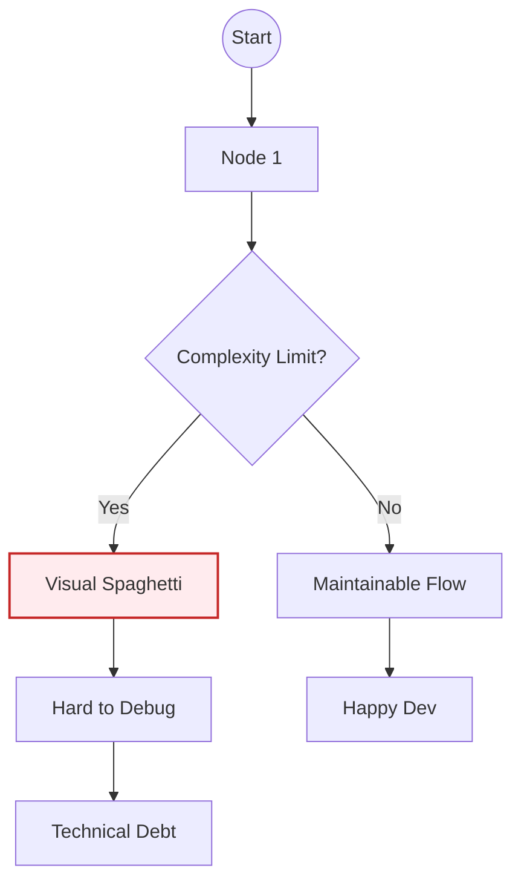
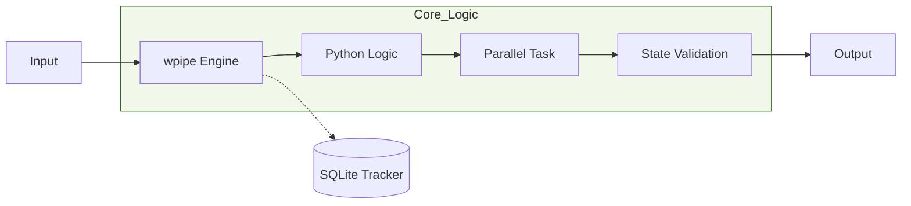
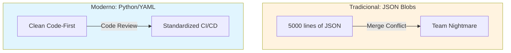
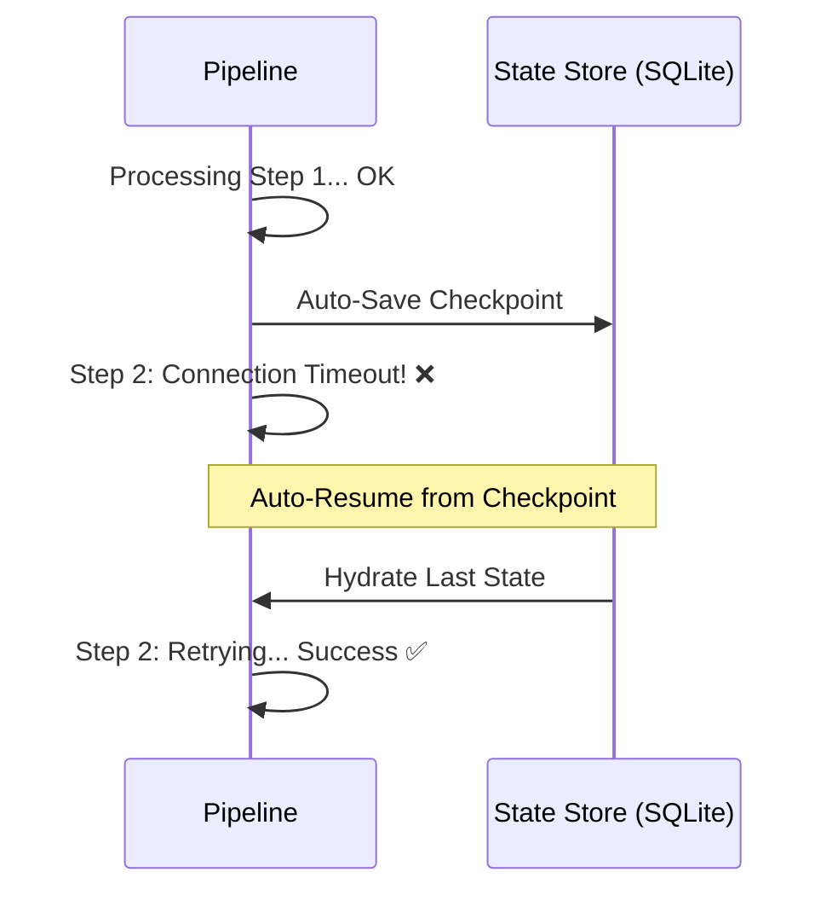
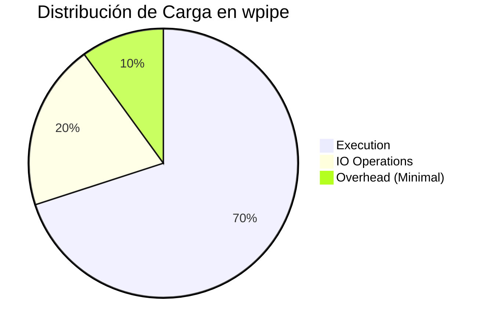
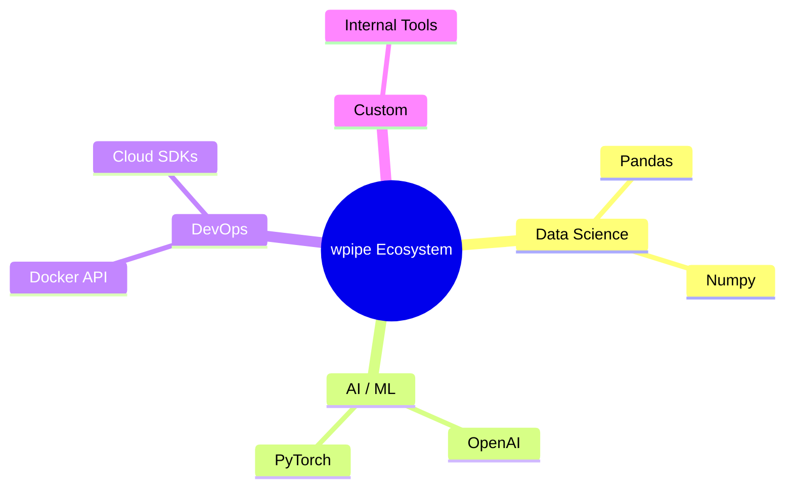
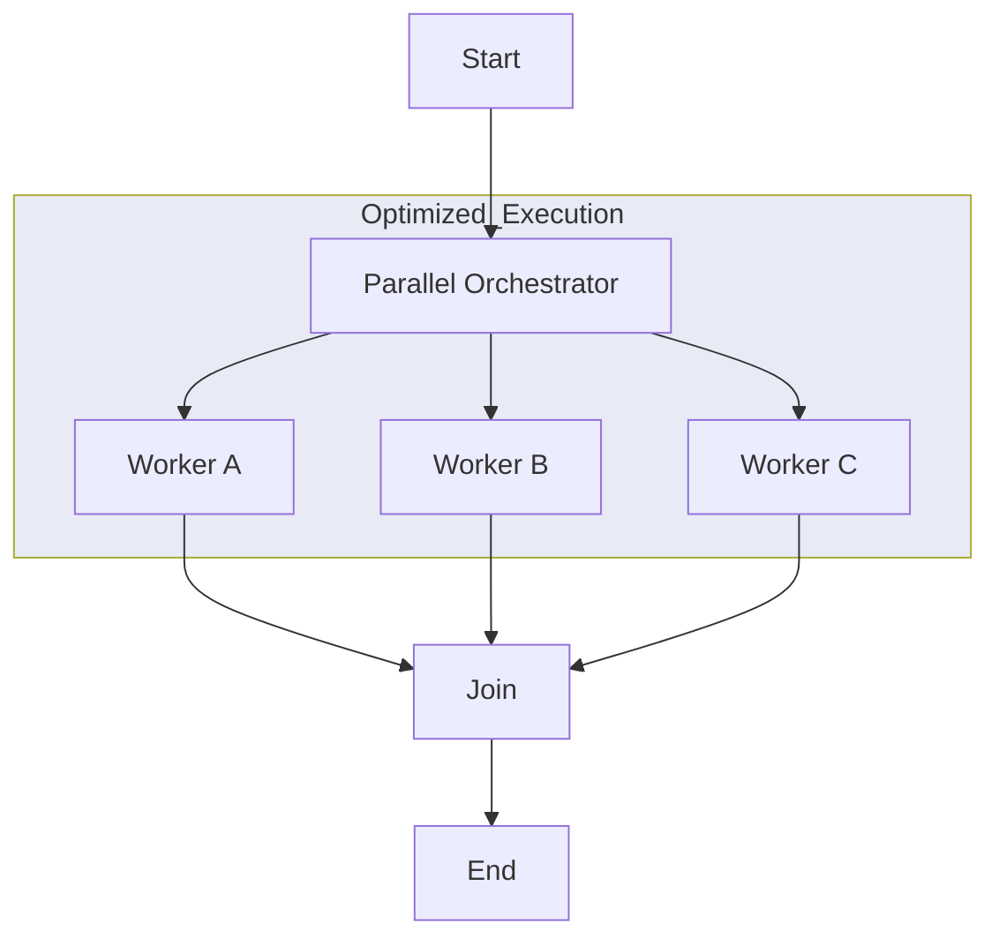
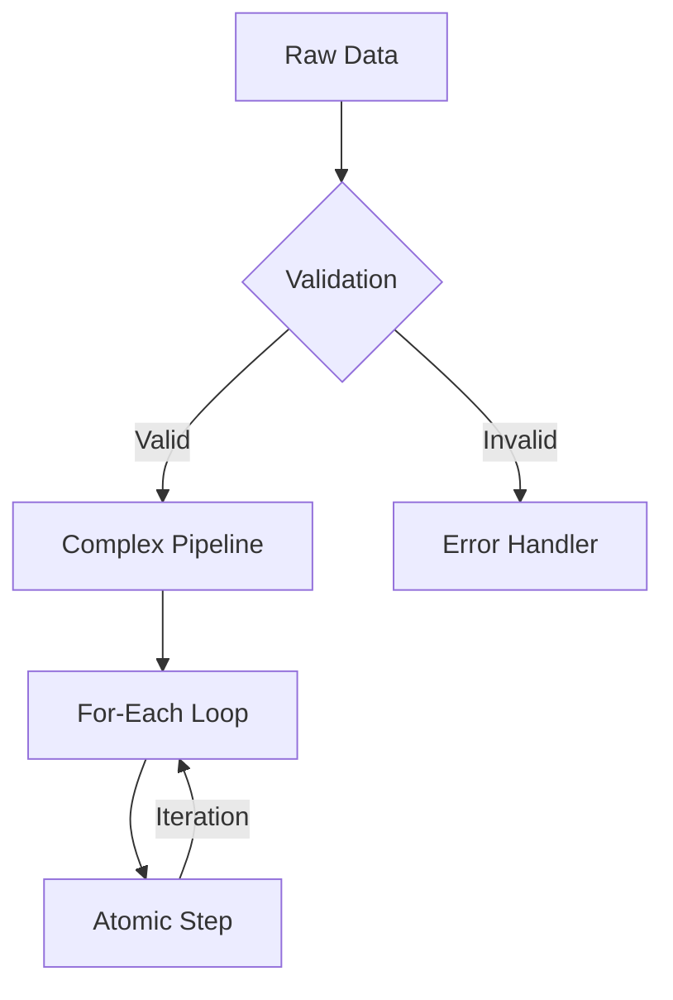
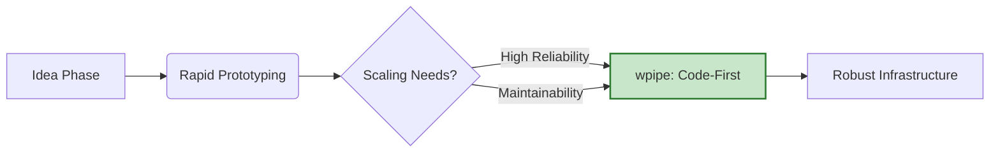
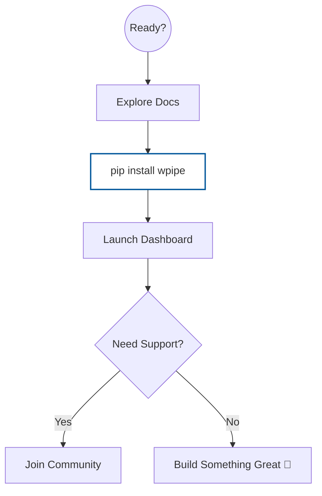

# 🎨 LinkedIn Visual Carousel: The wpipe Revolution

Este carrusel está diseñado para arquitectos de datos y desarrolladores senior que buscan profesionalizar sus flujos de automatización.

---

## 📸 Slide 1: El Desafío de la Complejidad Visual
**Texto Sugerido:** "¿Tu arquitectura de automatización está alcanzando su límite de legibilidad? El 'No-Code' brilla en la simplicidad, pero sufre en la escala."

---

## 📸 Slide 2: La Alternativa - Orquestación Determinística
**Texto Sugerido:** "Simplifica la lógica, no la capacidad. wpipe ofrece control total con un motor ligero y eficiente."

---

## 📸 Slide 3: Versionado Real para Equipos Reales
**Texto Sugerido:** "Cambia los blobs de JSON por código que tus compañeros puedan revisar en GitHub. Un `diff` limpio es una mente tranquila."

---

## 📸 Slide 4: Resiliencia - Checkpoints que no Olvidan
**Texto Sugerido:** "En producción, el tiempo es dinero. Si un proceso falla, wpipe retoma desde el estado exacto del error. Sin re-procesos innecesarios."

---

## 📸 Slide 5: Observabilidad Sin Esfuerzo
**Texto Sugerido:** "No adivines qué pasó. El tracking basado en SQLite te da una radiografía completa de cada ejecución, sin configurar bases de datos pesadas."

---

## 📸 Slide 6: Libertad Absoluta de Librerías
**Texto Sugerido:** "No esperes a un 'plugin' oficial. Si está en PyPI, está en tu pipeline. Integración nativa con Pandas, Scikit-learn o tus propios scripts."

---

## 📸 Slide 7: Paralelismo que Escala
**Texto Sugerido:** "Aprovecha al máximo tus recursos. Ejecución paralela nativa sin las complicaciones de la concurrencia manual."

---

## 📸 Slide 8: Lógica de Negocio, No de Cajas
**Texto Sugerido:** "Condicionales, bucles y lógica anidada escrita en el lenguaje que dominas. Sin límites de lo que puedes expresar."

---

## 📸 Slide 9: Del Prototipo a la Infraestructura
**Texto Sugerido:** "Usa herramientas visuales para prototipar rápido. Usa wpipe para construir sistemas que duren años."

---

## 📸 Slide 10: Toma el Control Hoy
**Texto Sugerido:** "La orquestación moderna no requiere servidores pesados, solo buena ingeniería. Empieza con `pip install wpipe`."

---

## 💡 Estrategia de Publicación:
*   **Target:** CTOs, Lead Developers, Data Architects.
*   **Objetivo:** Mostrar que wpipe es la "opción adulta" para quienes ya han pasado por los dolores de cabeza de las plataformas puramente visuales.
*   **Engagement:** Invita a comentar sobre los desafíos de mantener flujos visuales en equipos grandes.
