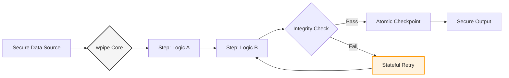

# 🚀 LinkedIn Post: wpipe — Scaling Beyond the Limits of SaaS Automation 💸

## 📌 Post Draft

**Headline: Cuando la agilidad del No-Code se convierte en un cuello de botella financiero y de seguridad. 🛑**

Para muchas startups, **Zapier** es el primer paso lógico: es rápido y funciona. Pero a medida que el volumen de datos crece y la lógica se vuelve crítica, el modelo de "pago por tarea" deja de ser una ventaja para convertirse en un riesgo estratégico.

Si tu equipo de ingeniería está lidiando con estas realidades, es hora de evaluar una transición hacia la **Orquestación Nativa**:

🔹 **El dilema de la Privacidad:** En Zapier, tus datos sensibles viajan a través de nubes de terceros. Con **wpipe**, la lógica y el dato permanecen en tu infraestructura.
🔹 **El Techo de Complejidad:** Las automatizaciones visuales sufren con bucles complejos, lógica condicional anidada y reintentos atómicos.
🔹 **OPEX vs. Ingeniería:** ¿Realmente quieres que tu factura crezca linealmente con tu éxito?

Aquí es donde **wpipe** redefine la eficiencia en la automatización industrial.

### ⚔️ Alineación Estratégica: Zapier vs. wpipe

| Dimensión | Zapier (SaaS) | wpipe (Ingeniería de Software) |
| :--- | :--- | :--- |
| **Soberanía de Datos** | Dependencia de terceros | **Total (In-house / Local-first)** |
| **Coste Operativo** | Basado en volumen (Variable) | **Predecible (Infraestructura propia)** |
| **Robustez** | Caja negra propietaria | **Transparente (Stack traces reales)** |
| **Resiliencia** | Reintentos genéricos | **Checkpoints SQLite (Estado persistente)** |
| **Ciclo de Vida** | Manual (Shadow IT) | **Git-First (CI/CD Standard)** |

### 🛠️ Por qué wpipe es la infraestructura de elección para Arquitectos:

1.  **Resiliencia Determinística:** Gracias a su motor de **Checkpoints**, wpipe no "reintenta" a ciegas. Recupera el estado exacto de las variables y retoma el flujo desde el punto de fallo, garantizando la integridad de los datos.
2.  **Arquitectura "Lean":** Sin necesidad de Redis ni sistemas de colas complejos. Un orquestador industrial que corre con la simplicidad de una librería de Python, optimizado para alto rendimiento y bajo consumo.
3.  **Libertad de PyPI:** No esperes a un "conector" oficial. Si existe en Python, es una parte nativa de tu pipeline.

---

### 📊 Security & Resilience Architecture

---

**💡 Mi veredicto:** 
El No-Code es una excelente herramienta de prototipado. **wpipe** es la herramienta de consolidación. Protege tus márgenes y tus datos con una arquitectura diseñada para durar.

¿Estás listo para profesionalizar tus flujos de trabajo sin comprometer la velocidad? 🐍

👇 **¿En qué punto de escala tu equipo empezó a preocuparse por los costes de las herramientas SaaS? Hablemos de optimización.**

#Python #SoftwareArchitecture #DataPrivacy #CostOptimization #wpipe #DevOps #Automation

---

## 🎨 Guía de Engagement

1.  **Enfoque Visual:** Una imagen que contraste "Shadow IT" (Zapier descontrolado) vs "Standard Engineering" (wpipe integrado en el stack).
2.  **Target:** CTOs, Lead Engineers, Data Officers que valoran la seguridad y el control de costes.
3.  **Valor añadido:** En el primer comentario, añade un enlace al "Quick Start" de wpipe para demostrar lo fácil que es migrar una lógica simple a código.

---

## 🧠 Psicología de la Decisión:
*   **Seguridad y Control:** Apelar a la soberanía de los datos es el argumento más fuerte para perfiles corporativos y de ciberseguridad.
*   **Eficiencia Económica:** Presentar el ahorro no como "tacañería", sino como una decisión inteligente de asignación de recursos.
*   **Autoridad Técnica:** El uso de términos como "Checkpoints", "WAL mode" y "CI/CD" posiciona a wpipe como la opción para expertos.
