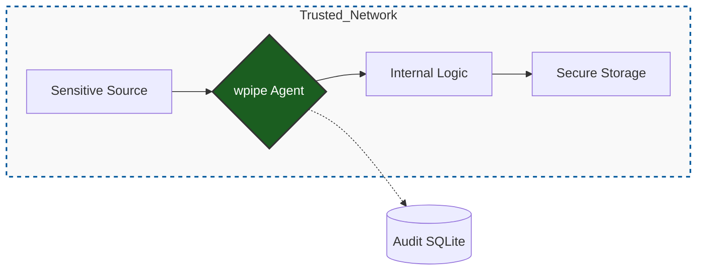

# 🔐 LinkedIn Post: wpipe — Orchestration with Integrity 🛡️

## 📌 Post Draft

**Headline: La automatización crítica no puede vivir en una caja negra. Es hora de recuperar la soberanía de tus datos. 🕵️‍♂️**

En el ecosistema empresarial actual, la conveniencia suele ser el enemigo de la seguridad. Depender de plataformas SaaS como **Zapier** para orquestar datos sensibles (clientes, finanzas, PI) introduce vectores de riesgo que muchas organizaciones ya no pueden permitirse.

No se trata solo de "dónde se guardan los datos", sino de **quién controla la ejecución**.

Si tu organización opera bajo marcos de cumplimiento estrictos (GDPR, HIPAA, SOC2), la **Orquestación Soberana** con **wpipe** es la respuesta técnica a la fragilidad del SaaS:

🔹 **Ejecución Local-First:** Los datos nunca abandonan tu perímetro. wpipe corre en tus servidores, en tus VPCs, bajo tus reglas de firewall.
🔹 **Auditabilidad Forense:** Cada transformación de datos se registra en un motor SQLite local. Tienes un registro inmutable y consultable de quién, qué y cuándo.
🔹 **Compliance por Diseño:** Al eliminar intermediarios innecesarios, reduces drásticamente la superficie de ataque y simplificas las auditorías de datos.

### 🏗️ Por qué los Arquitectos de Seguridad eligen wpipe:

1.  **Entornos Air-Gapped:** Diseñado para funcionar en aislamiento total si es necesario. Ideal para infraestructuras críticas donde el acceso a internet es un riesgo, no una opción.
2.  **Transparencia de Código:** Sin conectores propietarios opacos. Todo es Python. Puedes auditar, testear y validar cada línea de código antes de que toque producción.
3.  **Resiliencia Atómica:** El sistema de **Checkpoints** no solo recupera procesos; garantiza que el estado de los datos sea consistente incluso tras fallos catastróficos de hardware.

### 🔄 Comparativa de Integridad: SaaS vs. wpipe

| Métrica de Seguridad | Modelo SaaS Tradicional | Modelo wpipe (Sovereign) |
| :--- | :--- | :--- |
| **Control de Cifrado** | En manos del proveedor | **Tus propias llaves / HSM** |
| **Superficie de Ataque** | Nube pública compartida | **Tu infraestructura privada** |
| **Logs de Ejecución** | Dashboard limitado | **Base de Datos SQL completa** |
| **Vendor Risk** | Alto (Dependencia externa) | **Nulo (Open Source / Código propio)** |

---

### 📊 Zero-Trust Orchestration with wpipe

---

**💡 El estándar de la industria:**
La automatización real exige integridad. Con **wpipe**, no solo mueves datos; construyes una infraestructura resiliente, auditable y segura.

Es hora de dejar atrás las cajas negras y construir sobre cimientos sólidos. 🐍

👇 **¿Cómo gestiona tu equipo la seguridad en las integraciones con terceros? Compartamos mejores prácticas.**

#CyberSecurity #DataIntegrity #Compliance #wpipe #Python #InfoSec #SovereignTech

---

## 🎨 Guía Visual y Engagement

1.  **Imagen sugerida:** Un diagrama de arquitectura técnica que muestre a wpipe integrado dentro de un firewall, manejando flujos de datos cifrados.
2.  **Engagement:** Menciona a profesionales de Ciberseguridad y pregunta su opinión sobre la tendencia "Local-first" en la automatización industrial.

---

## 🧠 Notas de Psicología Aplicada:
*   **Autoridad Técnica:** Usar términos como "Air-gapped", "VPC", "SOC2" y "Auditoría Forense" atrae al perfil que toma decisiones de alto nivel.
*   **Seguridad como Valor:** Posicionar la seguridad no como una restricción, sino como un habilitador de escala y confianza.
*   **Soberanía:** El término "Orquestación Soberana" apela al deseo de independencia tecnológica de las grandes empresas.
