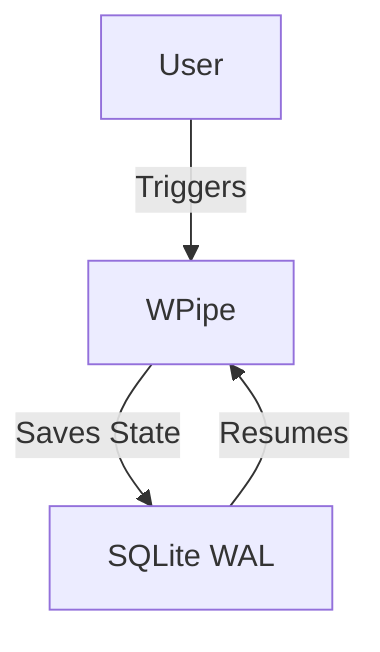

# Stop using Cron for Critical Tasks. Please.

Hey everyone! I've been working on this "Local-First" orchestration engine called WPipe.
I wanted to share how it's helped me scale my self-hosted setup without upgrading my hardware.

I'm looking for feedback from experts in r/Python and r/DevOps. How do you handle stateful failures in your pipelines?

### 🚀 Key Highlights:
- **+117k downloads**: A growing community of efficiency-first developers.
- **<50MB RAM**: Designed for the edge and cost-conscious scaling.
- **SQLite WAL Checkpoints**: Industrial-grade resilience without the heavy infrastructure.
- **@step decorator (@state)**: Focus on your logic, let WPipe handle the plumbing.

Would love to hear your thoughts on using SQLite for checkpoints instead of Redis/RabbitMQ!
