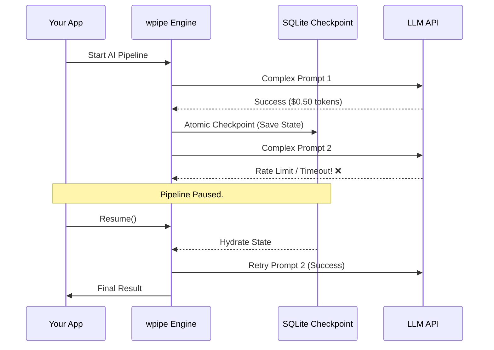

# Architecting Resilience: Beyond Drag-and-Drop Automation

*Subtitle: Why the future of industrial automation isn't built with a mouse, but with stateful, code-first orchestration. A deep dive into wpipe.*

---

## The Illusion of Simplicity

We live in the era of "low-code democratization." Tools like **Zapier**, **Make**, and **n8n** have promised that anyone can build complex systems with a few clicks. And for simple tasks, they are right. They’ve lowered the barrier to entry to zero.

But there is a hidden wall every solution architect eventually hits: **The Fragility Ceiling.**

When a workflow transitions from a "Slack notification" to a critical billing engine or an AI-driven data pipeline, visual simplicity becomes a liability. In this article, we’ll explore why native Python orchestration—specifically through **wpipe**—is the necessary evolution for engineering teams that have outgrown the canvas.

---

## 1. The Death of Determinism in SaaS

In software engineering, determinism is sacred. You want your system to produce the same output for the same input or, at the very least, fail predictably.

In multi-tenant SaaS platforms, determinism is elusive. You don't control the latency, the exact execution order, or the intermediate persistence. If a middle step fails, your data state enters a limbo. Did the database update but the webhook fail? Or was it the other way around?

### The wpipe Data Contract

**wpipe** solves this with the `PipelineContext`. You aren't just passing loose JSON objects; you are working with structured state. By using native Python types or Pydantic-like validation, wpipe ensures that if data doesn't meet the contract, the pipeline halts *before* causing side effects. It’s the difference between catching an error at line 1 or discovering you’ve sent 1,000 invoices with a zero balance.

---

## 2. The AI Orchestration Challenge: Token Efficiency

The rise of Generative AI has introduced a new variable: **Costly Failure.** 
Calling an LLM (like GPT-4 or Claude) is slow and expensive. If your pipeline involves chaining multiple AI calls and it fails at step 5, re-starting the whole flow isn't just a waste of time—it’s a waste of tokens and money.

### The "Save Game" Pattern (Checkpoints)

This is where **wpipe** truly shines. It implements a native **SQLite-backed Checkpoint system** (using WAL mode for extreme performance). 

When you define a checkpoint in wpipe:
1.  The engine takes a snapshot of your current context.
2.  If an API timeout or a Rate Limit occurs in the next step, the `CheckpointManager` allows you to resume from that exact snapshot.

You don't re-run the expensive AI calls that already succeeded. You pick up the state and continue. It’s **Stateful Continuity**, and it’s the only way to build cost-effective AI agents at scale.

---

## 3. Native Concurrency: Scaling Beyond the GIL

One of the most frustrating limits of SaaS tools is sequential execution or the absurd cost of "parallel tasks." If you need to process 5,000 records, Zapier will bill you for each one and likely process them in small, slow batches.

**wpipe** leverages your hardware. Through its `Parallel` component, you can choose:
-   **Threads:** Ideal for I/O bound tasks (API calls, web scraping).
-   **Processes:** Ideal for CPU bound tasks (image processing, data analysis), bypassing Python's Global Interpreter Lock (GIL).

What takes an hour in Zapier and costs $50 takes 2 minutes in wpipe and costs only the electricity of your CPU. This isn't just "automation"; it’s a **high-throughput data engine.**

---

## 4. Bringing Sanity to the SDLC

The greatest sin of No-Code is that it ignores 50 years of software engineering best practices:
-   **Version Control:** You can't `git diff` two versions of a Zap.
-   **Code Review:** You can't open a Pull Request for a visual flow.
-   **Rollbacks:** Reverting a complex visual workflow is a manual, error-prone nightmare.

**wpipe is Git-friendly by design.** By defining pipelines in Python or YAML, you enter the professional ecosystem. You have history, you have branches, and you have clear authorship of every change. 

### The Myth of "No-Maintenance"
Companies choose No-Code thinking it requires no maintenance. The truth is, No-Code maintenance is *more expensive* because it requires niche skills to navigate proprietary UIs. wpipe maintenance is standard: it’s Python code. Any developer can read a wpipe pipeline and understand the data flow in minutes.

---

## 5. When to Graduate to wpipe?

You should consider the move if:
*   **Data Sovereignty is Non-Negotiable:** If you work in Fintech, Health, or Legal, sending data to a third-party cloud is a compliance nightmare. wpipe stays inside your firewall.
*   **High-Frequency ETLs:** If you move data every minute, SaaS latency and "per-task" costs will kill your margins.
*   **Long-Running Processes:** For flows that span hours or days, wpipe’s checkpoints ensure that a maintenance reboot doesn't ruin days of progress.
*   **AI Agent Orchestration:** When you need to chain LLM calls with state persistence and cost control.

---

## Conclusion: Possession of Logic

The role of the solution architect is evolving. We are moving from "digital plumbers" to "system creators." 

Zapier and Make are the "putty" of the web—great for sealing leaks and prototyping ideas. But when that putty is expected to hold the foundations of a technological cathedral, it cracks. 

**wpipe** offers the perfect balance: the development speed of Python with the robustness of an industrial orchestrator. It’s lightweight, it’s fast, and most importantly, **it’s yours.** You aren't renting your business logic; you own it.

Stop being a tool user. Start being a system builder.

---

*About the author: William Rodriguez is an AI Solutions Architect specialized in turning data chaos into high-performance pipelines. He designs architectures that prioritize resilience, sovereignty, and total control.*
