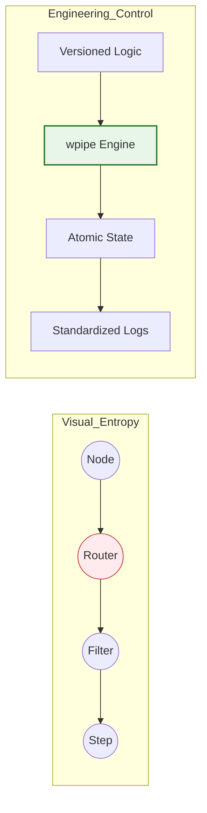

# 🎨 LinkedIn Post: wpipe — Scaling Beyond Visual Entropy 🍝

## 📌 Post Draft

**Headline: Cuando tu flujo de automatización crece, la visibilidad se convierte en ruido. Es hora de recuperar el control con Orquestación Estándar. 🏛️**

**Make** (antes Integromat) es una herramienta excepcional para el diseño visual. Ver los datos fluir entre "burbujas" es intuitivo para prototipos rápidos. Pero para los equipos que gestionan infraestructuras críticas, ese mismo canvas puede convertirse en una fuente de **Entropía Visual**.

A medida que un escenario escala, los desafíos de ingeniería real empiezan a aflorar:
❌ **La paradoja del Debugging:** Buscar un error entre 50 nodos y 20 filtros es buscar una aguja en un pajar visual.
❌ **El muro del Versionado:** Los cambios en un escenario de Make no se "revisan", se "asumen". Sin `diffs` claros, el riesgo de regresión es constante.
❌ **Lógica Fragmentada:** Reutilizar lógica entre diferentes proyectos termina siendo un ciclo de "copiar y pegar" módulos.

**wpipe** ofrece una alternativa para los que buscan **Arquitectura de Software** sobre diseño gráfico.

### 🔄 La Evolución: De Make a wpipe

| Desafío de Ingeniería | La Experiencia Make | El Estándar wpipe |
| :--- | :--- | :--- |
| **Gobernanza** | Diseños ad-hoc por usuario | **Estandarización vía Código** |
| **Mantenibilidad** | Opaca (JSON propietario) | **Transparente (Git Flow)** |
| **Observabilidad** | Logs efímeros en UI | **Persistencia SQL Forense** |
| **Escalabilidad** | Limitada por la nube SaaS | **Vertical y Horizontal (Local/Nativa)** |

### 🛠️ ¿Por qué los equipos de DevOps están integrando wpipe?

1.  **Código como Verdad Única:** Tus pipelines no son "dibujos", son activos de software. Se testean, se versionan y se despliegan con la misma rigurosidad que tu core business.
2.  **Tracking Estructurado:** Gracias a su motor SQLite nativo, wpipe ofrece una trazabilidad total. No "miras" qué pasó; consultas los datos exactos que causaron el fallo.
3.  **Modularidad Real:** Crea tus propios pasos (`steps`) y utilízalos en múltiples proyectos simplemente importándolos. Limpio, seco (DRY) y profesional.

---

### 📊 From Fragmentation to Engineering Excellence

---

**💡 Mi veredicto:** 
El diseño visual es para el descubrimiento. El código es para la estabilidad. 

Si tu equipo ha superado la fase de "conectar cajas" y necesita construir sistemas mantenibles y auditables, es hora de graduarse en **wpipe**. 🐍

👇 **¿En qué momento sentiste que un flujo visual se volvió "demasiado grande" para ser seguro? Hablemos de límites.**

#SoftwareArchitecture #DevOps #Automation #Make #wpipe #CleanCode #DataEngineering

---

## 🎨 Estrategia Visual y Engagement

1.  **Visual:** Una imagen que muestre el concepto de "Infraestructura como Código" aplicada a la automatización.
2.  **Target:** Ingenieros de Datos, Backend Leads, y arquitectos que sufren manteniendo flujos visuales heredados.
3.  **Primer comentario:** Enlace al repositorio de wpipe con el mensaje: "Mira cómo definimos un pipeline complejo en menos de 20 líneas de código".

---

## 🧠 Psicología Detrás del Post:
*   **Aspiración:** Posiciona a wpipe como el "siguiente nivel" profesional.
*   **Seguridad:** Aliviar el miedo a la regresión y a los errores difíciles de debuggear.
*   **Eficiencia:** Resaltar que el código es más rápido de leer y mantener que un diagrama complejo a largo plazo.
