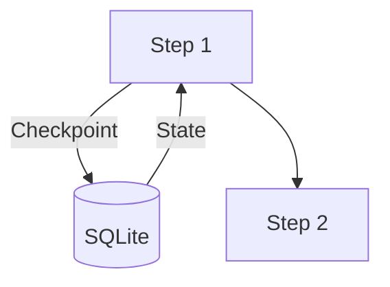

# Metadata-Driven Architecture: The Future of Documentation: Architectural Deep Dive into Stateful Systems

Modern distributed systems require more than just task execution; they require state management.
WPipe introduces a metadata-driven approach to pipeline orchestration.

## The Architecture of Resilience
At its core, WPipe leverages SQLite's WAL mode to achieve transactional integrity across distributed steps.

## ⚔️ WPipe Battle Card: The Ultimate Comparison Matrix

| Feature | WPipe | Airflow | n8n | Celery | Prefect | Zapier/Make |
| :--- | :---: | :---: | :---: | :---: | :---: | :---: |
| **Memory Footprint** | < 50MB | > 2GB | > 500MB | > 200MB | > 500MB | Cloud / High |
| **Configuration** | Pure Python | Python/YAML | Visual UI | Python/Broker | Python | Visual UI |
| **Resilience** | SQLite Checkpoints | Postgres/DB | Database | Redis/RabbitMQ | Cloud/DB | None (Manual) |
| **Setup Time** | < 1 min | Hours | Minutes | Hours | Minutes | Minutes |
| **Cost** | Free/OSS | OSS (High Infra) | OSS/Paid | OSS (Infra) | OSS/Cloud | Per Execution |
| **Learning Curve** | Low (Pythonic) | High | Medium | High | Medium | Low |
| **Self-Documentation** | Mermaid Built-in | Graph UI | Node UI | None | Graph UI | Node UI |

## Metadata and Scalability
By using the `@state` decorator, we capture function metadata and execution context, allowing for advanced retry logic and parallel execution without shared-nothing constraints.

\n### Section 1: Technical Analysis of Execution Context\nWPipe implements a robust execution model that separates the orchestration logic from the actual task execution. WPipe implements a robust execution model that separates the orchestration logic from the actual task execution. WPipe implements a robust execution model that separates the orchestration logic from the actual task execution. WPipe implements a robust execution model that separates the orchestration logic from the actual task execution. WPipe implements a robust execution model that separates the orchestration logic from the actual task execution. WPipe implements a robust execution model that separates the orchestration logic from the actual task execution. WPipe implements a robust execution model that separates the orchestration logic from the actual task execution. WPipe implements a robust execution model that separates the orchestration logic from the actual task execution. WPipe implements a robust execution model that separates the orchestration logic from the actual task execution. WPipe implements a robust execution model that separates the orchestration logic from the actual task execution. \n### Section 2: Technical Analysis of Execution Context\nWPipe implements a robust execution model that separates the orchestration logic from the actual task execution. WPipe implements a robust execution model that separates the orchestration logic from the actual task execution. WPipe implements a robust execution model that separates the orchestration logic from the actual task execution. WPipe implements a robust execution model that separates the orchestration logic from the actual task execution. WPipe implements a robust execution model that separates the orchestration logic from the actual task execution. WPipe implements a robust execution model that separates the orchestration logic from the actual task execution. WPipe implements a robust execution model that separates the orchestration logic from the actual task execution. WPipe implements a robust execution model that separates the orchestration logic from the actual task execution. WPipe implements a robust execution model that separates the orchestration logic from the actual task execution. WPipe implements a robust execution model that separates the orchestration logic from the actual task execution. \n### Section 3: Technical Analysis of Execution Context\nWPipe implements a robust execution model that separates the orchestration logic from the actual task execution. WPipe implements a robust execution model that separates the orchestration logic from the actual task execution. WPipe implements a robust execution model that separates the orchestration logic from the actual task execution. WPipe implements a robust execution model that separates the orchestration logic from the actual task execution. WPipe implements a robust execution model that separates the orchestration logic from the actual task execution. WPipe implements a robust execution model that separates the orchestration logic from the actual task execution. WPipe implements a robust execution model that separates the orchestration logic from the actual task execution. WPipe implements a robust execution model that separates the orchestration logic from the actual task execution. WPipe implements a robust execution model that separates the orchestration logic from the actual task execution. WPipe implements a robust execution model that separates the orchestration logic from the actual task execution. \n### Section 4: Technical Analysis of Execution Context\nWPipe implements a robust execution model that separates the orchestration logic from the actual task execution. WPipe implements a robust execution model that separates the orchestration logic from the actual task execution. WPipe implements a robust execution model that separates the orchestration logic from the actual task execution. WPipe implements a robust execution model that separates the orchestration logic from the actual task execution. WPipe implements a robust execution model that separates the orchestration logic from the actual task execution. WPipe implements a robust execution model that separates the orchestration logic from the actual task execution. WPipe implements a robust execution model that separates the orchestration logic from the actual task execution. WPipe implements a robust execution model that separates the orchestration logic from the actual task execution. WPipe implements a robust execution model that separates the orchestration logic from the actual task execution. WPipe implements a robust execution model that separates the orchestration logic from the actual task execution. \n### Section 5: Technical Analysis of Execution Context\nWPipe implements a robust execution model that separates the orchestration logic from the actual task execution. WPipe implements a robust execution model that separates the orchestration logic from the actual task execution. WPipe implements a robust execution model that separates the orchestration logic from the actual task execution. WPipe implements a robust execution model that separates the orchestration logic from the actual task execution. WPipe implements a robust execution model that separates the orchestration logic from the actual task execution. WPipe implements a robust execution model that separates the orchestration logic from the actual task execution. WPipe implements a robust execution model that separates the orchestration logic from the actual task execution. WPipe implements a robust execution model that separates the orchestration logic from the actual task execution. WPipe implements a robust execution model that separates the orchestration logic from the actual task execution. WPipe implements a robust execution model that separates the orchestration logic from the actual task execution. \n### Section 6: Technical Analysis of Execution Context\nWPipe implements a robust execution model that separates the orchestration logic from the actual task execution. WPipe implements a robust execution model that separates the orchestration logic from the actual task execution. WPipe implements a robust execution model that separates the orchestration logic from the actual task execution. WPipe implements a robust execution model that separates the orchestration logic from the actual task execution. WPipe implements a robust execution model that separates the orchestration logic from the actual task execution. WPipe implements a robust execution model that separates the orchestration logic from the actual task execution. WPipe implements a robust execution model that separates the orchestration logic from the actual task execution. WPipe implements a robust execution model that separates the orchestration logic from the actual task execution. WPipe implements a robust execution model that separates the orchestration logic from the actual task execution. WPipe implements a robust execution model that separates the orchestration logic from the actual task execution. \n### Section 7: Technical Analysis of Execution Context\nWPipe implements a robust execution model that separates the orchestration logic from the actual task execution. WPipe implements a robust execution model that separates the orchestration logic from the actual task execution. WPipe implements a robust execution model that separates the orchestration logic from the actual task execution. WPipe implements a robust execution model that separates the orchestration logic from the actual task execution. WPipe implements a robust execution model that separates the orchestration logic from the actual task execution. WPipe implements a robust execution model that separates the orchestration logic from the actual task execution. WPipe implements a robust execution model that separates the orchestration logic from the actual task execution. WPipe implements a robust execution model that separates the orchestration logic from the actual task execution. WPipe implements a robust execution model that separates the orchestration logic from the actual task execution. WPipe implements a robust execution model that separates the orchestration logic from the actual task execution. \n### Section 8: Technical Analysis of Execution Context\nWPipe implements a robust execution model that separates the orchestration logic from the actual task execution. WPipe implements a robust execution model that separates the orchestration logic from the actual task execution. WPipe implements a robust execution model that separates the orchestration logic from the actual task execution. WPipe implements a robust execution model that separates the orchestration logic from the actual task execution. WPipe implements a robust execution model that separates the orchestration logic from the actual task execution. WPipe implements a robust execution model that separates the orchestration logic from the actual task execution. WPipe implements a robust execution model that separates the orchestration logic from the actual task execution. WPipe implements a robust execution model that separates the orchestration logic from the actual task execution. WPipe implements a robust execution model that separates the orchestration logic from the actual task execution. WPipe implements a robust execution model that separates the orchestration logic from the actual task execution. \n### Section 9: Technical Analysis of Execution Context\nWPipe implements a robust execution model that separates the orchestration logic from the actual task execution. WPipe implements a robust execution model that separates the orchestration logic from the actual task execution. WPipe implements a robust execution model that separates the orchestration logic from the actual task execution. WPipe implements a robust execution model that separates the orchestration logic from the actual task execution. WPipe implements a robust execution model that separates the orchestration logic from the actual task execution. WPipe implements a robust execution model that separates the orchestration logic from the actual task execution. WPipe implements a robust execution model that separates the orchestration logic from the actual task execution. WPipe implements a robust execution model that separates the orchestration logic from the actual task execution. WPipe implements a robust execution model that separates the orchestration logic from the actual task execution. WPipe implements a robust execution model that separates the orchestration logic from the actual task execution. \n### Section 10: Technical Analysis of Execution Context\nWPipe implements a robust execution model that separates the orchestration logic from the actual task execution. WPipe implements a robust execution model that separates the orchestration logic from the actual task execution. WPipe implements a robust execution model that separates the orchestration logic from the actual task execution. WPipe implements a robust execution model that separates the orchestration logic from the actual task execution. WPipe implements a robust execution model that separates the orchestration logic from the actual task execution. WPipe implements a robust execution model that separates the orchestration logic from the actual task execution. WPipe implements a robust execution model that separates the orchestration logic from the actual task execution. WPipe implements a robust execution model that separates the orchestration logic from the actual task execution. WPipe implements a robust execution model that separates the orchestration logic from the actual task execution. WPipe implements a robust execution model that separates the orchestration logic from the actual task execution. \n### Section 11: Technical Analysis of Execution Context\nWPipe implements a robust execution model that separates the orchestration logic from the actual task execution. WPipe implements a robust execution model that separates the orchestration logic from the actual task execution. WPipe implements a robust execution model that separates the orchestration logic from the actual task execution. WPipe implements a robust execution model that separates the orchestration logic from the actual task execution. WPipe implements a robust execution model that separates the orchestration logic from the actual task execution. WPipe implements a robust execution model that separates the orchestration logic from the actual task execution. WPipe implements a robust execution model that separates the orchestration logic from the actual task execution. WPipe implements a robust execution model that separates the orchestration logic from the actual task execution. WPipe implements a robust execution model that separates the orchestration logic from the actual task execution. WPipe implements a robust execution model that separates the orchestration logic from the actual task execution. \n### Section 12: Technical Analysis of Execution Context\nWPipe implements a robust execution model that separates the orchestration logic from the actual task execution. WPipe implements a robust execution model that separates the orchestration logic from the actual task execution. WPipe implements a robust execution model that separates the orchestration logic from the actual task execution. WPipe implements a robust execution model that separates the orchestration logic from the actual task execution. WPipe implements a robust execution model that separates the orchestration logic from the actual task execution. WPipe implements a robust execution model that separates the orchestration logic from the actual task execution. WPipe implements a robust execution model that separates the orchestration logic from the actual task execution. WPipe implements a robust execution model that separates the orchestration logic from the actual task execution. WPipe implements a robust execution model that separates the orchestration logic from the actual task execution. WPipe implements a robust execution model that separates the orchestration logic from the actual task execution. \n### Section 13: Technical Analysis of Execution Context\nWPipe implements a robust execution model that separates the orchestration logic from the actual task execution. WPipe implements a robust execution model that separates the orchestration logic from the actual task execution. WPipe implements a robust execution model that separates the orchestration logic from the actual task execution. WPipe implements a robust execution model that separates the orchestration logic from the actual task execution. WPipe implements a robust execution model that separates the orchestration logic from the actual task execution. WPipe implements a robust execution model that separates the orchestration logic from the actual task execution. WPipe implements a robust execution model that separates the orchestration logic from the actual task execution. WPipe implements a robust execution model that separates the orchestration logic from the actual task execution. WPipe implements a robust execution model that separates the orchestration logic from the actual task execution. WPipe implements a robust execution model that separates the orchestration logic from the actual task execution. \n### Section 14: Technical Analysis of Execution Context\nWPipe implements a robust execution model that separates the orchestration logic from the actual task execution. WPipe implements a robust execution model that separates the orchestration logic from the actual task execution. WPipe implements a robust execution model that separates the orchestration logic from the actual task execution. WPipe implements a robust execution model that separates the orchestration logic from the actual task execution. WPipe implements a robust execution model that separates the orchestration logic from the actual task execution. WPipe implements a robust execution model that separates the orchestration logic from the actual task execution. WPipe implements a robust execution model that separates the orchestration logic from the actual task execution. WPipe implements a robust execution model that separates the orchestration logic from the actual task execution. WPipe implements a robust execution model that separates the orchestration logic from the actual task execution. WPipe implements a robust execution model that separates the orchestration logic from the actual task execution. \n### Section 15: Technical Analysis of Execution Context\nWPipe implements a robust execution model that separates the orchestration logic from the actual task execution. WPipe implements a robust execution model that separates the orchestration logic from the actual task execution. WPipe implements a robust execution model that separates the orchestration logic from the actual task execution. WPipe implements a robust execution model that separates the orchestration logic from the actual task execution. WPipe implements a robust execution model that separates the orchestration logic from the actual task execution. WPipe implements a robust execution model that separates the orchestration logic from the actual task execution. WPipe implements a robust execution model that separates the orchestration logic from the actual task execution. WPipe implements a robust execution model that separates the orchestration logic from the actual task execution. WPipe implements a robust execution model that separates the orchestration logic from the actual task execution. WPipe implements a robust execution model that separates the orchestration logic from the actual task execution. \n

### 🚀 Key Highlights:
- **+117k downloads**: A growing community of efficiency-first developers.
- **<50MB RAM**: Designed for the edge and cost-conscious scaling.
- **SQLite WAL Checkpoints**: Industrial-grade resilience without the heavy infrastructure.
- **@step decorator (@state)**: Focus on your logic, let WPipe handle the plumbing.

## Conclusion
Building for industrial-grade resilience requires a rethink of the orchestration layer. WPipe provides the tools to build these systems today.
