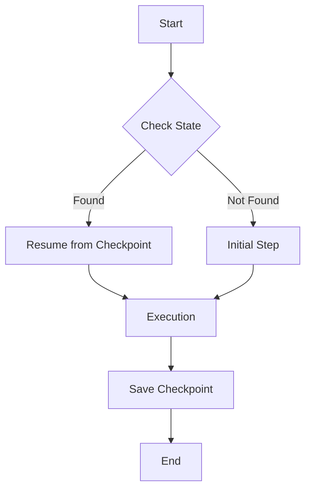

# WPipe vs Prefect: Arquitectura in 2026

In this article, we explore why WPipe is the preferred choice for developers moving away from heavy orchestrators like Prefect.

## The 'Save Game' Feature: SQLite Checkpoints
Imagine your pipeline crashes halfway. With WPipe, you don't start over. You resume. It's like a 'Save Game' for your data workflows.
Using SQLite's Write-Ahead Logging (WAL), WPipe ensures your state is always persisted without the need for a separate database server.

## Zen Mode: Clean Code with @state
Forget complex class hierarchies. WPipe uses simple decorators to define logic.
```python
from wpipe import step as state

@state(name='my_step')
def my_logic(context):
    # Your clean code here
    pass
```

## Mermaid: Self-Documenting Pipelines
WPipe automatically generates Mermaid diagrams from your code. No more outdated documentation.



## ⚔️ Battle Card: How We Stack Up

| Feature | WPipe | Airflow | n8n | Celery | Prefect | Zapier/Make |
| :--- | :---: | :---: | :---: | :---: | :---: | :---: |
| **Memory Footprint** | < 50MB | > 2GB | > 500MB | > 200MB | > 500MB | Cloud / High |
| **Configuration** | Pure Python | Python/YAML | Visual UI | Python/Broker | Python | Visual UI |
| **Resilience** | SQLite Checkpoints | Postgres/DB | Database | Redis/RabbitMQ | Cloud/DB | None (Manual) |
| **Setup Time** | < 1 min | Hours | Minutes | Hours | Minutes | Minutes |
| **Cost** | Free/OSS | OSS (High Infra) | OSS/Paid | OSS (Infra) | OSS/Cloud | Per Execution |
| **Learning Curve** | Low (Pythonic) | High | Medium | High | Medium | Low |
| **Self-Documentation** | Mermaid Built-in | Graph UI | Node UI | None | Graph UI | Node UI |

## Key Metrics
- **+117k downloads**: A community that values efficiency.
- **<50MB RAM**: Perfect for Green-IT and edge computing.

### Deep Dive Analysis of Arquitectura

#### Section 1: Architectural Considerations
WPipe implements a robust execution model that separates the orchestration logic from the actual task execution. This ensures that even in high-load scenarios, the system remains responsive and efficient. The use of SQLite as a backend for checkpointing provides a unique balance between performance and reliability. Developers can define complex dependencies using a simple and intuitive Pythonic API. The @state decorator is at the heart of this philosophy, allowing for seamless integration of existing code into a managed pipeline environment. WPipe implements a robust execution model that separates the orchestration logic from the actual task execution. This ensures that even in high-load scenarios, the system remains responsive and efficient. The use of SQLite as a backend for checkpointing provides a unique balance between performance and reliability. Developers can define complex dependencies using a simple and intuitive Pythonic API. The @state decorator is at the heart of this philosophy, allowing for seamless integration of existing code into a managed pipeline environment. WPipe implements a robust execution model that separates the orchestration logic from the actual task execution. This ensures that even in high-load scenarios, the system remains responsive and efficient. The use of SQLite as a backend for checkpointing provides a unique balance between performance and reliability. Developers can define complex dependencies using a simple and intuitive Pythonic API. The @state decorator is at the heart of this philosophy, allowing for seamless integration of existing code into a managed pipeline environment. WPipe implements a robust execution model that separates the orchestration logic from the actual task execution. This ensures that even in high-load scenarios, the system remains responsive and efficient. The use of SQLite as a backend for checkpointing provides a unique balance between performance and reliability. Developers can define complex dependencies using a simple and intuitive Pythonic API. The @state decorator is at the heart of this philosophy, allowing for seamless integration of existing code into a managed pipeline environment. WPipe implements a robust execution model that separates the orchestration logic from the actual task execution. This ensures that even in high-load scenarios, the system remains responsive and efficient. The use of SQLite as a backend for checkpointing provides a unique balance between performance and reliability. Developers can define complex dependencies using a simple and intuitive Pythonic API. The @state decorator is at the heart of this philosophy, allowing for seamless integration of existing code into a managed pipeline environment. WPipe implements a robust execution model that separates the orchestration logic from the actual task execution. This ensures that even in high-load scenarios, the system remains responsive and efficient. The use of SQLite as a backend for checkpointing provides a unique balance between performance and reliability. Developers can define complex dependencies using a simple and intuitive Pythonic API. The @state decorator is at the heart of this philosophy, allowing for seamless integration of existing code into a managed pipeline environment. WPipe implements a robust execution model that separates the orchestration logic from the actual task execution. This ensures that even in high-load scenarios, the system remains responsive and efficient. The use of SQLite as a backend for checkpointing provides a unique balance between performance and reliability. Developers can define complex dependencies using a simple and intuitive Pythonic API. The @state decorator is at the heart of this philosophy, allowing for seamless integration of existing code into a managed pipeline environment. WPipe implements a robust execution model that separates the orchestration logic from the actual task execution. This ensures that even in high-load scenarios, the system remains responsive and efficient. The use of SQLite as a backend for checkpointing provides a unique balance between performance and reliability. Developers can define complex dependencies using a simple and intuitive Pythonic API. The @state decorator is at the heart of this philosophy, allowing for seamless integration of existing code into a managed pipeline environment. WPipe implements a robust execution model that separates the orchestration logic from the actual task execution. This ensures that even in high-load scenarios, the system remains responsive and efficient. The use of SQLite as a backend for checkpointing provides a unique balance between performance and reliability. Developers can define complex dependencies using a simple and intuitive Pythonic API. The @state decorator is at the heart of this philosophy, allowing for seamless integration of existing code into a managed pipeline environment. WPipe implements a robust execution model that separates the orchestration logic from the actual task execution. This ensures that even in high-load scenarios, the system remains responsive and efficient. The use of SQLite as a backend for checkpointing provides a unique balance between performance and reliability. Developers can define complex dependencies using a simple and intuitive Pythonic API. The @state decorator is at the heart of this philosophy, allowing for seamless integration of existing code into a managed pipeline environment. 
#### Section 2: Architectural Considerations
WPipe implements a robust execution model that separates the orchestration logic from the actual task execution. This ensures that even in high-load scenarios, the system remains responsive and efficient. The use of SQLite as a backend for checkpointing provides a unique balance between performance and reliability. Developers can define complex dependencies using a simple and intuitive Pythonic API. The @state decorator is at the heart of this philosophy, allowing for seamless integration of existing code into a managed pipeline environment. WPipe implements a robust execution model that separates the orchestration logic from the actual task execution. This ensures that even in high-load scenarios, the system remains responsive and efficient. The use of SQLite as a backend for checkpointing provides a unique balance between performance and reliability. Developers can define complex dependencies using a simple and intuitive Pythonic API. The @state decorator is at the heart of this philosophy, allowing for seamless integration of existing code into a managed pipeline environment. WPipe implements a robust execution model that separates the orchestration logic from the actual task execution. This ensures that even in high-load scenarios, the system remains responsive and efficient. The use of SQLite as a backend for checkpointing provides a unique balance between performance and reliability. Developers can define complex dependencies using a simple and intuitive Pythonic API. The @state decorator is at the heart of this philosophy, allowing for seamless integration of existing code into a managed pipeline environment. WPipe implements a robust execution model that separates the orchestration logic from the actual task execution. This ensures that even in high-load scenarios, the system remains responsive and efficient. The use of SQLite as a backend for checkpointing provides a unique balance between performance and reliability. Developers can define complex dependencies using a simple and intuitive Pythonic API. The @state decorator is at the heart of this philosophy, allowing for seamless integration of existing code into a managed pipeline environment. WPipe implements a robust execution model that separates the orchestration logic from the actual task execution. This ensures that even in high-load scenarios, the system remains responsive and efficient. The use of SQLite as a backend for checkpointing provides a unique balance between performance and reliability. Developers can define complex dependencies using a simple and intuitive Pythonic API. The @state decorator is at the heart of this philosophy, allowing for seamless integration of existing code into a managed pipeline environment. WPipe implements a robust execution model that separates the orchestration logic from the actual task execution. This ensures that even in high-load scenarios, the system remains responsive and efficient. The use of SQLite as a backend for checkpointing provides a unique balance between performance and reliability. Developers can define complex dependencies using a simple and intuitive Pythonic API. The @state decorator is at the heart of this philosophy, allowing for seamless integration of existing code into a managed pipeline environment. WPipe implements a robust execution model that separates the orchestration logic from the actual task execution. This ensures that even in high-load scenarios, the system remains responsive and efficient. The use of SQLite as a backend for checkpointing provides a unique balance between performance and reliability. Developers can define complex dependencies using a simple and intuitive Pythonic API. The @state decorator is at the heart of this philosophy, allowing for seamless integration of existing code into a managed pipeline environment. WPipe implements a robust execution model that separates the orchestration logic from the actual task execution. This ensures that even in high-load scenarios, the system remains responsive and efficient. The use of SQLite as a backend for checkpointing provides a unique balance between performance and reliability. Developers can define complex dependencies using a simple and intuitive Pythonic API. The @state decorator is at the heart of this philosophy, allowing for seamless integration of existing code into a managed pipeline environment. WPipe implements a robust execution model that separates the orchestration logic from the actual task execution. This ensures that even in high-load scenarios, the system remains responsive and efficient. The use of SQLite as a backend for checkpointing provides a unique balance between performance and reliability. Developers can define complex dependencies using a simple and intuitive Pythonic API. The @state decorator is at the heart of this philosophy, allowing for seamless integration of existing code into a managed pipeline environment. WPipe implements a robust execution model that separates the orchestration logic from the actual task execution. This ensures that even in high-load scenarios, the system remains responsive and efficient. The use of SQLite as a backend for checkpointing provides a unique balance between performance and reliability. Developers can define complex dependencies using a simple and intuitive Pythonic API. The @state decorator is at the heart of this philosophy, allowing for seamless integration of existing code into a managed pipeline environment. 
#### Section 3: Architectural Considerations
WPipe implements a robust execution model that separates the orchestration logic from the actual task execution. This ensures that even in high-load scenarios, the system remains responsive and efficient. The use of SQLite as a backend for checkpointing provides a unique balance between performance and reliability. Developers can define complex dependencies using a simple and intuitive Pythonic API. The @state decorator is at the heart of this philosophy, allowing for seamless integration of existing code into a managed pipeline environment. WPipe implements a robust execution model that separates the orchestration logic from the actual task execution. This ensures that even in high-load scenarios, the system remains responsive and efficient. The use of SQLite as a backend for checkpointing provides a unique balance between performance and reliability. Developers can define complex dependencies using a simple and intuitive Pythonic API. The @state decorator is at the heart of this philosophy, allowing for seamless integration of existing code into a managed pipeline environment. WPipe implements a robust execution model that separates the orchestration logic from the actual task execution. This ensures that even in high-load scenarios, the system remains responsive and efficient. The use of SQLite as a backend for checkpointing provides a unique balance between performance and reliability. Developers can define complex dependencies using a simple and intuitive Pythonic API. The @state decorator is at the heart of this philosophy, allowing for seamless integration of existing code into a managed pipeline environment. WPipe implements a robust execution model that separates the orchestration logic from the actual task execution. This ensures that even in high-load scenarios, the system remains responsive and efficient. The use of SQLite as a backend for checkpointing provides a unique balance between performance and reliability. Developers can define complex dependencies using a simple and intuitive Pythonic API. The @state decorator is at the heart of this philosophy, allowing for seamless integration of existing code into a managed pipeline environment. WPipe implements a robust execution model that separates the orchestration logic from the actual task execution. This ensures that even in high-load scenarios, the system remains responsive and efficient. The use of SQLite as a backend for checkpointing provides a unique balance between performance and reliability. Developers can define complex dependencies using a simple and intuitive Pythonic API. The @state decorator is at the heart of this philosophy, allowing for seamless integration of existing code into a managed pipeline environment. WPipe implements a robust execution model that separates the orchestration logic from the actual task execution. This ensures that even in high-load scenarios, the system remains responsive and efficient. The use of SQLite as a backend for checkpointing provides a unique balance between performance and reliability. Developers can define complex dependencies using a simple and intuitive Pythonic API. The @state decorator is at the heart of this philosophy, allowing for seamless integration of existing code into a managed pipeline environment. WPipe implements a robust execution model that separates the orchestration logic from the actual task execution. This ensures that even in high-load scenarios, the system remains responsive and efficient. The use of SQLite as a backend for checkpointing provides a unique balance between performance and reliability. Developers can define complex dependencies using a simple and intuitive Pythonic API. The @state decorator is at the heart of this philosophy, allowing for seamless integration of existing code into a managed pipeline environment. WPipe implements a robust execution model that separates the orchestration logic from the actual task execution. This ensures that even in high-load scenarios, the system remains responsive and efficient. The use of SQLite as a backend for checkpointing provides a unique balance between performance and reliability. Developers can define complex dependencies using a simple and intuitive Pythonic API. The @state decorator is at the heart of this philosophy, allowing for seamless integration of existing code into a managed pipeline environment. WPipe implements a robust execution model that separates the orchestration logic from the actual task execution. This ensures that even in high-load scenarios, the system remains responsive and efficient. The use of SQLite as a backend for checkpointing provides a unique balance between performance and reliability. Developers can define complex dependencies using a simple and intuitive Pythonic API. The @state decorator is at the heart of this philosophy, allowing for seamless integration of existing code into a managed pipeline environment. WPipe implements a robust execution model that separates the orchestration logic from the actual task execution. This ensures that even in high-load scenarios, the system remains responsive and efficient. The use of SQLite as a backend for checkpointing provides a unique balance between performance and reliability. Developers can define complex dependencies using a simple and intuitive Pythonic API. The @state decorator is at the heart of this philosophy, allowing for seamless integration of existing code into a managed pipeline environment. 
#### Section 4: Architectural Considerations
WPipe implements a robust execution model that separates the orchestration logic from the actual task execution. This ensures that even in high-load scenarios, the system remains responsive and efficient. The use of SQLite as a backend for checkpointing provides a unique balance between performance and reliability. Developers can define complex dependencies using a simple and intuitive Pythonic API. The @state decorator is at the heart of this philosophy, allowing for seamless integration of existing code into a managed pipeline environment. WPipe implements a robust execution model that separates the orchestration logic from the actual task execution. This ensures that even in high-load scenarios, the system remains responsive and efficient. The use of SQLite as a backend for checkpointing provides a unique balance between performance and reliability. Developers can define complex dependencies using a simple and intuitive Pythonic API. The @state decorator is at the heart of this philosophy, allowing for seamless integration of existing code into a managed pipeline environment. WPipe implements a robust execution model that separates the orchestration logic from the actual task execution. This ensures that even in high-load scenarios, the system remains responsive and efficient. The use of SQLite as a backend for checkpointing provides a unique balance between performance and reliability. Developers can define complex dependencies using a simple and intuitive Pythonic API. The @state decorator is at the heart of this philosophy, allowing for seamless integration of existing code into a managed pipeline environment. WPipe implements a robust execution model that separates the orchestration logic from the actual task execution. This ensures that even in high-load scenarios, the system remains responsive and efficient. The use of SQLite as a backend for checkpointing provides a unique balance between performance and reliability. Developers can define complex dependencies using a simple and intuitive Pythonic API. The @state decorator is at the heart of this philosophy, allowing for seamless integration of existing code into a managed pipeline environment. WPipe implements a robust execution model that separates the orchestration logic from the actual task execution. This ensures that even in high-load scenarios, the system remains responsive and efficient. The use of SQLite as a backend for checkpointing provides a unique balance between performance and reliability. Developers can define complex dependencies using a simple and intuitive Pythonic API. The @state decorator is at the heart of this philosophy, allowing for seamless integration of existing code into a managed pipeline environment. WPipe implements a robust execution model that separates the orchestration logic from the actual task execution. This ensures that even in high-load scenarios, the system remains responsive and efficient. The use of SQLite as a backend for checkpointing provides a unique balance between performance and reliability. Developers can define complex dependencies using a simple and intuitive Pythonic API. The @state decorator is at the heart of this philosophy, allowing for seamless integration of existing code into a managed pipeline environment. WPipe implements a robust execution model that separates the orchestration logic from the actual task execution. This ensures that even in high-load scenarios, the system remains responsive and efficient. The use of SQLite as a backend for checkpointing provides a unique balance between performance and reliability. Developers can define complex dependencies using a simple and intuitive Pythonic API. The @state decorator is at the heart of this philosophy, allowing for seamless integration of existing code into a managed pipeline environment. WPipe implements a robust execution model that separates the orchestration logic from the actual task execution. This ensures that even in high-load scenarios, the system remains responsive and efficient. The use of SQLite as a backend for checkpointing provides a unique balance between performance and reliability. Developers can define complex dependencies using a simple and intuitive Pythonic API. The @state decorator is at the heart of this philosophy, allowing for seamless integration of existing code into a managed pipeline environment. WPipe implements a robust execution model that separates the orchestration logic from the actual task execution. This ensures that even in high-load scenarios, the system remains responsive and efficient. The use of SQLite as a backend for checkpointing provides a unique balance between performance and reliability. Developers can define complex dependencies using a simple and intuitive Pythonic API. The @state decorator is at the heart of this philosophy, allowing for seamless integration of existing code into a managed pipeline environment. WPipe implements a robust execution model that separates the orchestration logic from the actual task execution. This ensures that even in high-load scenarios, the system remains responsive and efficient. The use of SQLite as a backend for checkpointing provides a unique balance between performance and reliability. Developers can define complex dependencies using a simple and intuitive Pythonic API. The @state decorator is at the heart of this philosophy, allowing for seamless integration of existing code into a managed pipeline environment. 
#### Section 5: Architectural Considerations
WPipe implements a robust execution model that separates the orchestration logic from the actual task execution. This ensures that even in high-load scenarios, the system remains responsive and efficient. The use of SQLite as a backend for checkpointing provides a unique balance between performance and reliability. Developers can define complex dependencies using a simple and intuitive Pythonic API. The @state decorator is at the heart of this philosophy, allowing for seamless integration of existing code into a managed pipeline environment. WPipe implements a robust execution model that separates the orchestration logic from the actual task execution. This ensures that even in high-load scenarios, the system remains responsive and efficient. The use of SQLite as a backend for checkpointing provides a unique balance between performance and reliability. Developers can define complex dependencies using a simple and intuitive Pythonic API. The @state decorator is at the heart of this philosophy, allowing for seamless integration of existing code into a managed pipeline environment. WPipe implements a robust execution model that separates the orchestration logic from the actual task execution. This ensures that even in high-load scenarios, the system remains responsive and efficient. The use of SQLite as a backend for checkpointing provides a unique balance between performance and reliability. Developers can define complex dependencies using a simple and intuitive Pythonic API. The @state decorator is at the heart of this philosophy, allowing for seamless integration of existing code into a managed pipeline environment. WPipe implements a robust execution model that separates the orchestration logic from the actual task execution. This ensures that even in high-load scenarios, the system remains responsive and efficient. The use of SQLite as a backend for checkpointing provides a unique balance between performance and reliability. Developers can define complex dependencies using a simple and intuitive Pythonic API. The @state decorator is at the heart of this philosophy, allowing for seamless integration of existing code into a managed pipeline environment. WPipe implements a robust execution model that separates the orchestration logic from the actual task execution. This ensures that even in high-load scenarios, the system remains responsive and efficient. The use of SQLite as a backend for checkpointing provides a unique balance between performance and reliability. Developers can define complex dependencies using a simple and intuitive Pythonic API. The @state decorator is at the heart of this philosophy, allowing for seamless integration of existing code into a managed pipeline environment. WPipe implements a robust execution model that separates the orchestration logic from the actual task execution. This ensures that even in high-load scenarios, the system remains responsive and efficient. The use of SQLite as a backend for checkpointing provides a unique balance between performance and reliability. Developers can define complex dependencies using a simple and intuitive Pythonic API. The @state decorator is at the heart of this philosophy, allowing for seamless integration of existing code into a managed pipeline environment. WPipe implements a robust execution model that separates the orchestration logic from the actual task execution. This ensures that even in high-load scenarios, the system remains responsive and efficient. The use of SQLite as a backend for checkpointing provides a unique balance between performance and reliability. Developers can define complex dependencies using a simple and intuitive Pythonic API. The @state decorator is at the heart of this philosophy, allowing for seamless integration of existing code into a managed pipeline environment. WPipe implements a robust execution model that separates the orchestration logic from the actual task execution. This ensures that even in high-load scenarios, the system remains responsive and efficient. The use of SQLite as a backend for checkpointing provides a unique balance between performance and reliability. Developers can define complex dependencies using a simple and intuitive Pythonic API. The @state decorator is at the heart of this philosophy, allowing for seamless integration of existing code into a managed pipeline environment. WPipe implements a robust execution model that separates the orchestration logic from the actual task execution. This ensures that even in high-load scenarios, the system remains responsive and efficient. The use of SQLite as a backend for checkpointing provides a unique balance between performance and reliability. Developers can define complex dependencies using a simple and intuitive Pythonic API. The @state decorator is at the heart of this philosophy, allowing for seamless integration of existing code into a managed pipeline environment. WPipe implements a robust execution model that separates the orchestration logic from the actual task execution. This ensures that even in high-load scenarios, the system remains responsive and efficient. The use of SQLite as a backend for checkpointing provides a unique balance between performance and reliability. Developers can define complex dependencies using a simple and intuitive Pythonic API. The @state decorator is at the heart of this philosophy, allowing for seamless integration of existing code into a managed pipeline environment. 
#### Section 6: Architectural Considerations
WPipe implements a robust execution model that separates the orchestration logic from the actual task execution. This ensures that even in high-load scenarios, the system remains responsive and efficient. The use of SQLite as a backend for checkpointing provides a unique balance between performance and reliability. Developers can define complex dependencies using a simple and intuitive Pythonic API. The @state decorator is at the heart of this philosophy, allowing for seamless integration of existing code into a managed pipeline environment. WPipe implements a robust execution model that separates the orchestration logic from the actual task execution. This ensures that even in high-load scenarios, the system remains responsive and efficient. The use of SQLite as a backend for checkpointing provides a unique balance between performance and reliability. Developers can define complex dependencies using a simple and intuitive Pythonic API. The @state decorator is at the heart of this philosophy, allowing for seamless integration of existing code into a managed pipeline environment. WPipe implements a robust execution model that separates the orchestration logic from the actual task execution. This ensures that even in high-load scenarios, the system remains responsive and efficient. The use of SQLite as a backend for checkpointing provides a unique balance between performance and reliability. Developers can define complex dependencies using a simple and intuitive Pythonic API. The @state decorator is at the heart of this philosophy, allowing for seamless integration of existing code into a managed pipeline environment. WPipe implements a robust execution model that separates the orchestration logic from the actual task execution. This ensures that even in high-load scenarios, the system remains responsive and efficient. The use of SQLite as a backend for checkpointing provides a unique balance between performance and reliability. Developers can define complex dependencies using a simple and intuitive Pythonic API. The @state decorator is at the heart of this philosophy, allowing for seamless integration of existing code into a managed pipeline environment. WPipe implements a robust execution model that separates the orchestration logic from the actual task execution. This ensures that even in high-load scenarios, the system remains responsive and efficient. The use of SQLite as a backend for checkpointing provides a unique balance between performance and reliability. Developers can define complex dependencies using a simple and intuitive Pythonic API. The @state decorator is at the heart of this philosophy, allowing for seamless integration of existing code into a managed pipeline environment. WPipe implements a robust execution model that separates the orchestration logic from the actual task execution. This ensures that even in high-load scenarios, the system remains responsive and efficient. The use of SQLite as a backend for checkpointing provides a unique balance between performance and reliability. Developers can define complex dependencies using a simple and intuitive Pythonic API. The @state decorator is at the heart of this philosophy, allowing for seamless integration of existing code into a managed pipeline environment. WPipe implements a robust execution model that separates the orchestration logic from the actual task execution. This ensures that even in high-load scenarios, the system remains responsive and efficient. The use of SQLite as a backend for checkpointing provides a unique balance between performance and reliability. Developers can define complex dependencies using a simple and intuitive Pythonic API. The @state decorator is at the heart of this philosophy, allowing for seamless integration of existing code into a managed pipeline environment. WPipe implements a robust execution model that separates the orchestration logic from the actual task execution. This ensures that even in high-load scenarios, the system remains responsive and efficient. The use of SQLite as a backend for checkpointing provides a unique balance between performance and reliability. Developers can define complex dependencies using a simple and intuitive Pythonic API. The @state decorator is at the heart of this philosophy, allowing for seamless integration of existing code into a managed pipeline environment. WPipe implements a robust execution model that separates the orchestration logic from the actual task execution. This ensures that even in high-load scenarios, the system remains responsive and efficient. The use of SQLite as a backend for checkpointing provides a unique balance between performance and reliability. Developers can define complex dependencies using a simple and intuitive Pythonic API. The @state decorator is at the heart of this philosophy, allowing for seamless integration of existing code into a managed pipeline environment. WPipe implements a robust execution model that separates the orchestration logic from the actual task execution. This ensures that even in high-load scenarios, the system remains responsive and efficient. The use of SQLite as a backend for checkpointing provides a unique balance between performance and reliability. Developers can define complex dependencies using a simple and intuitive Pythonic API. The @state decorator is at the heart of this philosophy, allowing for seamless integration of existing code into a managed pipeline environment. 
#### Section 7: Architectural Considerations
WPipe implements a robust execution model that separates the orchestration logic from the actual task execution. This ensures that even in high-load scenarios, the system remains responsive and efficient. The use of SQLite as a backend for checkpointing provides a unique balance between performance and reliability. Developers can define complex dependencies using a simple and intuitive Pythonic API. The @state decorator is at the heart of this philosophy, allowing for seamless integration of existing code into a managed pipeline environment. WPipe implements a robust execution model that separates the orchestration logic from the actual task execution. This ensures that even in high-load scenarios, the system remains responsive and efficient. The use of SQLite as a backend for checkpointing provides a unique balance between performance and reliability. Developers can define complex dependencies using a simple and intuitive Pythonic API. The @state decorator is at the heart of this philosophy, allowing for seamless integration of existing code into a managed pipeline environment. WPipe implements a robust execution model that separates the orchestration logic from the actual task execution. This ensures that even in high-load scenarios, the system remains responsive and efficient. The use of SQLite as a backend for checkpointing provides a unique balance between performance and reliability. Developers can define complex dependencies using a simple and intuitive Pythonic API. The @state decorator is at the heart of this philosophy, allowing for seamless integration of existing code into a managed pipeline environment. WPipe implements a robust execution model that separates the orchestration logic from the actual task execution. This ensures that even in high-load scenarios, the system remains responsive and efficient. The use of SQLite as a backend for checkpointing provides a unique balance between performance and reliability. Developers can define complex dependencies using a simple and intuitive Pythonic API. The @state decorator is at the heart of this philosophy, allowing for seamless integration of existing code into a managed pipeline environment. WPipe implements a robust execution model that separates the orchestration logic from the actual task execution. This ensures that even in high-load scenarios, the system remains responsive and efficient. The use of SQLite as a backend for checkpointing provides a unique balance between performance and reliability. Developers can define complex dependencies using a simple and intuitive Pythonic API. The @state decorator is at the heart of this philosophy, allowing for seamless integration of existing code into a managed pipeline environment. WPipe implements a robust execution model that separates the orchestration logic from the actual task execution. This ensures that even in high-load scenarios, the system remains responsive and efficient. The use of SQLite as a backend for checkpointing provides a unique balance between performance and reliability. Developers can define complex dependencies using a simple and intuitive Pythonic API. The @state decorator is at the heart of this philosophy, allowing for seamless integration of existing code into a managed pipeline environment. WPipe implements a robust execution model that separates the orchestration logic from the actual task execution. This ensures that even in high-load scenarios, the system remains responsive and efficient. The use of SQLite as a backend for checkpointing provides a unique balance between performance and reliability. Developers can define complex dependencies using a simple and intuitive Pythonic API. The @state decorator is at the heart of this philosophy, allowing for seamless integration of existing code into a managed pipeline environment. WPipe implements a robust execution model that separates the orchestration logic from the actual task execution. This ensures that even in high-load scenarios, the system remains responsive and efficient. The use of SQLite as a backend for checkpointing provides a unique balance between performance and reliability. Developers can define complex dependencies using a simple and intuitive Pythonic API. The @state decorator is at the heart of this philosophy, allowing for seamless integration of existing code into a managed pipeline environment. WPipe implements a robust execution model that separates the orchestration logic from the actual task execution. This ensures that even in high-load scenarios, the system remains responsive and efficient. The use of SQLite as a backend for checkpointing provides a unique balance between performance and reliability. Developers can define complex dependencies using a simple and intuitive Pythonic API. The @state decorator is at the heart of this philosophy, allowing for seamless integration of existing code into a managed pipeline environment. WPipe implements a robust execution model that separates the orchestration logic from the actual task execution. This ensures that even in high-load scenarios, the system remains responsive and efficient. The use of SQLite as a backend for checkpointing provides a unique balance between performance and reliability. Developers can define complex dependencies using a simple and intuitive Pythonic API. The @state decorator is at the heart of this philosophy, allowing for seamless integration of existing code into a managed pipeline environment. 
#### Section 8: Architectural Considerations
WPipe implements a robust execution model that separates the orchestration logic from the actual task execution. This ensures that even in high-load scenarios, the system remains responsive and efficient. The use of SQLite as a backend for checkpointing provides a unique balance between performance and reliability. Developers can define complex dependencies using a simple and intuitive Pythonic API. The @state decorator is at the heart of this philosophy, allowing for seamless integration of existing code into a managed pipeline environment. WPipe implements a robust execution model that separates the orchestration logic from the actual task execution. This ensures that even in high-load scenarios, the system remains responsive and efficient. The use of SQLite as a backend for checkpointing provides a unique balance between performance and reliability. Developers can define complex dependencies using a simple and intuitive Pythonic API. The @state decorator is at the heart of this philosophy, allowing for seamless integration of existing code into a managed pipeline environment. WPipe implements a robust execution model that separates the orchestration logic from the actual task execution. This ensures that even in high-load scenarios, the system remains responsive and efficient. The use of SQLite as a backend for checkpointing provides a unique balance between performance and reliability. Developers can define complex dependencies using a simple and intuitive Pythonic API. The @state decorator is at the heart of this philosophy, allowing for seamless integration of existing code into a managed pipeline environment. WPipe implements a robust execution model that separates the orchestration logic from the actual task execution. This ensures that even in high-load scenarios, the system remains responsive and efficient. The use of SQLite as a backend for checkpointing provides a unique balance between performance and reliability. Developers can define complex dependencies using a simple and intuitive Pythonic API. The @state decorator is at the heart of this philosophy, allowing for seamless integration of existing code into a managed pipeline environment. WPipe implements a robust execution model that separates the orchestration logic from the actual task execution. This ensures that even in high-load scenarios, the system remains responsive and efficient. The use of SQLite as a backend for checkpointing provides a unique balance between performance and reliability. Developers can define complex dependencies using a simple and intuitive Pythonic API. The @state decorator is at the heart of this philosophy, allowing for seamless integration of existing code into a managed pipeline environment. WPipe implements a robust execution model that separates the orchestration logic from the actual task execution. This ensures that even in high-load scenarios, the system remains responsive and efficient. The use of SQLite as a backend for checkpointing provides a unique balance between performance and reliability. Developers can define complex dependencies using a simple and intuitive Pythonic API. The @state decorator is at the heart of this philosophy, allowing for seamless integration of existing code into a managed pipeline environment. WPipe implements a robust execution model that separates the orchestration logic from the actual task execution. This ensures that even in high-load scenarios, the system remains responsive and efficient. The use of SQLite as a backend for checkpointing provides a unique balance between performance and reliability. Developers can define complex dependencies using a simple and intuitive Pythonic API. The @state decorator is at the heart of this philosophy, allowing for seamless integration of existing code into a managed pipeline environment. WPipe implements a robust execution model that separates the orchestration logic from the actual task execution. This ensures that even in high-load scenarios, the system remains responsive and efficient. The use of SQLite as a backend for checkpointing provides a unique balance between performance and reliability. Developers can define complex dependencies using a simple and intuitive Pythonic API. The @state decorator is at the heart of this philosophy, allowing for seamless integration of existing code into a managed pipeline environment. WPipe implements a robust execution model that separates the orchestration logic from the actual task execution. This ensures that even in high-load scenarios, the system remains responsive and efficient. The use of SQLite as a backend for checkpointing provides a unique balance between performance and reliability. Developers can define complex dependencies using a simple and intuitive Pythonic API. The @state decorator is at the heart of this philosophy, allowing for seamless integration of existing code into a managed pipeline environment. WPipe implements a robust execution model that separates the orchestration logic from the actual task execution. This ensures that even in high-load scenarios, the system remains responsive and efficient. The use of SQLite as a backend for checkpointing provides a unique balance between performance and reliability. Developers can define complex dependencies using a simple and intuitive Pythonic API. The @state decorator is at the heart of this philosophy, allowing for seamless integration of existing code into a managed pipeline environment. 
#### Section 9: Architectural Considerations
WPipe implements a robust execution model that separates the orchestration logic from the actual task execution. This ensures that even in high-load scenarios, the system remains responsive and efficient. The use of SQLite as a backend for checkpointing provides a unique balance between performance and reliability. Developers can define complex dependencies using a simple and intuitive Pythonic API. The @state decorator is at the heart of this philosophy, allowing for seamless integration of existing code into a managed pipeline environment. WPipe implements a robust execution model that separates the orchestration logic from the actual task execution. This ensures that even in high-load scenarios, the system remains responsive and efficient. The use of SQLite as a backend for checkpointing provides a unique balance between performance and reliability. Developers can define complex dependencies using a simple and intuitive Pythonic API. The @state decorator is at the heart of this philosophy, allowing for seamless integration of existing code into a managed pipeline environment. WPipe implements a robust execution model that separates the orchestration logic from the actual task execution. This ensures that even in high-load scenarios, the system remains responsive and efficient. The use of SQLite as a backend for checkpointing provides a unique balance between performance and reliability. Developers can define complex dependencies using a simple and intuitive Pythonic API. The @state decorator is at the heart of this philosophy, allowing for seamless integration of existing code into a managed pipeline environment. WPipe implements a robust execution model that separates the orchestration logic from the actual task execution. This ensures that even in high-load scenarios, the system remains responsive and efficient. The use of SQLite as a backend for checkpointing provides a unique balance between performance and reliability. Developers can define complex dependencies using a simple and intuitive Pythonic API. The @state decorator is at the heart of this philosophy, allowing for seamless integration of existing code into a managed pipeline environment. WPipe implements a robust execution model that separates the orchestration logic from the actual task execution. This ensures that even in high-load scenarios, the system remains responsive and efficient. The use of SQLite as a backend for checkpointing provides a unique balance between performance and reliability. Developers can define complex dependencies using a simple and intuitive Pythonic API. The @state decorator is at the heart of this philosophy, allowing for seamless integration of existing code into a managed pipeline environment. WPipe implements a robust execution model that separates the orchestration logic from the actual task execution. This ensures that even in high-load scenarios, the system remains responsive and efficient. The use of SQLite as a backend for checkpointing provides a unique balance between performance and reliability. Developers can define complex dependencies using a simple and intuitive Pythonic API. The @state decorator is at the heart of this philosophy, allowing for seamless integration of existing code into a managed pipeline environment. WPipe implements a robust execution model that separates the orchestration logic from the actual task execution. This ensures that even in high-load scenarios, the system remains responsive and efficient. The use of SQLite as a backend for checkpointing provides a unique balance between performance and reliability. Developers can define complex dependencies using a simple and intuitive Pythonic API. The @state decorator is at the heart of this philosophy, allowing for seamless integration of existing code into a managed pipeline environment. WPipe implements a robust execution model that separates the orchestration logic from the actual task execution. This ensures that even in high-load scenarios, the system remains responsive and efficient. The use of SQLite as a backend for checkpointing provides a unique balance between performance and reliability. Developers can define complex dependencies using a simple and intuitive Pythonic API. The @state decorator is at the heart of this philosophy, allowing for seamless integration of existing code into a managed pipeline environment. WPipe implements a robust execution model that separates the orchestration logic from the actual task execution. This ensures that even in high-load scenarios, the system remains responsive and efficient. The use of SQLite as a backend for checkpointing provides a unique balance between performance and reliability. Developers can define complex dependencies using a simple and intuitive Pythonic API. The @state decorator is at the heart of this philosophy, allowing for seamless integration of existing code into a managed pipeline environment. WPipe implements a robust execution model that separates the orchestration logic from the actual task execution. This ensures that even in high-load scenarios, the system remains responsive and efficient. The use of SQLite as a backend for checkpointing provides a unique balance between performance and reliability. Developers can define complex dependencies using a simple and intuitive Pythonic API. The @state decorator is at the heart of this philosophy, allowing for seamless integration of existing code into a managed pipeline environment. 
#### Section 10: Architectural Considerations
WPipe implements a robust execution model that separates the orchestration logic from the actual task execution. This ensures that even in high-load scenarios, the system remains responsive and efficient. The use of SQLite as a backend for checkpointing provides a unique balance between performance and reliability. Developers can define complex dependencies using a simple and intuitive Pythonic API. The @state decorator is at the heart of this philosophy, allowing for seamless integration of existing code into a managed pipeline environment. WPipe implements a robust execution model that separates the orchestration logic from the actual task execution. This ensures that even in high-load scenarios, the system remains responsive and efficient. The use of SQLite as a backend for checkpointing provides a unique balance between performance and reliability. Developers can define complex dependencies using a simple and intuitive Pythonic API. The @state decorator is at the heart of this philosophy, allowing for seamless integration of existing code into a managed pipeline environment. WPipe implements a robust execution model that separates the orchestration logic from the actual task execution. This ensures that even in high-load scenarios, the system remains responsive and efficient. The use of SQLite as a backend for checkpointing provides a unique balance between performance and reliability. Developers can define complex dependencies using a simple and intuitive Pythonic API. The @state decorator is at the heart of this philosophy, allowing for seamless integration of existing code into a managed pipeline environment. WPipe implements a robust execution model that separates the orchestration logic from the actual task execution. This ensures that even in high-load scenarios, the system remains responsive and efficient. The use of SQLite as a backend for checkpointing provides a unique balance between performance and reliability. Developers can define complex dependencies using a simple and intuitive Pythonic API. The @state decorator is at the heart of this philosophy, allowing for seamless integration of existing code into a managed pipeline environment. WPipe implements a robust execution model that separates the orchestration logic from the actual task execution. This ensures that even in high-load scenarios, the system remains responsive and efficient. The use of SQLite as a backend for checkpointing provides a unique balance between performance and reliability. Developers can define complex dependencies using a simple and intuitive Pythonic API. The @state decorator is at the heart of this philosophy, allowing for seamless integration of existing code into a managed pipeline environment. WPipe implements a robust execution model that separates the orchestration logic from the actual task execution. This ensures that even in high-load scenarios, the system remains responsive and efficient. The use of SQLite as a backend for checkpointing provides a unique balance between performance and reliability. Developers can define complex dependencies using a simple and intuitive Pythonic API. The @state decorator is at the heart of this philosophy, allowing for seamless integration of existing code into a managed pipeline environment. WPipe implements a robust execution model that separates the orchestration logic from the actual task execution. This ensures that even in high-load scenarios, the system remains responsive and efficient. The use of SQLite as a backend for checkpointing provides a unique balance between performance and reliability. Developers can define complex dependencies using a simple and intuitive Pythonic API. The @state decorator is at the heart of this philosophy, allowing for seamless integration of existing code into a managed pipeline environment. WPipe implements a robust execution model that separates the orchestration logic from the actual task execution. This ensures that even in high-load scenarios, the system remains responsive and efficient. The use of SQLite as a backend for checkpointing provides a unique balance between performance and reliability. Developers can define complex dependencies using a simple and intuitive Pythonic API. The @state decorator is at the heart of this philosophy, allowing for seamless integration of existing code into a managed pipeline environment. WPipe implements a robust execution model that separates the orchestration logic from the actual task execution. This ensures that even in high-load scenarios, the system remains responsive and efficient. The use of SQLite as a backend for checkpointing provides a unique balance between performance and reliability. Developers can define complex dependencies using a simple and intuitive Pythonic API. The @state decorator is at the heart of this philosophy, allowing for seamless integration of existing code into a managed pipeline environment. WPipe implements a robust execution model that separates the orchestration logic from the actual task execution. This ensures that even in high-load scenarios, the system remains responsive and efficient. The use of SQLite as a backend for checkpointing provides a unique balance between performance and reliability. Developers can define complex dependencies using a simple and intuitive Pythonic API. The @state decorator is at the heart of this philosophy, allowing for seamless integration of existing code into a managed pipeline environment. 
#### Section 11: Architectural Considerations
WPipe implements a robust execution model that separates the orchestration logic from the actual task execution. This ensures that even in high-load scenarios, the system remains responsive and efficient. The use of SQLite as a backend for checkpointing provides a unique balance between performance and reliability. Developers can define complex dependencies using a simple and intuitive Pythonic API. The @state decorator is at the heart of this philosophy, allowing for seamless integration of existing code into a managed pipeline environment. WPipe implements a robust execution model that separates the orchestration logic from the actual task execution. This ensures that even in high-load scenarios, the system remains responsive and efficient. The use of SQLite as a backend for checkpointing provides a unique balance between performance and reliability. Developers can define complex dependencies using a simple and intuitive Pythonic API. The @state decorator is at the heart of this philosophy, allowing for seamless integration of existing code into a managed pipeline environment. WPipe implements a robust execution model that separates the orchestration logic from the actual task execution. This ensures that even in high-load scenarios, the system remains responsive and efficient. The use of SQLite as a backend for checkpointing provides a unique balance between performance and reliability. Developers can define complex dependencies using a simple and intuitive Pythonic API. The @state decorator is at the heart of this philosophy, allowing for seamless integration of existing code into a managed pipeline environment. WPipe implements a robust execution model that separates the orchestration logic from the actual task execution. This ensures that even in high-load scenarios, the system remains responsive and efficient. The use of SQLite as a backend for checkpointing provides a unique balance between performance and reliability. Developers can define complex dependencies using a simple and intuitive Pythonic API. The @state decorator is at the heart of this philosophy, allowing for seamless integration of existing code into a managed pipeline environment. WPipe implements a robust execution model that separates the orchestration logic from the actual task execution. This ensures that even in high-load scenarios, the system remains responsive and efficient. The use of SQLite as a backend for checkpointing provides a unique balance between performance and reliability. Developers can define complex dependencies using a simple and intuitive Pythonic API. The @state decorator is at the heart of this philosophy, allowing for seamless integration of existing code into a managed pipeline environment. WPipe implements a robust execution model that separates the orchestration logic from the actual task execution. This ensures that even in high-load scenarios, the system remains responsive and efficient. The use of SQLite as a backend for checkpointing provides a unique balance between performance and reliability. Developers can define complex dependencies using a simple and intuitive Pythonic API. The @state decorator is at the heart of this philosophy, allowing for seamless integration of existing code into a managed pipeline environment. WPipe implements a robust execution model that separates the orchestration logic from the actual task execution. This ensures that even in high-load scenarios, the system remains responsive and efficient. The use of SQLite as a backend for checkpointing provides a unique balance between performance and reliability. Developers can define complex dependencies using a simple and intuitive Pythonic API. The @state decorator is at the heart of this philosophy, allowing for seamless integration of existing code into a managed pipeline environment. WPipe implements a robust execution model that separates the orchestration logic from the actual task execution. This ensures that even in high-load scenarios, the system remains responsive and efficient. The use of SQLite as a backend for checkpointing provides a unique balance between performance and reliability. Developers can define complex dependencies using a simple and intuitive Pythonic API. The @state decorator is at the heart of this philosophy, allowing for seamless integration of existing code into a managed pipeline environment. WPipe implements a robust execution model that separates the orchestration logic from the actual task execution. This ensures that even in high-load scenarios, the system remains responsive and efficient. The use of SQLite as a backend for checkpointing provides a unique balance between performance and reliability. Developers can define complex dependencies using a simple and intuitive Pythonic API. The @state decorator is at the heart of this philosophy, allowing for seamless integration of existing code into a managed pipeline environment. WPipe implements a robust execution model that separates the orchestration logic from the actual task execution. This ensures that even in high-load scenarios, the system remains responsive and efficient. The use of SQLite as a backend for checkpointing provides a unique balance between performance and reliability. Developers can define complex dependencies using a simple and intuitive Pythonic API. The @state decorator is at the heart of this philosophy, allowing for seamless integration of existing code into a managed pipeline environment. 
#### Section 12: Architectural Considerations
WPipe implements a robust execution model that separates the orchestration logic from the actual task execution. This ensures that even in high-load scenarios, the system remains responsive and efficient. The use of SQLite as a backend for checkpointing provides a unique balance between performance and reliability. Developers can define complex dependencies using a simple and intuitive Pythonic API. The @state decorator is at the heart of this philosophy, allowing for seamless integration of existing code into a managed pipeline environment. WPipe implements a robust execution model that separates the orchestration logic from the actual task execution. This ensures that even in high-load scenarios, the system remains responsive and efficient. The use of SQLite as a backend for checkpointing provides a unique balance between performance and reliability. Developers can define complex dependencies using a simple and intuitive Pythonic API. The @state decorator is at the heart of this philosophy, allowing for seamless integration of existing code into a managed pipeline environment. WPipe implements a robust execution model that separates the orchestration logic from the actual task execution. This ensures that even in high-load scenarios, the system remains responsive and efficient. The use of SQLite as a backend for checkpointing provides a unique balance between performance and reliability. Developers can define complex dependencies using a simple and intuitive Pythonic API. The @state decorator is at the heart of this philosophy, allowing for seamless integration of existing code into a managed pipeline environment. WPipe implements a robust execution model that separates the orchestration logic from the actual task execution. This ensures that even in high-load scenarios, the system remains responsive and efficient. The use of SQLite as a backend for checkpointing provides a unique balance between performance and reliability. Developers can define complex dependencies using a simple and intuitive Pythonic API. The @state decorator is at the heart of this philosophy, allowing for seamless integration of existing code into a managed pipeline environment. WPipe implements a robust execution model that separates the orchestration logic from the actual task execution. This ensures that even in high-load scenarios, the system remains responsive and efficient. The use of SQLite as a backend for checkpointing provides a unique balance between performance and reliability. Developers can define complex dependencies using a simple and intuitive Pythonic API. The @state decorator is at the heart of this philosophy, allowing for seamless integration of existing code into a managed pipeline environment. WPipe implements a robust execution model that separates the orchestration logic from the actual task execution. This ensures that even in high-load scenarios, the system remains responsive and efficient. The use of SQLite as a backend for checkpointing provides a unique balance between performance and reliability. Developers can define complex dependencies using a simple and intuitive Pythonic API. The @state decorator is at the heart of this philosophy, allowing for seamless integration of existing code into a managed pipeline environment. WPipe implements a robust execution model that separates the orchestration logic from the actual task execution. This ensures that even in high-load scenarios, the system remains responsive and efficient. The use of SQLite as a backend for checkpointing provides a unique balance between performance and reliability. Developers can define complex dependencies using a simple and intuitive Pythonic API. The @state decorator is at the heart of this philosophy, allowing for seamless integration of existing code into a managed pipeline environment. WPipe implements a robust execution model that separates the orchestration logic from the actual task execution. This ensures that even in high-load scenarios, the system remains responsive and efficient. The use of SQLite as a backend for checkpointing provides a unique balance between performance and reliability. Developers can define complex dependencies using a simple and intuitive Pythonic API. The @state decorator is at the heart of this philosophy, allowing for seamless integration of existing code into a managed pipeline environment. WPipe implements a robust execution model that separates the orchestration logic from the actual task execution. This ensures that even in high-load scenarios, the system remains responsive and efficient. The use of SQLite as a backend for checkpointing provides a unique balance between performance and reliability. Developers can define complex dependencies using a simple and intuitive Pythonic API. The @state decorator is at the heart of this philosophy, allowing for seamless integration of existing code into a managed pipeline environment. WPipe implements a robust execution model that separates the orchestration logic from the actual task execution. This ensures that even in high-load scenarios, the system remains responsive and efficient. The use of SQLite as a backend for checkpointing provides a unique balance between performance and reliability. Developers can define complex dependencies using a simple and intuitive Pythonic API. The @state decorator is at the heart of this philosophy, allowing for seamless integration of existing code into a managed pipeline environment. 
#### Section 13: Architectural Considerations
WPipe implements a robust execution model that separates the orchestration logic from the actual task execution. This ensures that even in high-load scenarios, the system remains responsive and efficient. The use of SQLite as a backend for checkpointing provides a unique balance between performance and reliability. Developers can define complex dependencies using a simple and intuitive Pythonic API. The @state decorator is at the heart of this philosophy, allowing for seamless integration of existing code into a managed pipeline environment. WPipe implements a robust execution model that separates the orchestration logic from the actual task execution. This ensures that even in high-load scenarios, the system remains responsive and efficient. The use of SQLite as a backend for checkpointing provides a unique balance between performance and reliability. Developers can define complex dependencies using a simple and intuitive Pythonic API. The @state decorator is at the heart of this philosophy, allowing for seamless integration of existing code into a managed pipeline environment. WPipe implements a robust execution model that separates the orchestration logic from the actual task execution. This ensures that even in high-load scenarios, the system remains responsive and efficient. The use of SQLite as a backend for checkpointing provides a unique balance between performance and reliability. Developers can define complex dependencies using a simple and intuitive Pythonic API. The @state decorator is at the heart of this philosophy, allowing for seamless integration of existing code into a managed pipeline environment. WPipe implements a robust execution model that separates the orchestration logic from the actual task execution. This ensures that even in high-load scenarios, the system remains responsive and efficient. The use of SQLite as a backend for checkpointing provides a unique balance between performance and reliability. Developers can define complex dependencies using a simple and intuitive Pythonic API. The @state decorator is at the heart of this philosophy, allowing for seamless integration of existing code into a managed pipeline environment. WPipe implements a robust execution model that separates the orchestration logic from the actual task execution. This ensures that even in high-load scenarios, the system remains responsive and efficient. The use of SQLite as a backend for checkpointing provides a unique balance between performance and reliability. Developers can define complex dependencies using a simple and intuitive Pythonic API. The @state decorator is at the heart of this philosophy, allowing for seamless integration of existing code into a managed pipeline environment. WPipe implements a robust execution model that separates the orchestration logic from the actual task execution. This ensures that even in high-load scenarios, the system remains responsive and efficient. The use of SQLite as a backend for checkpointing provides a unique balance between performance and reliability. Developers can define complex dependencies using a simple and intuitive Pythonic API. The @state decorator is at the heart of this philosophy, allowing for seamless integration of existing code into a managed pipeline environment. WPipe implements a robust execution model that separates the orchestration logic from the actual task execution. This ensures that even in high-load scenarios, the system remains responsive and efficient. The use of SQLite as a backend for checkpointing provides a unique balance between performance and reliability. Developers can define complex dependencies using a simple and intuitive Pythonic API. The @state decorator is at the heart of this philosophy, allowing for seamless integration of existing code into a managed pipeline environment. WPipe implements a robust execution model that separates the orchestration logic from the actual task execution. This ensures that even in high-load scenarios, the system remains responsive and efficient. The use of SQLite as a backend for checkpointing provides a unique balance between performance and reliability. Developers can define complex dependencies using a simple and intuitive Pythonic API. The @state decorator is at the heart of this philosophy, allowing for seamless integration of existing code into a managed pipeline environment. WPipe implements a robust execution model that separates the orchestration logic from the actual task execution. This ensures that even in high-load scenarios, the system remains responsive and efficient. The use of SQLite as a backend for checkpointing provides a unique balance between performance and reliability. Developers can define complex dependencies using a simple and intuitive Pythonic API. The @state decorator is at the heart of this philosophy, allowing for seamless integration of existing code into a managed pipeline environment. WPipe implements a robust execution model that separates the orchestration logic from the actual task execution. This ensures that even in high-load scenarios, the system remains responsive and efficient. The use of SQLite as a backend for checkpointing provides a unique balance between performance and reliability. Developers can define complex dependencies using a simple and intuitive Pythonic API. The @state decorator is at the heart of this philosophy, allowing for seamless integration of existing code into a managed pipeline environment. 
#### Section 14: Architectural Considerations
WPipe implements a robust execution model that separates the orchestration logic from the actual task execution. This ensures that even in high-load scenarios, the system remains responsive and efficient. The use of SQLite as a backend for checkpointing provides a unique balance between performance and reliability. Developers can define complex dependencies using a simple and intuitive Pythonic API. The @state decorator is at the heart of this philosophy, allowing for seamless integration of existing code into a managed pipeline environment. WPipe implements a robust execution model that separates the orchestration logic from the actual task execution. This ensures that even in high-load scenarios, the system remains responsive and efficient. The use of SQLite as a backend for checkpointing provides a unique balance between performance and reliability. Developers can define complex dependencies using a simple and intuitive Pythonic API. The @state decorator is at the heart of this philosophy, allowing for seamless integration of existing code into a managed pipeline environment. WPipe implements a robust execution model that separates the orchestration logic from the actual task execution. This ensures that even in high-load scenarios, the system remains responsive and efficient. The use of SQLite as a backend for checkpointing provides a unique balance between performance and reliability. Developers can define complex dependencies using a simple and intuitive Pythonic API. The @state decorator is at the heart of this philosophy, allowing for seamless integration of existing code into a managed pipeline environment. WPipe implements a robust execution model that separates the orchestration logic from the actual task execution. This ensures that even in high-load scenarios, the system remains responsive and efficient. The use of SQLite as a backend for checkpointing provides a unique balance between performance and reliability. Developers can define complex dependencies using a simple and intuitive Pythonic API. The @state decorator is at the heart of this philosophy, allowing for seamless integration of existing code into a managed pipeline environment. WPipe implements a robust execution model that separates the orchestration logic from the actual task execution. This ensures that even in high-load scenarios, the system remains responsive and efficient. The use of SQLite as a backend for checkpointing provides a unique balance between performance and reliability. Developers can define complex dependencies using a simple and intuitive Pythonic API. The @state decorator is at the heart of this philosophy, allowing for seamless integration of existing code into a managed pipeline environment. WPipe implements a robust execution model that separates the orchestration logic from the actual task execution. This ensures that even in high-load scenarios, the system remains responsive and efficient. The use of SQLite as a backend for checkpointing provides a unique balance between performance and reliability. Developers can define complex dependencies using a simple and intuitive Pythonic API. The @state decorator is at the heart of this philosophy, allowing for seamless integration of existing code into a managed pipeline environment. WPipe implements a robust execution model that separates the orchestration logic from the actual task execution. This ensures that even in high-load scenarios, the system remains responsive and efficient. The use of SQLite as a backend for checkpointing provides a unique balance between performance and reliability. Developers can define complex dependencies using a simple and intuitive Pythonic API. The @state decorator is at the heart of this philosophy, allowing for seamless integration of existing code into a managed pipeline environment. WPipe implements a robust execution model that separates the orchestration logic from the actual task execution. This ensures that even in high-load scenarios, the system remains responsive and efficient. The use of SQLite as a backend for checkpointing provides a unique balance between performance and reliability. Developers can define complex dependencies using a simple and intuitive Pythonic API. The @state decorator is at the heart of this philosophy, allowing for seamless integration of existing code into a managed pipeline environment. WPipe implements a robust execution model that separates the orchestration logic from the actual task execution. This ensures that even in high-load scenarios, the system remains responsive and efficient. The use of SQLite as a backend for checkpointing provides a unique balance between performance and reliability. Developers can define complex dependencies using a simple and intuitive Pythonic API. The @state decorator is at the heart of this philosophy, allowing for seamless integration of existing code into a managed pipeline environment. WPipe implements a robust execution model that separates the orchestration logic from the actual task execution. This ensures that even in high-load scenarios, the system remains responsive and efficient. The use of SQLite as a backend for checkpointing provides a unique balance between performance and reliability. Developers can define complex dependencies using a simple and intuitive Pythonic API. The @state decorator is at the heart of this philosophy, allowing for seamless integration of existing code into a managed pipeline environment. 

## Conclusion
Whether you are coming from Prefect or starting fresh, WPipe offers the resilience and simplicity you need for modern Green-IT workflows.
