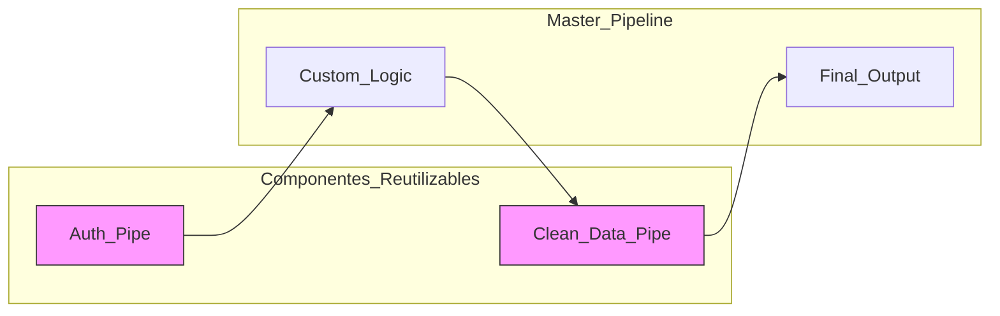

# YAML vs. Visual Nodes: The Engineering Case for Text-Based Workflows

*Por qué la infraestructura como código (IaC) debe llegar finalmente al mundo de la automatización de procesos.*

---

## El Espejismo de la Interfaz de Usuario

En los últimos diez años, la industria del software ha vivido una revolución silenciosa: la transición hacia el "Todo como Código" (Everything as Code). Terraform nos dio infraestructura como código, Kubernetes nos dio orquestación como configuración, y GitHub Actions nos dio CI/CD como YAML.

Sin embargo, hay un reducto que se resiste: la automatización de flujos de trabajo empresariales. Herramientas como **Make** siguen apostando por una interfaz de nodos visuales como su principal (y a veces única) forma de interacción.

A primera vista, un nodo visual es superior: es intuitivo, es colorido y reduce la carga cognitiva inicial. Pero para un ingeniero que debe mantener sistemas en producción, los nodos visuales son una **abstracción con fugas**. En este artículo, analizaremos por qué el enfoque basado en texto de **wpipe** es la elección racional para la ingeniería de pipelines moderna.

---

## 1. El Problema de la Densidad de Información

Un archivo YAML bien estructurado puede describir un flujo complejo en menos de una pantalla de texto. El mismo flujo en una interfaz de nodos requiere scroll horizontal, vertical y clics profundos para ver la configuración oculta dentro de cada burbuja.

En **wpipe**, la configuración YAML te permite ver la jerarquía del pipeline de un solo vistazo:

```yaml
pipeline_name: "OrderProcessing"
steps:
  - name: "Validate"
    type: "step"
  - name: "BranchLogic"
    type: "condition"
    expression: "total > 100"
    branch_true:
      - name: "ApplyDiscount"
        type: "step"
```

Esta densidad de información permite al cerebro humano detectar patrones y errores estructurales mucho más rápido que navegando por una interfaz gráfica. Es la diferencia entre leer un libro y tener que ir abriendo cajas para leer una frase en cada una.

---

## 2. Versionado Real vs. "Snapshots" Opacos

La mayor debilidad de las herramientas visuales como Make es su incompatibilidad con el ciclo de vida del software moderno.

### El Desafío del Git Diff
Cuando usas **wpipe**, tu pipeline vive en un repositorio Git. Si un compañero cambia una condición o añade un paso, el `git diff` te mostrará exactamente qué cambió:

```diff
- expression: "total > 100"
+ expression: "total > 150"
```

En una herramienta visual, no hay diff. Tienes que confiar en que la descripción de la versión sea precisa o intentar encontrar qué burbuja ha cambiado entre dos estados. Para un equipo que busca la certificación ISO 27001 o que trabaja en entornos regulados, la **auditabilidad** del texto es un requisito no negociable.

---

## 3. Modularidad y Composición

Las herramientas visuales sufren de un problema de "monolitismo gráfico". Es difícil extraer una parte de un escenario de Make y convertirla en una pieza reutilizable que se actualice automáticamente en todos los lugares donde se usa.

**wpipe** hereda la modularidad natural de Python y YAML. Puedes definir un pipeline como un componente y luego "anidarlo" dentro de otros pipelines.



Al ser texto, puedes importar tus pasos desde librerías compartidas. Si actualizas la lógica de autenticación en tu librería central, todos tus pipelines de wpipe se actualizan instantáneamente. En el mundo visual, tendrías que ir "escenario por escenario" actualizando burbujas.

---

## 4. El Coste del Context Switching

Para un desarrollador, cambiar entre su editor de código (VS Code, PyCharm) y una interfaz web para configurar la lógica de automatización es un golpe a la productividad. Cada vez que sales de tu entorno de desarrollo, pierdes acceso a:
- Copilotos de IA (GitHub Copilot, Cursor).
- Linters y analizadores estáticos.
- Tus propios snippets de código.
- Atajos de teclado personalizados.

**wpipe permite que la automatización ocurra donde vive el código.** No hay salto de contexto. Configuras tu pipeline en el mismo editor donde escribes tu lógica de negocio. Esta integración profunda reduce la fricción y acelera el ciclo de desarrollo.

---

## 5. El Factor de la Resiliencia: Checkpointing de Texto

Make y otras herramientas similares a menudo fallan en la persistencia de estado profunda. Si el servidor de Make tiene un hipo, tu ejecución puede quedar en un estado indeterminado.

**wpipe** utiliza el archivo YAML para definir los puntos de control (**Checkpoints**), pero la ejecución se apoya en una base de datos SQLite local. Esto significa que la "definición" (YAML) y el "estado" (SQLite) están desacoplados pero sincronizados.

Si decides mover tu pipeline de un servidor a otro, solo tienes que mover tu archivo YAML y tu base de datos SQLite. Es **portabilidad total**. No estás atado a la base de datos propietaria de un proveedor de servicios en la nube.

---

## Conclusión: La Automatización es Ingeniería

Es hora de dejar de tratar la automatización de procesos como una tarea secundaria que se resuelve "arrastrando cajas". La automatización es el tejido conectivo de la empresa moderna y, como tal, merece el mismo rigor que el desarrollo de la aplicación principal.

**wpipe** no intenta ser la herramienta más colorida del mercado. Intenta ser la más profesional. Al elegir YAML y Python sobre nodos visuales, estás eligiendo:
- **Auditabilidad** sobre opacidad.
- **Escalabilidad** sobre facilidad inicial.
- **Control** sobre dependencia del proveedor.

Si valoras la estabilidad a largo plazo y la cordura de tu equipo de ingeniería, el caso a favor de los flujos basados en texto es abrumador. Es hora de volver al código. Es hora de usar wpipe.

---

*Sobre el autor: William Rodriguez es Solutions Architect y promotor de las arquitecturas "Everything as Code". Cree que la mejor interfaz de usuario para un ingeniero es un archivo de texto bien estructurado y un sistema de control de versiones potente.*
