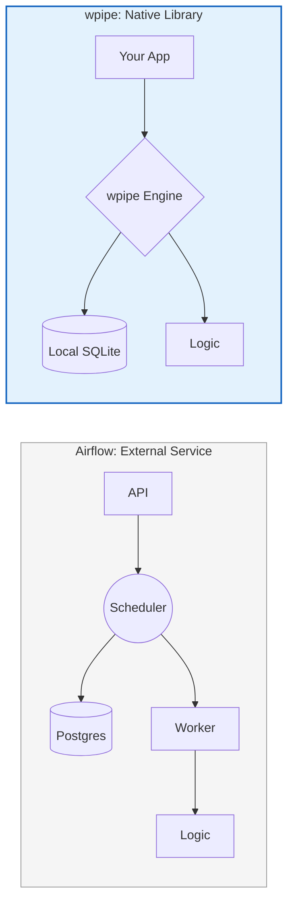

# 🔨 LinkedIn Post: wpipe — Embedded Orchestration for Modern Python 🐍

## 📌 Post Draft

**Headline: ¿Por qué desplegar un servicio completo cuando solo necesitas una librería robusta? Redefiniendo la Micro-Orquestación. ⚡**

**Apache Airflow** es la columna vertebral del Big Data. Pero en la era de los microservicios y el Edge Computing, la orquestación centralizada a menudo introduce una latencia y una complejidad de mantenimiento innecesarias.

Si tu pipeline no necesita miles de tareas distribuidas en un clúster de Kubernetes, quizás no necesites un orquestador como servicio. Necesitas **Orquestación Embebida**.

Aquí es donde **wpipe** cambia las reglas del juego.

### ⚔️ Paradigmas: Airflow (Servicio) vs. wpipe (Librería)

| Dimensión | Apache Airflow | wpipe |
| :--- | :--- | :--- |
| **Arquitectura** | Cliente-Servidor (Centralizado) | **Librería Nativa (Descentralizado)** |
| **Footprint** | GBs (Contenedores múltiples) | **MBs (Single process)** |
| **Persistencia** | Postgres/Redis Externo | **SQLite WAL (Zero-Config)** |
| **Latencia de Tarea** | Segundos (Scheduling overhead) | **Milisegundos (Ejecución directa)** |
| **Mantenimiento** | Alto (Actualizaciones de clúster) | **Nulo (Dependency management)** |

### 🛠️ ¿Por qué los arquitectos de microservicios están eligiendo wpipe?

1.  **Soberanía de Ejecución:** No dependes de un Scheduler externo. El orquestador vive dentro de tu aplicación. Si tu servicio está vivo, tu pipeline está vivo.
2.  **Resiliencia Determinística:** wpipe utiliza **Checkpoints atómicos** en SQLite. Si el proceso se interrumpe, retoma exactamente donde se quedó, con el estado intacto, sin necesidad de bases de datos externas pesadas.
3.  **Desarrollo en Tiempo Real:** Olvida las esperas de Docker. Escribe tu lógica, añade `@step` y ejecuta. El ciclo de feedback es instantáneo.

---

### 📊 The Embedded Advantage

---

**💡 El Veredicto Técnico:** 
No uses un martillo pilón para un clavo de precisión. Airflow es para Data Warehousing masivo. **wpipe** es para aplicaciones resilientes, microservicios y sistemas donde la simplicidad y el rendimiento son la prioridad.

Estandariza tu lógica de negocio con la potencia de un orquestador, pero con la ligereza de una librería. 🐍

👇 **¿En qué proyectos has sentido que la infraestructura del orquestador pesaba más que la propia lógica de negocio?**

#Python #SoftwareArchitecture #Microservices #Airflow #wpipe #DataEngineering #CloudNative #Performance

---

## 🎨 Guía de Engagement

1.  **Visual:** Una comparación visual de un stack de Airflow (muchos cubos) vs un solo bloque de wpipe integrado en una App.
2.  **Target:** Backend Developers, Arquitectos de Microservicios, SREs que buscan simplicidad.
3.  **Valor añadido:** En el primer comentario, explica cómo wpipe maneja el paralelismo sin necesidad de Celery o Redis.

---

## 🧠 Psicología Detrás del Post:
*   **Eficiencia:** Resalta la reducción de latencia y "overhead" como una ventaja técnica competitiva.
*   **Modernidad:** El término "Embedded Orchestration" suena a tendencia tecnológica avanzada.
*   **Pragmatismo:** Se enfoca en resolver el problema del mantenimiento, un punto de dolor constante para los DevOps.
