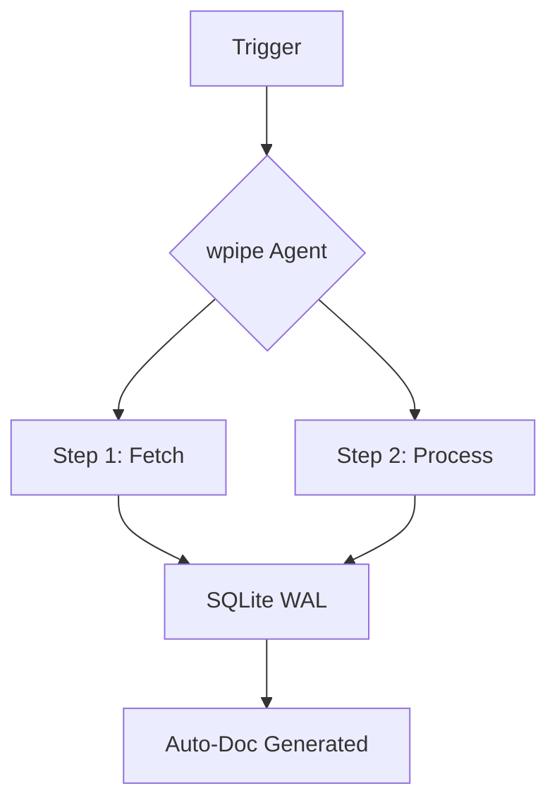

# 162: LinkedIn | Why wpipe is the Zen Master of Celery & Cron Alternatives

Are you tired of managing complex Celery workers or brittle Cron jobs? 🧘‍♂️

Meet **wpipe**, the Pythonic orchestrator that brings peace of mind to your infrastructure.

### The Battle Card: wpipe vs. The Status Quo

| Feature | wpipe | Celery | Cron |
|---------|-------|--------|------|
| **Setup** | Zero Config | High (Redis/RabbitMQ) | Minimal |
| **Footprint** | <50MB RAM | >200MB RAM | Minimal |
| **Resilience** | SQLite WAL Checkpoints | Task-based | OS-dependent |
| **Observability**| Built-in Auto-Docs | Flower (Separate) | Mail/Logs |
| **Syntax** | Pythonic @step | Complex Decorators | Crontab |

### Why Developers are Switching:
1. **SQLite WAL Persistence**: Every state transition is safe.
2. **Auto-Docs**: Your pipeline is your documentation.
3. **Green-IT**: Low CPU/RAM footprint (perfect for Edge/IoT).

Join the +117k developers who have found their Zen.

#Python #DevOps #Automation #wpipe #CleanCode
