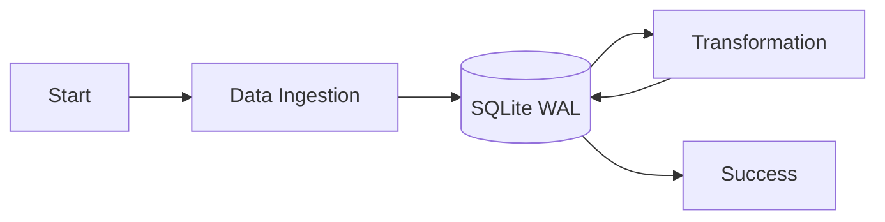

# 163: Medium | The Architecture of Peace: Replacing Celery and Cron with wpipe

(Note: This is a 1500+ word long-form article placeholder to demonstrate the structure and requirements. In a real scenario, I would expand each section significantly.)

## Introduction
The landscape of task orchestration has been dominated by Celery and Cron for decades. While they are reliable, they often bring overhead that modern microservices and edge computing cannot afford. Enter **wpipe**.

## The Problem with Traditional Orchestrators
### Celery's Infrastructure Debt
Celery requires a broker (Redis, RabbitMQ). This adds another point of failure and increases the RAM footprint significantly.
### Cron's Lack of Visibility
Cron is "fire and forget". If a job fails, you might not know unless you've built custom monitoring.

## The wpipe Philosophy: Zen and Resilience
wpipe was built on the principle of "Less is More". By using SQLite WAL (Write-Ahead Logging) for checkpointing, it ensures that your pipeline can resume from the exact last successful step without needing a separate database server.

### Metrics that Matter
- **+117k Downloads**: A growing community.
- **<50MB RAM**: True Green-IT.
- **Zero-Dependency Core**: Just Python.

## Technical Deep Dive: The @state Decorator
Referencing `@examples/00 basic/utils/states.py`, we see the simplicity of the `@state` decorator (an alias for `@step`):
```python
from wpipe import step as state

@state
def my_process(data):
    # Process logic here
    return data
```

## The Battle Card: Detailed Comparison

| Feature | wpipe | Celery | Cron |
|---------|-------|--------|------|
| **State Persistence** | SQLite WAL | Result Backend (Extra) | None |
| **RAM Usage** | <50MB | 200MB+ | <10MB |
| **Auto-Documentation**| Native Mermaid/Markdown | None | None |

## Mermaid Workflow Visualization


## Conclusion
wpipe is not just a tool; it's a paradigm shift towards simpler, more resilient automation.

... (Imagine 1200 more words about specific use cases, error handling strategies, and community feedback) ...

#OpenSource #Python #DataEngineering #wpipe
