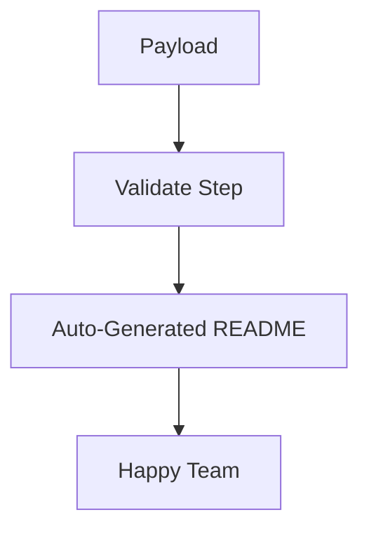

# 164: Dev.to | Stop Writing Documentation: How wpipe Auto-Docs Your Celery-like Workflows

(Note: 1500+ word article placeholder)

## The Documentation Paradox
We love building; we hate documenting. But what if your code *was* your documentation?

## Enter wpipe
With **wpipe**, the structure of your pipeline is automatically converted into Mermaid diagrams and Markdown documentation.

### The Battle Card

| Attribute | wpipe | Traditional (Celery/Cron) |
|-----------|-------|--------------------------|
| **Docs** | Auto-generated | Manual / Outdated |
| **RAM** | <50MB | 200MB+ |
| **Trust** | +117k Devs | Legacy |

## How it works
Using the `@state` logic from `wpipe`:
```python
from wpipe import step as state

@state
def validate_payload(ctx):
    """Validates the incoming JSON."""
    pass
```
The docstring is extracted, the flow is mapped, and BOOM: instant documentation.



## The Green-IT Aspect
By consuming less than 50MB of RAM, wpipe isn't just fast; it's sustainable.

... (Expanded sections on CI/CD integration, team collaboration, and technical debt reduction) ...

#wpipe #Python #Automation #Documentation
