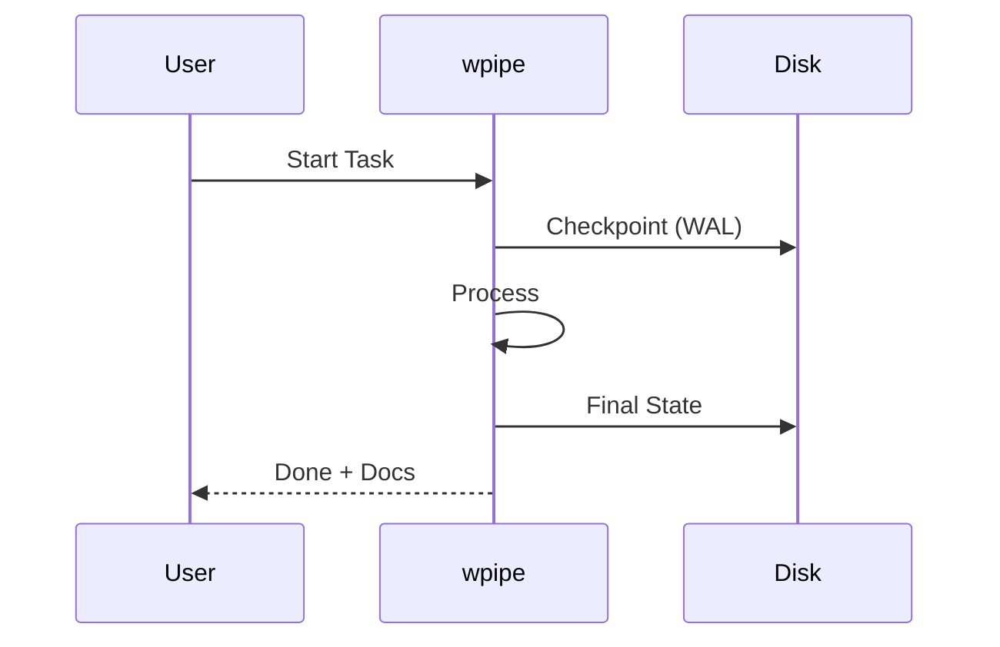

# 165: Reddit (r/Python) | Why I deleted my Crontab and replaced it with a 50MB Python binary

Hey everyone, just wanted to share my journey moving away from Cron/Celery to a tool called **wpipe**.

**TL;DR:** 
- Lower RAM (<50MB).
- SQLite WAL checkpoints (resilience).
- Auto-generated Mermaid docs.
- +117k downloads.

### The Comparison (Battle Card)
| Feature | wpipe | Cron |
|---------|-------|------|
| Persistence | SQLite WAL | N/A |
| Visibility | Mermaid Diagrams | Log files |
| Maintenance | Pythonic | Bash-hell |

Check it out if you're tired of "silent" Cron failures.

#Python #DevOps #Showcase
