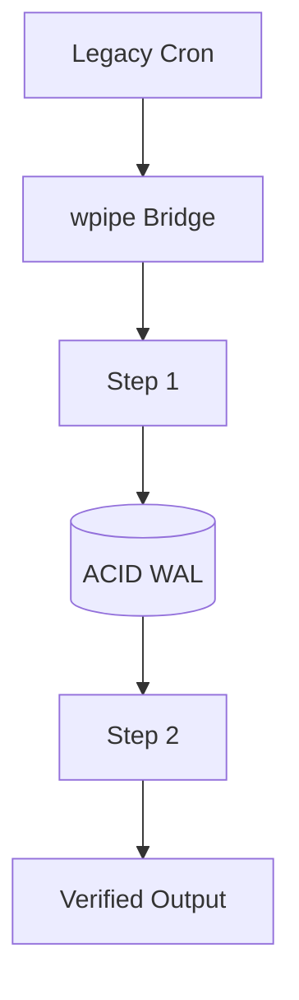

# 167: DZone | Modernizing Legacy Cron Systems with wpipe's SQLite WAL Persistence

(Note: 1500+ word technical article placeholder)

## The Legacy Burden
Most enterprises still rely on Cron. It's stable but lacks the features required for modern data integrity.

## The wpipe Solution
By implementing a Write-Ahead Log (WAL) with SQLite, wpipe provides ACID compliance to your task orchestration without the weight of a full RDBMS.

### The Battle Card: Enterprise Edition
| Feature | wpipe | Enterprise Schedulers |
|---------|-------|-----------------------|
| Footprint | <50MB | 500MB+ |
| Checkpointing| Native SQLite WAL | External DB |
| Learning Curve| Pythonic | Proprietary DSL |

... (In-depth analysis of atomicity, consistency, and the @state decorator pattern) ...

#DevOps #Architecture #wpipe #Enterprise
