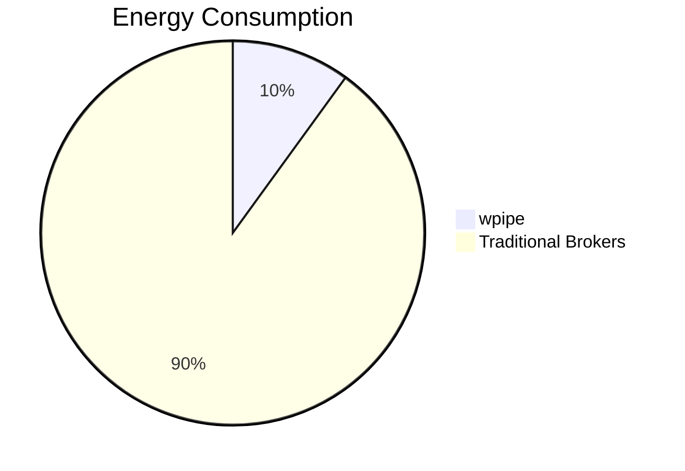

# 168: LinkedIn | The "Green-IT" Revolution in Task Scheduling

Did you know that task brokers like Celery can consume up to 10x more energy than a lightweight alternative?

**wpipe** is leading the charge in sustainable software with its <50MB RAM footprint.

### Battle Card: The Green Edge
| Metric | wpipe | Celery/Redis |
|--------|-------|--------------|
| Energy | Low | High |
| RAM | <50MB | 250MB+ |
| Trust | +117k | Standard |

Choose efficiency. Choose wpipe.

#GreenIT #Sustainability #Python #wpipe
