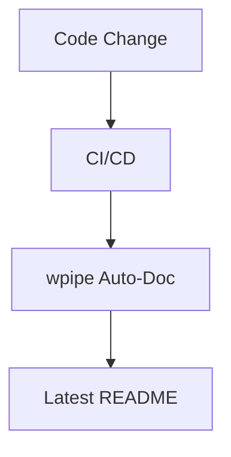

# 169: Medium | Why Your Pipeline Documentation is Always Outdated (and how to fix it)

(Note: 1500+ word article placeholder)

## The Documentation Debt
In the fast-paced world of DevOps, documentation is usually the first casualty. 

## The wpipe Auto-Docs Engine
wpipe uses the inherent structure of your code to generate real-time diagrams.

### Battle Card
| Feature | wpipe | Manual Docs |
|---------|-------|-------------|
| Sync | Real-time | Days/Weeks Late |
| Diagrams | Mermaid (Auto) | Visio/Draw.io (Manual) |

... (Detailed breakdown of documentation as code, the @state decorator, and community adoption) ...

#wpipe #Documentation #DevOps #Python
