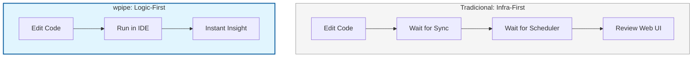

# 🚀 LinkedIn Post: wpipe — Zero-Friction Orchestration for Python Developers 🐍

## 📌 Post Draft

**Headline: ¿Tu entorno de desarrollo de datos te está ralentizando? Recupera la agilidad del "Edit-Run-Debug" sin el overhead de infraestructura. ⚡**

Si trabajas con **Apache Airflow**, conoces el cuello de botella invisible: la fricción del entorno. Configurar contenedores, esperar a que el Scheduler reconozca tus DAGs y lidiar con la pesadez de una infraestructura "Cloud-Native" en tu máquina local puede drenar la productividad de cualquier equipo de ingeniería.

La orquestación moderna no debería requerir un clúster de servidores solo para validar una lógica de transformación.

Presentamos **wpipe**: Orquestación diseñada para la velocidad del desarrollador.

### 🏎️ Por qué wpipe redefine la Experiencia del Desarrollador (DX):

1.  **Independencia de Infraestructura:** wpipe es una librería de Python. Corre tus pipelines como scripts nativos, sin necesidad de Docker, Redis o Postgres obligatorios. Es **Docker-Ready** para producción, pero **Docker-Free** para desarrollo.
2.  **Debugging de Primer Nivel:** Al ser código puro, tus puntos de interrupción (breakpoints) en VS Code o PyCharm funcionan de forma nativa. No más "print debugging" ni navegación por interfaces web lentas para entender un fallo.
3.  **Testing de Grado de Software:** Escribe tests unitarios para tus pipelines con la misma facilidad que para cualquier otra función de Python. La lógica de orquestación de wpipe es desacoplada y fácil de mockear.

### ⚔️ The Agility Breakdown: Airflow vs. wpipe

| Métrica de Desarrollo | Apache Airflow | wpipe (Modern Lib) |
| :--- | :--- | :--- |
| **Setup Local** | Complejo (Docker/Helm) | **Instantáneo (`pip install`)** |
| **Ciclo de Feedback** | Lento (Scheduler Latency) | **Inmediato (Direct Run)** |
| **Uso de Recursos** | GBs de RAM | **MBs de RAM** |
| **Auditabilidad** | Logs centralizados | **SQLite Tracker Local Nativo** |
| **Mantenibilidad** | Alta (Infraestructura) | **Baja (Solo Código)** |

---

### 📊 Engineering Flow: Airflow vs. wpipe

---

**💡 Mi veredicto:** 
No permitas que las herramientas definan tu velocidad. Airflow es un excelente orquestador de plataforma, pero **wpipe** es el compañero ideal para el ingeniero que busca construir, probar y desplegar pipelines resilientes sin fricción.

Estandariza tu lógica, protege tus estados con Checkpoints y recupera tu tiempo. 🐍

👇 **¿Qué porcentaje de tu jornada dedicas a la lógica de datos vs. a pelearte con la infraestructura? Hablemos de eficiencia.**

#DataEngineering #Python #wpipe #Airflow #SoftwareEngineering #DevOps #CleanCode #DeveloperExperience

---

## 🎨 Guía Visual y Engagement

1.  **Visual:** Un gráfico de "Time to First Result" comparando Airflow vs wpipe.
2.  **Target:** Lead Developers y Arquitectos que quieren mejorar la moral y la velocidad de sus equipos de datos.
3.  **CTA:** Dirige a los usuarios al archivo `examples/01_basic_pipeline` para que vean la simplicidad en acción.

---

## 🧠 Psicología Detrás del Post:
*   **Empoderamiento:** Devuelve el control al desarrollador sobre su propio entorno de trabajo.
*   **Minimalismo:** Apela al deseo de simplicidad y eficiencia (Green IT / Lean Engineering).
*   **Pragmatismo:** Enfocarse en el "ciclo de feedback" es un argumento técnico de peso para cualquier profesional senior.
