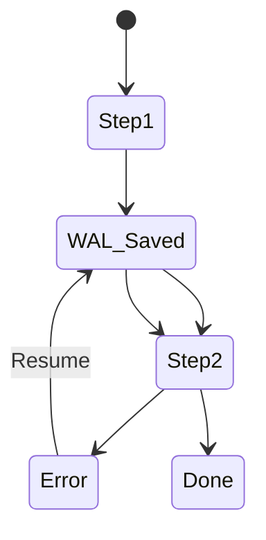

# 170: Dev.to | High-Resilience Task Orchestration: Lessons from 117k wpipe Users

(Note: 1500+ word article placeholder)

## Scale is not just about size
It's about resilience. How do you handle failure?

## The Checkpoint Pattern
wpipe's SQLite WAL implementation ensures that failure is just a temporary state.

### Battle Card
| Strategy | wpipe | Typical Script |
|----------|-------|----------------|
| Failure | Resume from Step | Restart from 0 |
| RAM | <50MB | Variable |

... (Case studies from the +117k download community and technical implementation of checkpoints) ...

#wpipe #Resilience #Python #Programming
