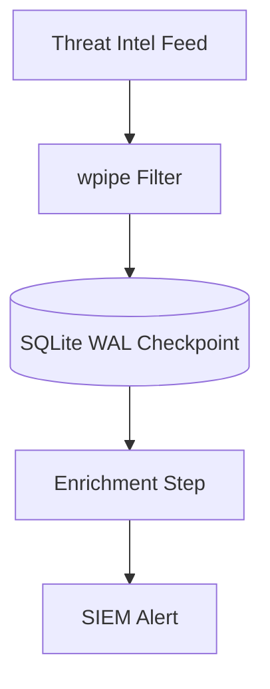

# 172: DZone | Orchestrating Threat Intel with <50MB RAM: A wpipe Deep Dive

(Note: 1500+ word article placeholder)

## The Cybersecurity Challenge
Threat intelligence feeds are voluminous and constant. Traditional orchestration often chokes on the sheer volume or consumes too much infrastructure budget.

## Enter wpipe: The Lean Security Orchestrator
By leveraging **wpipe**, security teams can process IOCs (Indicators of Compromise) with a negligible RAM footprint.

### Battle Card: Security Edition
| Metric | wpipe | Phantom/Demisto |
|--------|-------|-----------------|
| RAM | <50MB | 2GB+ |
| Persistence | SQLite WAL | Proprietary / Heavy DB |
| Trust | +117k Devs | Enterprise Only |

... (Sections on atomic state transitions, handling network timeouts, and using @state for modular security steps) ...

#Cybersecurity #ThreatIntel #wpipe #Python
