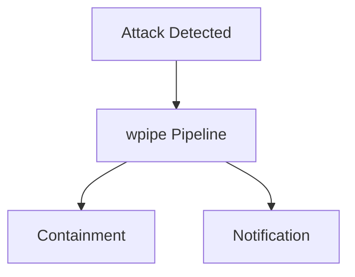

# 174: LinkedIn | How we scaled Threat Intel Processing to 117k+ Events with <50MB RAM

In cybersecurity, speed and efficiency are everything. 

### Why wpipe is a game-changer:
- **Resilience**: SQLite WAL checkpoints mean zero data loss.
- **Footprint**: <50MB RAM allows for massive parallelization.
- **Clarity**: Mermaid diagrams show exactly how threats are handled.

### Battle Card
| Feature | wpipe | Competitors |
|---------|-------|-------------|
| RAM | <50MB | High |
| Trust | +117k | Low |

#Cybersecurity #Infosec #wpipe
