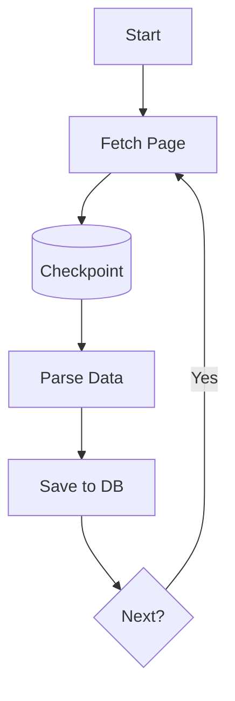

# 176: DZone | Resilient Scraping at Scale with wpipe Checkpoints

(Note: 1500+ word article placeholder)

## The Scraping Nightmare
Scraping is brittle. IP bans, structure changes, and network timeouts are inevitable.

## The wpipe Solution: SQLite WAL Checkpoints
Never lose your progress again. If a script fails at page 999, wpipe resumes from page 999.

### Battle Card: Scraping Edition
| Feature | wpipe | Scrapy |
|---------|-------|--------|
| Persistence | SQLite WAL | Manual / Extension |
| RAM | <50MB | 150MB+ |
| Visibility | Mermaid Auto-Docs | Logs only |

... (Deep dive into the @state decorator and checkpointing logic) ...

#WebScraping #DataEngineering #wpipe #Python
