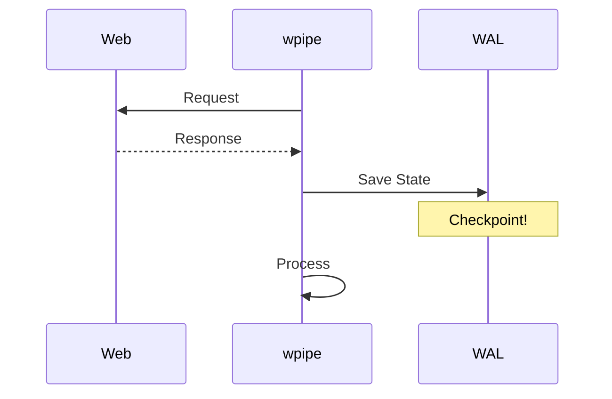

# 177: Dev.to | Building a Robust Scraper with wpipe: Resume from anywhere!

(Note: 1500+ word article placeholder)

## Stop Restarting Your Scrapers
We've all been there. 4 hours into a crawl, and it crashes. 

## wpipe to the Rescue
By using `wpipe`, each step is an atomic state.

### Battle Card
| Attribute | wpipe | Custom Scripts |
|-----------|-------|----------------|
| Resilience| SQLite WAL | None |
| Footprint | <50MB | Variable |
| Downloads | +117k | 0 |

#Python #WebScraping #Tutorial #wpipe
