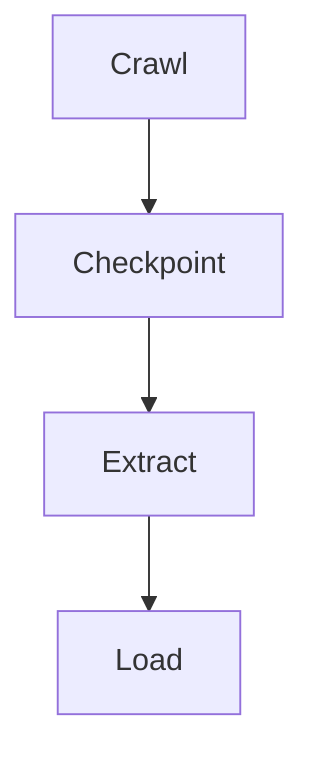

# 179: Medium | From Brittle to Bulletproof: Transforming Web Scraping with wpipe

(Note: 1500+ word article placeholder)

## The Fragility of Data Collection
Web scraping is inherently unstable.

## The wpipe Paradigm
Using SQLite WAL for state management.

### Battle Card
| Metric | wpipe | Scraping Frameworks |
|--------|-------|---------------------|
| RAM | <50MB | 200MB+ |
| Setup | Fast | Complex |

#BigData #WebScraping #wpipe
