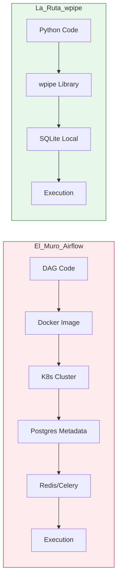

# The Over-Engineered Pipeline: Why Airflow is Overkill for 90% of your Tasks

*Cómo la industria del Big Data nos convenció de que necesitábamos un portaaviones para cruzar un río de 10 metros, y cómo wpipe nos devolvió la agilidad.*

---

## La Paradoja de la Infraestructura Moderna

Hubo un tiempo en que "mover datos" significaba escribir un script de Python, poner un `cron job` y olvidarse del asunto. Pero entonces llegó la era del Big Data, y con ella, la necesidad de orquestación. Apache Airflow se convirtió en el estándar de facto, la "navaja suiza" que todo ingeniero de datos debía dominar.

Y no me malinterpreten: Airflow es una obra maestra de la ingeniería. Si eres Netflix o Airbnb y tienes miles de DAGs (Directed Acyclic Graphs) interconectados, con dependencias cruzadas entre equipos y petabytes de datos, Airflow es tu mejor amigo.

Pero para el resto de nosotros —los que trabajamos en startups, en departamentos de BI de medianas empresas o en proyectos de IA que necesitan pipelines ágiles— Airflow se ha convertido en una fuente constante de frustración y sobre-ingeniería. Hemos caído en la trampa de creer que, si no es complejo, no es profesional.

---

## El Coste Oculto de la "Solución Estándar"

Imagina que quieres automatizar un proceso sencillo: extraer datos de una API de marketing, transformarlos ligeramente y cargarlos en un Data Warehouse.

### El Escenario Airflow
Para poner esto en producción con Airflow, primero debes enfrentarte a su infraestructura. Necesitas un clúster de Kubernetes o, al menos, una instancia potente con Docker. Debes configurar una base de datos Postgres para el metadato, un servidor web para la interfaz, un planificador (scheduler) para las tareas y, posiblemente, Redis o RabbitMQ si quieres escalabilidad con Celery.

De repente, tu script de Python de 50 líneas está rodeado por un ecosistema de infraestructura que requiere mantenimiento, parches de seguridad y monitoreo constante. Has pasado de ser un ingeniero de datos a ser un administrador de sistemas a tiempo parcial.

### El Escenario wpipe
Aquí es donde la filosofía de **wpipe** rompe con el status quo. wpipe no asume que eres una empresa de Fortune 500 con un presupuesto infinito de infraestructura. Asume que eres un ingeniero que quiere **resultados fiables, rápido**.

Con wpipe, el orquestador es una librería que vive dentro de tu código. No hay servidor web que mantener, no hay Postgres que configurar. La persistencia se maneja nativamente con **SQLite en modo WAL**, lo que significa que tienes toda la potencia de la orquestación industrial en un archivo local ultra-rápido.

---

## El Problema del Desarrollo Local (The "Docker Tax")

Pregunta a cualquier ingeniero de datos qué es lo que más odia de Airflow, y la respuesta será casi siempre la misma: **desarrollar localmente**.

Intentar correr Airflow en tu laptop es un ejercicio de paciencia. Tienes que levantar una infraestructura pesada que consume gigas de RAM y calienta tu procesador antes de que hayas escrito la primera línea de lógica. Si quieres debuggear una tarea, tienes que bucear entre los logs del contenedor o intentar configurar integraciones complejas con tu IDE.

**wpipe elimina el "Impuesto Docker".** Al ser una librería nativa de Python, puedes usar el depurador de VS Code o PyCharm de forma natural. Puedes poner puntos de interrupción, inspeccionar el contexto de tu pipeline en tiempo real y ver exactamente qué está pasando sin esperar a que un Scheduler detecte cambios en tu archivo DAG.

Esta velocidad de iteración no es solo un lujo; es la diferencia entre entregar un proyecto en una semana o en un mes.

---

## Resiliencia sin Complejidad: El Poder de los Checkpoints

La gran promesa de Airflow es que, si una tarea falla, puedes reintentarla. Pero Airflow maneja esto a nivel de proceso completo. Si tu tarea es un proceso largo que hace varias cosas, Airflow no sabe qué partes se completaron con éxito y cuáles no, a menos que dividas tu DAG en cientos de tareas minúsculas, lo que añade aún más complejidad visual y de gestión.

**wpipe introduce los Checkpoints Nativos.** Puedes definir puntos de control dentro de tu lógica de Python. Si el proceso se interrumpe por una caída del servidor o un error de red, wpipe sabe exactamente en qué estado estaban tus datos gracias a su persistencia en SQLite. Al reiniciar, el `CheckpointManager` restaura el estado y retoma la ejecución desde el último punto seguro.

Es la robustez de Airflow, pero con la granularidad y simplicidad de una librería local.

---

## Cuándo dar el salto (o cuándo dar un paso atrás)

Como arquitectos, nuestra responsabilidad es elegir la herramienta adecuada para el trabajo, no la herramienta más popular en Twitter.

### Usa Airflow si:
- Tienes un equipo de DevOps dedicado a mantener la infraestructura de datos.
- Gestionas dependencias complejas entre cientos de equipos diferentes.
- Necesitas una interfaz web para que usuarios no técnicos disparen procesos.
- Tu volumen de DAGs justifica el coste de mantenimiento.

### Usa wpipe si:
- Quieres pipelines que simplemente funcionen, sin configurar servidores externos.
- Valoramos la velocidad de desarrollo y la facilidad de testing.
- Trabajas en entornos donde la RAM y el CPU son recursos valiosos (ej. Edge Computing, microservicios ligeros).
- Necesitas que tus automatizaciones vivan dentro de tu repositorio de código principal, no en una plataforma separada.
- Buscas una solución **Git-friendly** donde cada cambio sea auditable y fácil de revertir.

---

## Conclusión: Volviendo a la Ingeniería Esencial

La industria se ha movido hacia la complejidad por inercia. Hemos aceptado que para hacer ingeniería de datos de calidad, necesitamos herramientas que requieran un máster solo para instalarlas.

**wpipe** es un recordatorio de que la elegancia en la ingeniería a menudo viene de la eliminación de lo innecesario. No necesitas un portaaviones para cruzar un río de 10 metros; necesitas un puente sólido. wpipe es ese puente. Es ligero, es resiliente y, sobre todo, respeta tu tiempo como desarrollador.

Es hora de dejar de pelearse con la infraestructura y volver a lo que realmente importa: **los datos**.

---

*William Rodriguez es un Senior Solutions Architect que cree firmemente en la simplicidad radical. A través de su experiencia diseñando sistemas de datos, ha aprendido que la herramienta más potente no es siempre la más grande, sino la que mejor se adapta al flujo de trabajo humano.*
