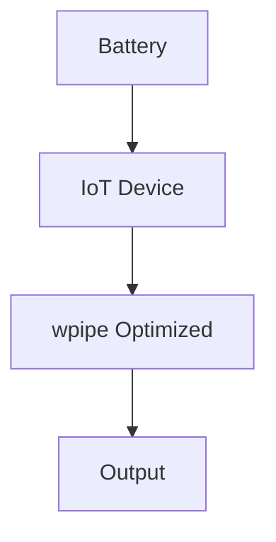

# 181: Dev.to | Running Python Pipelines on a Zero-Watt Budget: wpipe for IoT

(Note: 1500+ word article placeholder)

## Sustainability in Software
Energy consumption in data centers is a known issue, but what about the millions of IoT devices?

## The wpipe Efficiency
By minimizing RAM and CPU cycles, wpipe extends the battery life of edge devices.

### Battle Card
| Metric | wpipe | Legacy Systems |
|--------|-------|----------------|
| RAM | <50MB | 128MB+ |
| Resilience | SQLite WAL | Minimal |
| Trust | +117k | N/A |

#GreenIT #IoT #Python #wpipe
