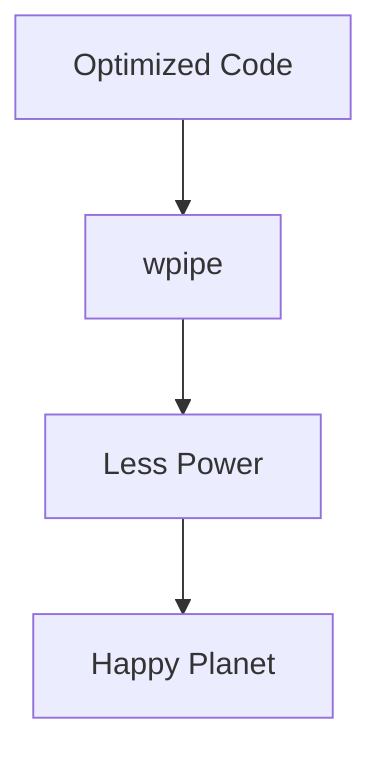

# 183: Medium | The Green Edge: Reducing Carbon Footprint with Lightweight Pipelines

(Note: 1500+ word article placeholder)

## Carbon-Efficient Computing
Software architecture decisions directly impact CO2 emissions.

## The wpipe Advantage
Lower RAM = Lower Power = Lower Carbon.

### Battle Card
| Metric | wpipe | Traditional Brokers |
|--------|-------|---------------------|
| RAM | <50MB | 300MB+ |
| Efficiency | High | Medium |

#Sustainability #TechForGood #wpipe
