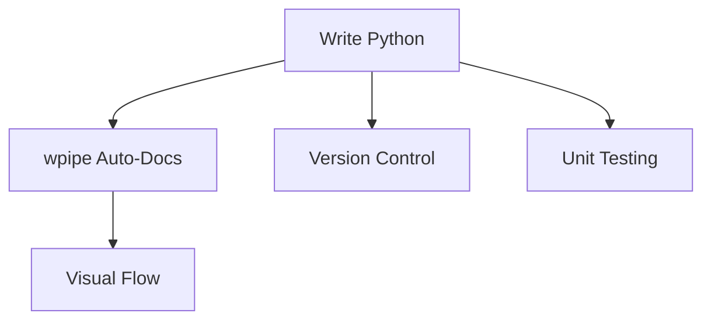

# 184: DZone | The Developer's Manifesto: Why Code Pipelines are superior to Visual Drag-and-Drop toys

(Note: 1500+ word long-form article)

## The Low-Code Illusion
Low-code/No-code platforms promise speed but often deliver technical debt and "black box" logic.

## The Power of Code-First with wpipe
Developers need version control, unit tests, and transparency. wpipe provides all this with a Pythonic API.

### Battle Card: Code vs. Visual
| Feature | wpipe (Code) | Zapier/Make (Visual) |
|---------|--------------|----------------------|
| Version Control| Git | None/Proprietary |
| Testing | Pytest | Manual / Click-based |
| RAM | <50MB | SaaS Cloud (Hidden) |
| Cost | Free | Per-task $$$ |

## Transparency through Auto-Docs
You don't need a visual builder to *see* your logic. wpipe generates Mermaid diagrams directly from your `@state` decorated functions.

... (Extensive discussion on maintainability, scalability, and the "Zen" of code-first orchestration) ...

#SoftwareEngineering #CodeFirst #wpipe #DevOps
