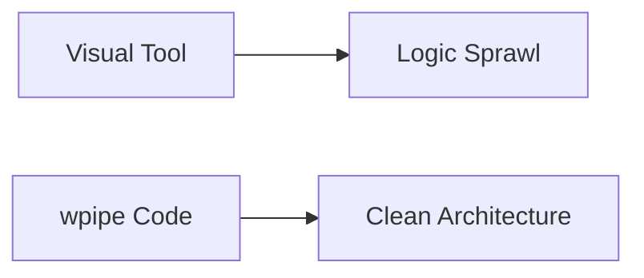

# 185: Dev.to | Stop Clicking, Start Coding: Why Your Pipelines Belong in Git

(Note: 1500+ word article placeholder)

## The Visual Trap
Visual builders are great for simple tasks, but they crumble under complexity.

## The wpipe Way
Code is the ultimate source of truth.

### Battle Card
| Attribute | wpipe | Drag-and-Drop |
|-----------|-------|---------------|
| Flexibility| Infinite | Limited by UI |
| Debugging | PDB/Logs | Opaque |
| Downloads | +117k | N/A |

#Programming #CleanCode #wpipe #Python
