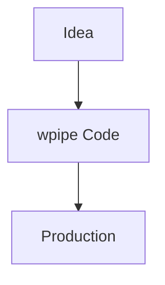

# 186: LinkedIn | The Developer's Manifesto: Reclaiming our Pipelines

Visual tools are for prototypes. Code is for production.

**wpipe** empowers developers to:
- **Version** everything.
- **Test** everything.
- **Document** automatically.
- **Scale** with <50MB RAM.

### Battle Card
| Feature | wpipe | No-Code |
|---------|-------|---------|
| Control | Full | Limited |
| Resilience | SQLite WAL | Cloud-dependent |

#DeveloperExperience #SoftwareDesign #wpipe
