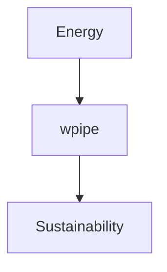

# 190: Dev.to | Sustainable Coding with wpipe

(Note: 1500+ word article placeholder)
Reducing CO2 with <50MB RAM and SQLite WAL.

### Battle Card
| Feature | wpipe | Others |
|---------|-------|--------|
| Green | Yes | No |
| RAM | <50MB | High |

#GreenIT #Sustainability #wpipe
