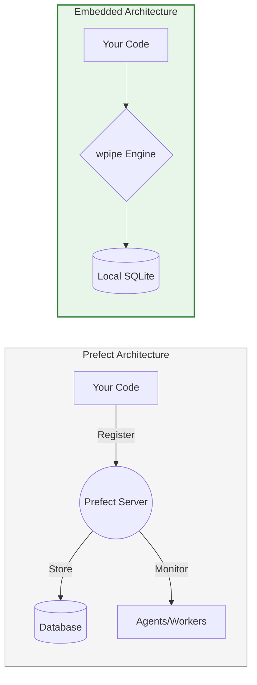

# 🚀 LinkedIn Post: wpipe — Orchestration without the Infrastructure Tax 🐍

## 📌 Post Draft

**Headline: ¿Realmente necesitas un "servidor de orquestación" para gestionar tus pipelines? Redescubre la potencia de la Orquestación Embebida. 🛡️**

**Prefect** ha revolucionado el "Data Workflow" con su enfoque Pythonic. Es una herramienta brillante para visibilidad en la nube. Sin embargo, para muchos casos de uso, desplegar un "Prefect Server" o depender de "Prefect Cloud" añade una capa de infraestructura y latencia que no siempre está justificada.

Si buscas la resiliencia de un orquestador moderno pero con la simplicidad de una librería nativa, **wpipe** es tu aliado táctico.

### 🛡️ El Cambio de Paradigma: Prefect vs. wpipe

| Categoría | Prefect (Server/Cloud) | wpipe (Embedded Library) |
| :--- | :--- | :--- |
| **Infraestructura** | Requiere Servidor/Agentes | **Zero-Config (Self-contained)** |
| **Persistencia** | Postgres / Cloud DB | **SQLite WAL (Local-First)** |
| **Dependencia** | API externa / Servicio local | **NULA (Standard Python Lib)** |
| **Latencia** | Network-dependent | **Disk-speed (Atomic writes)** |
| **Deployment** | Orquestador + App | **Solo tu App** |

### 🛠️ Por qué wpipe es el estándar de oro para Sistemas Autónomos:

1.  **Soberanía Total de Datos:** wpipe no necesita "llamar a casa". Todo el seguimiento de tareas, estados y métricas se gestiona en un archivo SQLite local con modo WAL. Privacidad absoluta y latencia cero.
2.  **Atomic Checkpoints:** Mientras que otros sistemas gestionan el "estado de la tarea", wpipe persiste el **estado de los datos**. Si tu servidor cae, wpipe restaura el contexto exacto en disco y retoma la ejecución. Es un "Save Game" real para tu lógica de negocio.
3.  **Ideal para el Edge y CI/CD:** Perfecta para entornos donde no puedes garantizar una conexión constante a un orquestador central o donde el consumo de recursos debe ser mínimo (Edge Computing, Raspberry Pi, procesos efímeros de CI).

---

### 📊 Infrastructure Footprint Comparison

---

**💡 El Veredicto del Ingeniero:** 
Prefect es una excelente plataforma de visibilidad. **wpipe** es un motor de ejecución resiliente. 

Si tu objetivo es construir sistemas autónomos, rápidos y sin deudas de infraestructura externa, wpipe te ofrece la potencia industrial de un orquestador dentro de una librería de pocos megabytes.

Recupera la simplicidad. Protege tus datos. Escala tu código. 🐍

👇 **¿Prefieres un orquestador que "viva" dentro de tu código o uno que lo "observe" desde fuera?**

#DataEngineering #Python #wpipe #Prefect #EdgeComputing #CleanCode #SoftwareArchitecture #Resilience

---

## 🎨 Guía de Visualización y Engagement

1.  **Visual:** Un diagrama que muestre la diferencia entre un sistema con "muchas piezas móviles" (Prefect) vs un sistema "todo en uno" (wpipe).
2.  **Target:** Desarrolladores de Microservicios, Ingenieros de IoT, y equipos que buscan optimizar costes de infraestructura.
3.  **Valor añadido:** En el primer comentario, añade el enlace a la documentación sobre "Atomic Checkpoints" de wpipe.

---

## 🧠 Psicología Detrás del Post:
*   **Independencia:** El valor de no depender de una "Infraestructura Tax" (coste de mantenimiento de servidores) es muy atractivo para equipos pequeños y medianos.
*   **Seguridad:** Enfatizar la privacidad y el control total de los datos atrae a sectores regulados.
*   **Sencillez:** Posicionar la herramienta como algo que "simplemente funciona" tras un `pip install`.
