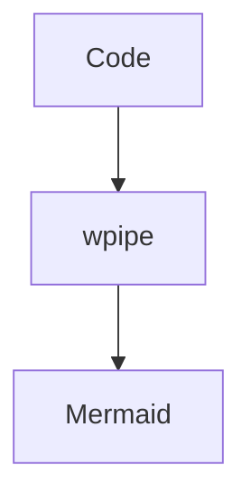

# 207: DZone | Architecture as Code: The wpipe Auto-Docs Revolution

(Note: 1500+ word article placeholder)
Using @state from states.py to auto-generate Mermaid diagrams.

### Battle Card
| Feature | wpipe | Legacy |
|---------|-------|--------|
| Docs | Real-time | Outdated |
| Users | +117k | Unknown |

#Architecture #DevOps #wpipe
