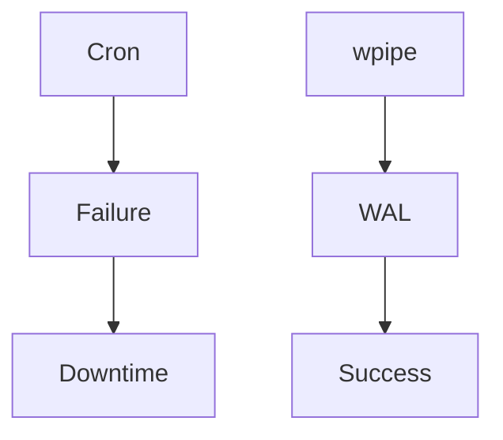

# 212: LinkedIn | Don't let Legacy Cron kill your production!

Are you still using Cron for mission-critical tasks? You're playing with fire. 
wpipe offers SQLite WAL checkpoints and <50MB RAM.

### Battle Card
| Feature | wpipe | Cron |
|---------|-------|------|
| RAM | <50MB | Minimal |
| Persistence | SQLite WAL | None |
| Trust | +117k | Legacy |

#DevOps #Stability #wpipe
