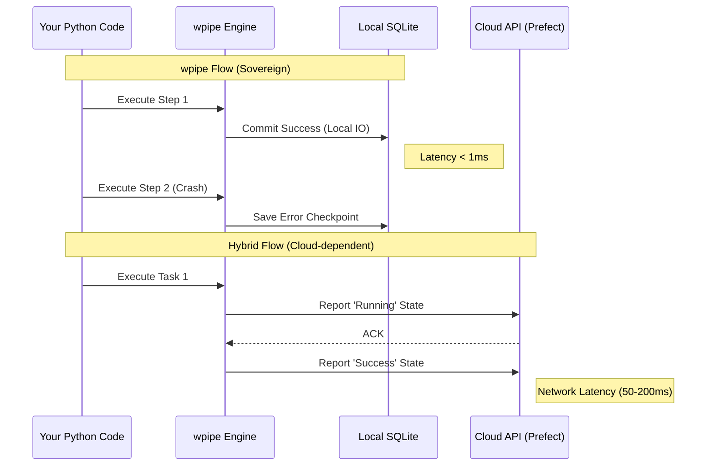

# The State Machine Dilemma: Why Prefect's Model might be Over-Engineered for Your Project

*Subtitle: When the overhead of managing state becomes more complex than the data logic it aims to protect. A case for wpipe.*

---

## The Promise of Modernity

If you’ve been in the data engineering world in the last three years, you’ve heard of **Prefect**. It’s marketed as the "Modern Data Stack" orchestrator, and for good reason. Its "Code as Tasks" approach is a breath of fresh air compared to the rigidity of Airflow DAGs. Prefect allows you to write almost normal Python, add a few decorators, and suddenly you have retries, tracking, and a beautiful cloud UI.

It’s seductive. It’s elegant. But there’s a hidden cost that doesn't appear on the pricing page: the **Cognitive and Architectural Complexity of the Hybrid Model**.

In this article, we’ll explore why for many projects—especially those valuing autonomy, local speed, and simplicity—Prefect's model can be a classic case of over-engineering, and how **wpipe** offers a more pragmatic, sovereign alternative.

---

## 1. The Labyrinth of States

Prefect is built on a sophisticated state machine. A task doesn't just "run" or "fail." It can be `Scheduled`, `Pending`, `Running`, `Retrying`, `Success`, `Failed`, `Cancelled`, `Crashed`... and the list goes on.

For a systems architect, this sounds like glory. You have granular control over every millisecond of your task's lifecycle. But for the developer who just wants to move data from point A to point B reliably, this state machine becomes a labyrinth.

### The Cloud Friction
Prefect's hybrid model means your code runs on your infrastructure, but the "brain" (the state server) often lives in Prefect Cloud. Every time a task changes state, it must "call home."

This introduces three fundamental bottlenecks:
1.  **Network Latency:** Every step in your pipeline adds a small network penalty. In flows with thousands of small tasks, this accumulates into significant overhead.
2.  **External Dependency:** If the Prefect API experiences latency or downtime, your local pipelines are affected, even if your data and code are perfectly healthy.
3.  **Debugging Complexity:** Trying to understand why a task skipped from `Running` to `Crashed` often requires diving into agent logs and cloud states, rather than just looking at a local stack trace.

---

## 2. wpipe: The Philosophy of Sovereign Resilience

Faced with Prefect's cloud-dependent state machine, **wpipe** proposes a much more grounded model: **Native SQLite-backed Checkpoints**.

In wpipe, there is no external API to communicate with. There is a high-performance SQLite database (operating in WAL mode for maximum concurrency) that records the ground truth of what’s happening in your CPU.

### Orchestration Sovereignty
We call this "Sovereign Resilience" because it depends on no one but your own system. If step 5 of your pipeline fails, wpipe saves the current context to your local database. Upon restarting the script, the engine reads that SQLite file and resumes execution. It’s instantaneous, deterministic, and requires zero internet connection to function.

---

## 3. The Myth of "Zero-Infrastructure"

Prefect is often sold as a "no-infra" solution. "Just install the library and go." But the moment you want your flows to be resilient and scheduled, you find yourself managing:
-   **Agents** running in the background.
-   **Work Pools** and **Workers** to be configured.
-   **API Key** management and secrets rotation.
-   Possibly a **Prefect Orion** server if you want to avoid their cloud.

In the end, you’ve built an orchestration infrastructure—just with more modern names.

**wpipe is truly zero-infrastructure.** There are no agents, no servers, no API calls. A simple `pip install wpipe` is all you need for industrial-grade orchestration. Your infrastructure *is* your Python script. This makes wpipe ideal for:
-   **Ephemeral Microservices:** Where you don't want to register a flow every time a container boots.
-   **Edge Computing:** Where resources are limited and internet connectivity is unreliable.
-   **Development Speed:** Where you want results now, not after configuring a work pool.

---

## 4. The "Save Game" Pattern vs. State Management

For an engineer, simplicity is a safety feature. The fewer moving parts a system has, the fewer ways it has to fail.

Prefect’s approach of managing states in the cloud is powerful for visualization but adds moving parts. **wpipe’s** approach of using **Checkpoints** is pragmatic. It’s the "Save Game" pattern from gaming: you save your progress at a safe point, and if you "die," you go back there.

In wpipe, a checkpoint isn't just a record of "success." It’s an **atomic serialization of context**. If your pipeline was handling a complex data object, wpipe ensures that the data state is preserved on disk. You have a local time machine for your data.

---

## 5. When is Prefect the Right Choice? (and when is it not?)

We aren't saying Prefect is a bad tool. It’s fantastic for specific scenarios:
-   If you need a **Centralized Dashboard** for an entire data team to monitor hundreds of flows from a browser.
-   If you operate in a purely **Cloud-Native environment** where network latency is negligible compared to the benefits of centralized management.

But, **if you are a developer who values:**
1.  **Privacy:** Your data and execution logs never leave your server.
2.  **Local Speed:** You want to debug with F5 in your IDE, not by scrolling through logs in a web UI.
3.  **Simplicity:** You want orchestration without the ceremony of agents, pools, and clouds.

Then **wpipe** is the tool that allows you to scale without the weight of over-engineering.

## Conclusion: Returning to Pragmatism

Data orchestration has gone through a phase of exploding complexity. We have tried to solve "workflow" problems with "massive infrastructure" solutions. 

**wpipe** represents a return to pragmatism. By focusing on local resilience, native checkpoints, and deep integration with Python (without cloud dependencies), wpipe puts the power back into the developer's hands. 

You don't need a state machine in the cloud to ensure your data process finishes successfully. You need a solid local checkpoint engine. You need wpipe.

---

*About the author: William Rodriguez is a Solutions Architect who has seen too many projects die under the weight of misapplied "modern" tools. With wpipe, he advocates for data engineering that is, above all, useful and maintainable.*
