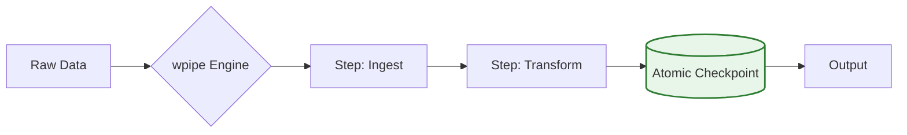

# 🌿 WPipe vs. Luigi: Sustainable Orchestration for the Modern Dev

¿Tu orquestador está consumiendo más energía y recursos que la propia lógica de datos? 🔋 En un mundo que camina hacia el **Green IT**, la eficiencia no es una opción, es una responsabilidad.

**Luigi** fue pionero, pero su arquitectura centralizada y su alto consumo de RAM pertenecen a otra época. Para proyectos de microservicios, IoT o pipelines ágiles, necesitas un motor que sea potente pero invisible.

### ⚔️ Battle Card: WPipe vs. Luigi

| Feature | WPipe | Luigi |
| :--- | :---: | :---: |
| **RAM Footprint** | **< 50MB** | > 2GB |
| **Persistence** | **SQLite WAL (Sovereign)** | Central Scheduler |
| **Deployment** | **Zero-Infra (Library)** | Server-Dependent |
| **Green-IT** | 🌱 High Efficiency | 🔋 Resource Heavy |

### 🛠️ La Elegancia del Decorador `@step`

WPipe simplifica la orquestación. No heredes de clases complejas; simplemente decora tu lógica de Python pura.

```python
from wpipe import step, Pipeline

@step(name="DataIngestion", version="v1.2")
def ingest(data: dict):
    # Pure Python logic, clean and testable
    return {"status": "success", "payload": data}

# Your pipeline lives inside your app
pipe = Pipeline(pipeline_name="SensorSync")
pipe.set_steps([ingest])
pipe.run({})
```

### 📊 Observabilidad Forense Integrada

Con WPipe, cada ejecución genera un rastro en una base de datos SQLite local. No más logs efímeros; tienes un historial inmutable de cada transformación.



Con más de **+117k instalaciones**, WPipe demuestra que la potencia industrial no requiere infraestructuras pesadas. Es hora de hacer que tu código sea más ligero, más rápido y más resiliente.

👇 **¿Prefieres un orquestador que "pese" en tu servidor o uno que "vuele" con tu código?**

#GreenIT #Python #DataEngineering #wpipe #Luigi #Sustainability #CleanCode #DevOps
