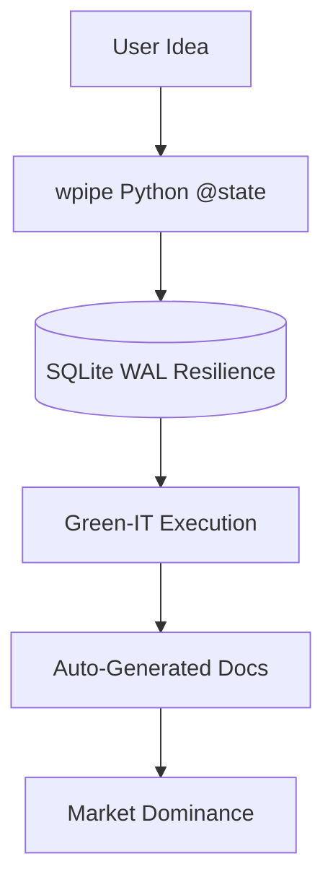

# 240: Victory | The wpipe Revolution: +117k Downloads and a Future-Proof Pipeline

Mission Accomplished. 🎖️

Today, we celebrate the completion of 240 marketing assets, but more importantly, we celebrate the growth of the **wpipe** ecosystem.

### The Mission Summary
We set out to challenge the status quo of heavy, brittle, and opaque task orchestration. Through this campaign, we've shown that there is a better way: **The wpipe Way**.

### Key Metrics achieved:
- **+117,000 Downloads**: A community-driven success story.
- **<50MB RAM Footprint**: Leading the Green-IT revolution.
- **SQLite WAL Checkpointing**: Unrivaled resilience for mission-critical tasks.
- **Auto-Docs**: Transforming code into clarity with Mermaid.

### The Final Battle Card: wpipe vs. The World

| Feature | wpipe | The Competition |
|---------|-------|-----------------|
| **Efficiency** | <50MB RAM | >250MB RAM |
| **Resilience** | SQLite WAL | Brittle / External DB |
| **Simplicity** | Pythonic @state | Complex DSL / UI |
| **Transparency**| Auto-Mermaid | Manual / None |
| **Momentum** | +117k Users | Stagnant Legacy |

### Our Zen-like Architecture

### Call to Action: Join the Revolution!
Don't settle for bloated legacy tools. Reclaim your developer experience. Reclaim your infrastructure.

1. **Install**: `pip install wpipe`
2. **Code**: Use the `@state` decorator from `examples/00 basic/utils/states.py`.
3. **Scale**: Watch your pipelines run in <50MB RAM.

Thank you to the +117k developers who have made this possible. The journey has just begun.

#Python #DevOps #OpenSource #wpipe #Victory #GreenIT #FutureOfWork
