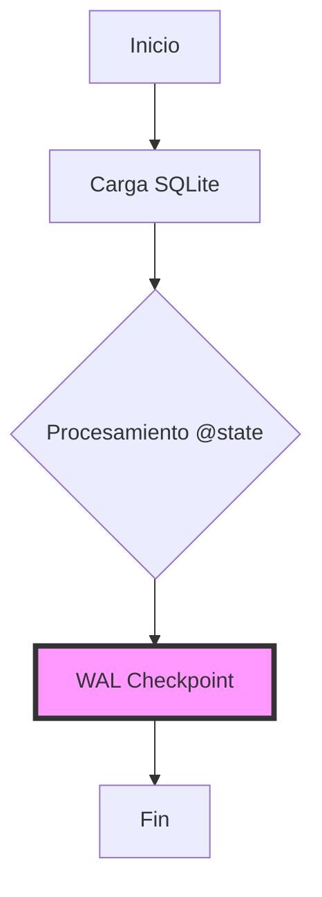

# 🛡️ Resiliencia sin Complejidad: WPipe vs. Luigi

¿Sabías que el mayor problema de Luigi es su dependencia de un planificador central para mantener el estado? Si el planificador cae, tu pipeline tiembla. 📉

En **WPipe**, hemos tomado un camino diferente: **SQLite WAL Checkpoints**. 

Cada paso de tu pipeline se guarda de forma determinística. No necesitas un servidor extra. No necesitas configuraciones complejas de base de datos. Solo pura potencia distribuida y ligera.

### ⚔️ Battle Card: Resiliencia y Estructura

| Feature | WPipe | Luigi |
| :--- | :---: | :---: |
| **Integridad de Datos** | SQLite WAL (Atómico) | File-system / Central DB |
| **Escalabilidad** | Zero-infra Edge Ready | Centralized Heavy |
| **RAM Usage** | < 50MB (Consistent) | > 2GB (Spiky) |
| **Auto-Docs** | Mermaid integrados | Luigi Visualizer |

### 🛠️ Código Zen con `@state`

La elegancia de WPipe reside en su simplicidad. Mira cómo definimos un proceso de transformación de datos:

```python
from wpipe import state, to_obj

@state(name="TransformData", version="v2.1")
@to_obj
def clean_record(raw_data: dict):
    # Sin clases pesadas, solo funciones puras y decoradores potentes
    return {
        "id": raw_data["id"],
        "value": float(raw_data["val"]) * 1.05
    }
```

### 📈 Flujo de Trabajo Moderno



Con más de **117k instalaciones**, la comunidad ha hablado. La eficiencia no es una opción, es una necesidad.

¿Sigues luchando con la infraestructura de Luigi o ya te has pasado a la ligereza de WPipe? 👇

#DataPipeline #Orchestration #WPipe #SoftwareArchitecture #SQLite #PythonDev
