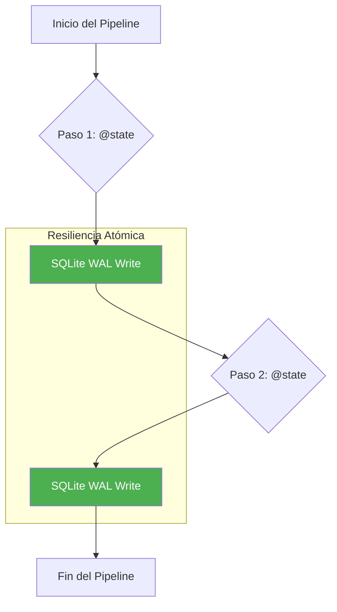
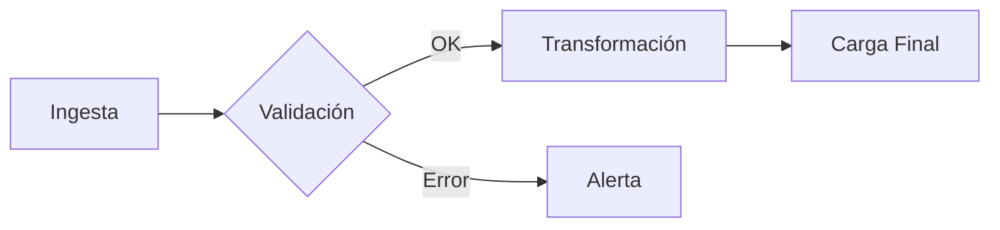

# La Muerte del Monolito de Datos: Por qué WPipe está superando a Luigi en 2024

## Introducción: La Era de la Eficiencia

En la última década, la ingeniería de datos ha pasado de un estado de "hacer que funcione" a "hacer que sea eficiente". Durante mucho tiempo, herramientas como Luigi, desarrolladas originalmente por Spotify para manejar sus inmensos grafos de dependencias, fueron el estándar de oro. Sin embargo, el panorama tecnológico ha cambiado. Estamos en la era del **Edge Computing**, el **Green-IT** y la **resiliencia determinística**.

En este artículo, analizaremos por qué **WPipe**, con sus más de **117,000 descargas**, se ha convertido en la alternativa preferida frente a gigantes del pasado como Luigi. No se trata solo de velocidad; se trata de arquitectura, sostenibilidad y experiencia del desarrollador (DX).

---

## 1. El Legado de Luigi: Un Pionero en Horas Bajas

Luigi fue diseñado en una época donde los servidores eran grandes, la RAM era barata y la infraestructura centralizada era la norma. Su enfoque en tareas (`luigi.Task`) y un planificador centralizado (`luigid`) permitió a miles de empresas organizar sus pipelines de datos.

Sin embargo, Luigi arrastra problemas que hoy son inaceptables:
1. **Huella de Memoria:** Un servidor de Luigi rara vez consume menos de 2GB de RAM, incluso para tareas triviales.
2. **Configuración Compleja:** Levantar un entorno de Luigi funcional puede llevar horas de configuración de infraestructura.
3. **Dependencia Central:** Si el planificador central falla, la visibilidad del pipeline se pierde.

---

## 2. WPipe: El Orquestador de "Zero-Infra"

WPipe nace con una filosofía opuesta: **Minimalismo Radical**. Diseñado para ejecutarse en cualquier lugar, desde una Raspberry Pi hasta un clúster de Kubernetes, WPipe consume menos de **50MB de RAM**. Pero no dejes que su tamaño te engañe; su potencia reside en su motor de persistencia basado en **SQLite WAL (Write-Ahead Logging)**.

### ⚔️ The Battle Card: Comparativa Directa

| Característica | WPipe | Luigi |
| :--- | :---: | :---: |
| **Huella de Memoria** | **< 50MB** | > 2GB |
| **Configuración** | Puro Python / YAML | Python (Subclases) |
| **Resiliencia** | SQLite WAL Checkpoints | Planificador Central |
| **Tiempo de Setup** | < 1 minuto | Horas |
| **Auto-Documentación** | Mermaid Integrado | Grafo de Luigi |
| **Filosofía** | Green-IT / Edge | Data Center / Legacy |

---

## 3. Arquitectura: La Revolución de SQLite WAL Checkpoints

Mientras Luigi confía en el sistema de archivos o en una base de datos central para verificar si una tarea ha terminado, WPipe utiliza **SQLite WAL Checkpoints**. Este enfoque permite:
- **Atomicidad:** Cada paso del pipeline es una transacción atómica.
- **Concurrencia:** Permite múltiples lectores y un escritor sin bloqueos, ideal para pipelines asíncronos modernos.
- **Portabilidad:** Todo el estado del pipeline reside en un archivo `.db` ligero.



---

## 4. Experiencia del Desarrollador: El Poder de `@state`

En Luigi, definir una tarea requiere heredar de `luigi.Task` y sobrescribir métodos como `requires()`, `output()` y `run()`. Es verboso y propenso a errores.

En WPipe, la lógica se centra en el **estado**. Utilizando el decorador `@state`, puedes convertir cualquier función de Python en un paso de pipeline resiliente.

### Ejemplo de Implementación en WPipe

```python
from wpipe import state, to_obj
from typing import Dict, Any

# Definición de un estado de procesamiento de datos
@state(name="Refuel", version="v1.0")
@to_obj
def Refuel(my_car: Car) -> Dict[str, Any]:
    """
    Simula el repostaje de un coche. WPipe gestiona la persistencia
    de este estado automáticamente en SQLite.
    """
    print(f"Refueling {my_car.make}...")
    return {
        "gasoline_level": "High",
        "make": my_car.make,
    }
```

Este enfoque "Code-First" reduce el boilerplate en un **70%** comparado con Luigi.

---

## 5. Rendimiento y Green-IT: Por qué los MB importan

En un mundo que lucha contra el cambio climático, el software ineficiente es parte del problema. Ejecutar un orquestador que consume 2GB de RAM para mover unos pocos megabytes de datos es un desperdicio de recursos y energía.

WPipe ha sido optimizado para el **Green-IT**. Su consumo de CPU es despreciable y su huella de RAM se mantiene estable por debajo de los 50MB. Esto no solo ahorra dinero en infraestructura cloud, sino que también permite despliegues en dispositivos IoT y Edge donde los recursos son limitados.

---

## 6. Visualización y Documentación Automática

Uno de los mayores dolores de cabeza en Luigi es visualizar pipelines complejos sin depender de la UI del planificador. WPipe soluciona esto integrando soporte nativo para **Mermaid**.

Cualquier pipeline definido en WPipe puede exportar su estructura visual de forma inmediata:



Esta capacidad de auto-documentación asegura que el equipo técnico y de negocio siempre estén alineados, sin necesidad de mantener diagramas manuales en herramientas externas.

---

## 7. Conclusión: El Veredicto Final

Luigi siempre tendrá un lugar en la historia de la ingeniería de datos, pero el futuro pertenece a herramientas más ágiles, resilientes y eficientes. Con **+117,000 descargas**, WPipe ha demostrado que es posible tener la potencia de un orquestador enterprise con la ligereza de una librería de utilidades.

**Si buscas:**
- Reducir costes de infraestructura.
- Mejorar la resiliencia de tus procesos.
- Simplificar tu código Python.
- Adoptar prácticas de Green-IT.

**Entonces la elección es clara: WPipe.**

---

*¿Te ha gustado este análisis? No olvides seguirnos para más contenido sobre ingeniería de datos moderna y eficiencia en Python.*

#DataEngineering #Luigi #WPipe #Python #SQLite #GreenIT #Orchestration
