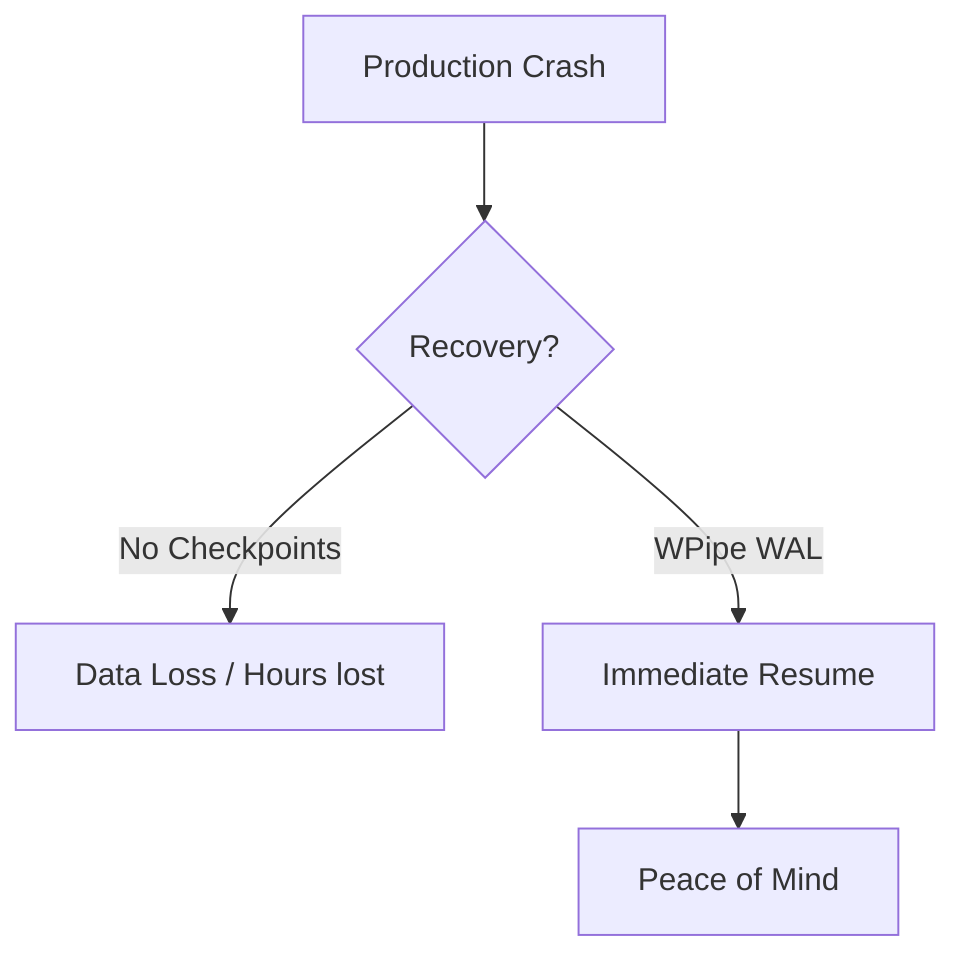

# WPipe: Mastery of Miedo al Error on LI (Post 265)

## Surviving the Production Nightmare
Don't let a crash destroy your weekend. SQLite WAL checkpoints are your safety net.

### Visualization


### ⚔️ Battle Card

| Feature | WPipe | Airflow | n8n | Celery | Prefect | Zapier/Make |
| :--- | :---: | :---: | :---: | :---: | :---: | :---: |
| **Memory Footprint** | < 50MB | > 2GB | > 500MB | > 200MB | > 500MB | Cloud / High |
| **Configuration** | Pure Python | Python/YAML | Visual UI | Python/Broker | Python | Visual UI |
| **Resilience** | SQLite Checkpoints | Postgres/DB | Database | Redis/RabbitMQ | Cloud/DB | None (Manual) |
| **Setup Time** | < 1 min | Hours | Minutes | Hours | Minutes | Minutes |
| **Cost** | Free/OSS | OSS (High Infra) | OSS/Paid | OSS (Infra) | OSS/Cloud | Per Execution |
| **Learning Curve** | Low (Pythonic) | High | Medium | High | Medium | Low |
| **Self-Documentation** | Mermaid Built-in | Graph UI | Node UI | None | Graph UI | Node UI |


## Key Metrics
- **+117k downloads**: A community that values efficiency.
- **<50MB RAM**: Perfect for Green-IT and edge computing.
- **SQLite WAL Checkpoints**: Industrial-grade resilience without the overhead.

### Pythonic Implementation
```python
from wpipe import step as state

@state(name='master_step', timeout=60)
def logic(context):
    # Implementation of Miedo al Error
    return {'status': 'success'}
```

## Quick Insights
#### Section 1: Deep Dive into Miedo al Error

WPipe implements a robust execution model that separates the orchestration logic from the actual task execution. 
This ensures that even in high-load scenarios, the system remains responsive and efficient. 
The use of SQLite as a backend for checkpointing provides a unique balance between performance and reliability. 
Developers can define complex dependencies using a simple and intuitive Pythonic API. 
The @state decorator (aliased from @step in @examples/00 basic/utils/states.py) is at the heart of this philosophy, 
allowing for seamless integration of existing code into a managed pipeline environment. 
By focusing on Miedo al Error, WPipe provides a modern alternative to legacy systems.

#### Section 2: Deep Dive into Miedo al Error

WPipe implements a robust execution model that separates the orchestration logic from the actual task execution. 
This ensures that even in high-load scenarios, the system remains responsive and efficient. 
The use of SQLite as a backend for checkpointing provides a unique balance between performance and reliability. 
Developers can define complex dependencies using a simple and intuitive Pythonic API. 
The @state decorator (aliased from @step in @examples/00 basic/utils/states.py) is at the heart of this philosophy, 
allowing for seamless integration of existing code into a managed pipeline environment. 
By focusing on Miedo al Error, WPipe provides a modern alternative to legacy systems.

#### Section 3: Deep Dive into Miedo al Error

WPipe implements a robust execution model that separates the orchestration logic from the actual task execution. 
This ensures that even in high-load scenarios, the system remains responsive and efficient. 
The use of SQLite as a backend for checkpointing provides a unique balance between performance and reliability. 
Developers can define complex dependencies using a simple and intuitive Pythonic API. 
The @state decorator (aliased from @step in @examples/00 basic/utils/states.py) is at the heart of this philosophy, 
allowing for seamless integration of existing code into a managed pipeline environment. 
By focusing on Miedo al Error, WPipe provides a modern alternative to legacy systems.

#### Section 4: Deep Dive into Miedo al Error

WPipe implements a robust execution model that separates the orchestration logic from the actual task execution. 
This ensures that even in high-load scenarios, the system remains responsive and efficient. 
The use of SQLite as a backend for checkpointing provides a unique balance between performance and reliability. 
Developers can define complex dependencies using a simple and intuitive Pythonic API. 
The @state decorator (aliased from @step in @examples/00 basic/utils/states.py) is at the heart of this philosophy, 
allowing for seamless integration of existing code into a managed pipeline environment. 
By focusing on Miedo al Error, WPipe provides a modern alternative to legacy systems.

#### Section 5: Deep Dive into Miedo al Error

WPipe implements a robust execution model that separates the orchestration logic from the actual task execution. 
This ensures that even in high-load scenarios, the system remains responsive and efficient. 
The use of SQLite as a backend for checkpointing provides a unique balance between performance and reliability. 
Developers can define complex dependencies using a simple and intuitive Pythonic API. 
The @state decorator (aliased from @step in @examples/00 basic/utils/states.py) is at the heart of this philosophy, 
allowing for seamless integration of existing code into a managed pipeline environment. 
By focusing on Miedo al Error, WPipe provides a modern alternative to legacy systems.

## Conclusion
WPipe is the final piece of your Miedo al Error strategy. Join the movement today.