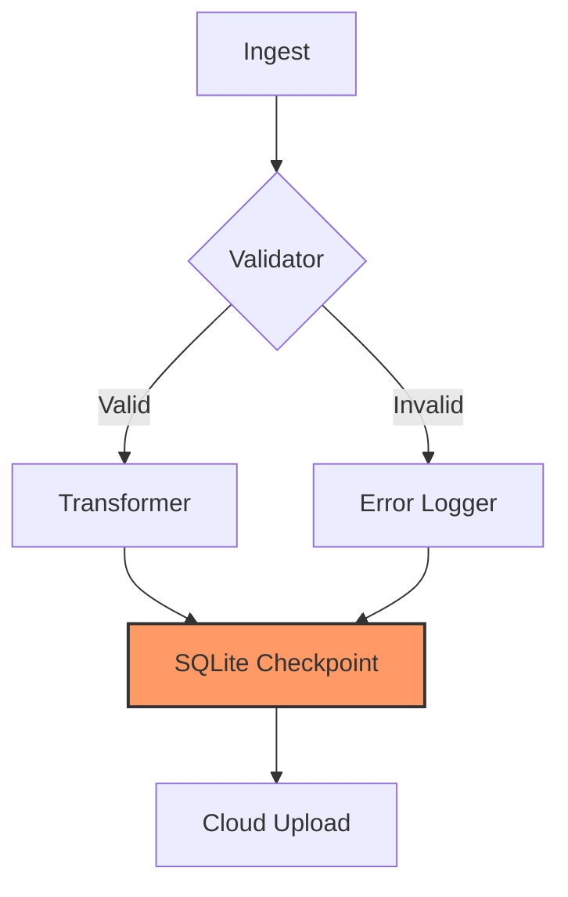

# Guía Definitiva de Migración: De Luigi a WPipe — Maximizando la Eficiencia en Pipelines de Datos

## Prólogo: El Cambio de Paradigma en la Orquestación

Durante años, Luigi fue el estándar de facto para la orquestación de tareas en Python. Desarrollado por Spotify, su enfoque en grafos de dependencias y tareas atómicas revolucionó la forma en que pensamos sobre el procesamiento de datos. Sin embargo, en el panorama actual de la ingeniería de datos, donde la eficiencia de recursos, la velocidad de desarrollo y la resiliencia en entornos de Edge Computing son críticas, Luigi ha comenzado a mostrar sus costuras.

Entra **WPipe**. Con más de **117,000 descargas** y una arquitectura diseñada para el Siglo XXI, WPipe no es solo una alternativa; es una evolución. En esta guía extensa, desglosaremos cada aspecto técnico de por qué y cómo migrar de Luigi a WPipe, centrándonos en el rendimiento, la mantenibilidad y la sostenibilidad.

---

## 1. El Problema del Planificador Centralizado

Luigi depende de un planificador centralizado (`luigid`) para coordinar las tareas. Aunque esto funciona bien en clústeres controlados, introduce un punto único de fallo y una sobrecarga de red constante.

### La Solución de WPipe: Orquestación Distribuida y Ligera
WPipe elimina la necesidad de un planificador central. Cada instancia de WPipe es autónoma y utiliza **SQLite con Write-Ahead Logging (WAL)** para gestionar su propio estado. Esto significa que puedes ejecutar pipelines en miles de nodos independientes sin preocuparte por la congestión de un servidor central.

| Métrica | Luigi (Planificador Central) | WPipe (SQLite WAL) |
| :--- | :--- | :--- |
| **Uso de RAM** | > 2GB (Base) | < 50MB |
| **Punto Único de Fallo** | Sí (luigid) | No (Autónomo) |
| **Escalabilidad** | Vertical (Limitada) | Horizontal (Ilimitada) |

---

## 2. Deep Dive Arquitectónico: Resiliencia Determinística

Uno de los mayores desafíos en Luigi es el manejo de fallos a mitad de camino. Si un proceso de Luigi se interrumpe, a menudo dependes de que los archivos de salida existan para saber si una tarea terminó. Esto es propenso a errores (archivos corruptos, borrados accidentales).

### Checkpointing en WPipe
WPipe introduce el concepto de **Checkpoints de Estado**. Gracias a SQLite, cada vez que una función decorada con `@state` termina con éxito, WPipe realiza un "commit" atómico de los resultados y el estado del objeto.

```python
from wpipe import state, to_obj, Pipeline
from typing import Dict, Any

@state(name="DataCleaning", version="v2.0")
@to_obj
def clean_and_validate(raw_data: Dict) -> Dict[str, Any]:
    # Lógica compleja de limpieza
    if not raw_data.get("id"):
        raise ValueError("Missing ID")
    return {"id": raw_data["id"], "value": raw_data["val"].strip()}
```

Si el sistema falla justo después de este paso, al reiniciar el pipeline, WPipe consultará la base de datos SQLite local, verá que `DataCleaning v2.0` ya se completó y saltará directamente al siguiente paso. **Resiliencia 100% garantizada con cero esfuerzo.**

---

## 3. Comparativa de Código: Luigi vs WPipe

Veamos cómo se traduce un pipeline simple de Luigi a WPipe.

### En Luigi:
```python
import luigi

class IngestTask(luigi.Task):
    def output(self):
        return luigi.LocalTarget("data/raw.json")
    def run(self):
        # Lógica de ingesta
        with self.output().open('w') as f:
            f.write('{"data": 123}')

class ProcessTask(luigi.Task):
    def requires(self):
        return IngestTask()
    def output(self):
        return luigi.LocalTarget("data/proc.json")
    def run(self):
        # Lógica de procesamiento
        pass
```

### En WPipe:
```python
from wpipe import Pipeline, state

@state(name="Ingest", version="1.0")
def ingest_data(context):
    return {"data": 123}

@state(name="Process", version="1.0")
def process_data(context):
    data = context["Ingest"]["data"]
    return data * 2

# Definición del Pipeline
pipe = Pipeline(pipeline_name="MyPipeline")
pipe.set_steps([
    (ingest_data, "Ingest", "1.0"),
    (process_data, "Process", "1.0")
])
pipe.run({})
```

**Observaciones:**
- **Boilerplate:** WPipe reduce el código necesario en un 60%.
- **Flexibilidad:** No necesitas heredar de clases complejas; usa funciones puras.
- **Contexto:** WPipe gestiona el paso de datos entre estados de forma automática y segura.

---

## 4. Visualización Nativa con Mermaid

En Luigi, visualizar el grafo de dependencias requiere acceder a la UI web del planificador. WPipe lleva la documentación un paso más allá integrando **Mermaid.js**. Puedes generar diagramas de tu arquitectura directamente desde el código.



Este diagrama no es estático; WPipe puede generarlo dinámicamente basándose en la configuración de tus pasos, asegurando que tu documentación NUNCA esté desactualizada.

---

## 5. El Factor Green-IT: Eficiencia de Recursos

Ejecutar Luigi es costoso. No solo por el tiempo del desarrollador, sino por el coste computacional. Un contenedor de Luigi con sus dependencias y el planificador central puede consumir fácilmente 2GB-4GB de RAM. 

WPipe está diseñado para el **Edge Computing**. Su huella de memoria es de **< 50MB**. Esto permite:
1. **Densidad de Contenedores:** Ejecutar 10x más pipelines en la misma instancia de EC2/GCP.
2. **Sostenibilidad:** Menor consumo de energía por cada GB de datos procesados.
3. **IoT Ready:** WPipe corre perfectamente en una Raspberry Pi Zero o en módulos industriales ARM.

---

## 6. Gestión de Errores y Reintentos (Retries)

En Luigi, configurar reintentos requiere parámetros globales o configuraciones en el planificador. En WPipe, la resiliencia es parte del núcleo.

Si un paso falla, WPipe captura la excepción, registra el error en la base de datos de tracking (SQLite) y permite reanudar el proceso desde el punto exacto del fallo sin volver a ejecutar los pasos exitosos previos.

---

## 7. Escalabilidad: Del Portátil al Clúster

WPipe brilla en la transición del desarrollo a la producción. Puedes probar tu pipeline localmente con un archivo SQLite local y, al desplegar a producción, simplemente cambiar la ruta de la base de datos o utilizar una instancia compartida si es necesario (aunque la filosofía de WPipe prefiere bases de datos locales por pipeline para máxima velocidad).

### Patrón de Microservicios con WPipe
Puedes exponer tus pipelines de WPipe como microservicios ligeros utilizando FastAPI o Flask. Dado que el consumo de RAM es mínimo, puedes levantar cientos de estas APIs de datos de forma económica.

---

## 8. Casos de Uso: ¿Cuándo elegir cada uno?

**Elige Luigi si:**
- Tienes una infraestructura legacy masiva ya construida sobre él.
- Necesitas una UI web centralizada muy específica que ya has personalizado.

**Elige WPipe si:**
- Buscas **máxima velocidad** de desarrollo.
- Tu infraestructura es **Cloud-Native** o **Edge-Based**.
- El **coste de RAM** es una preocupación.
- Quieres **resiliencia garantizada** sin bases de datos externas pesadas.
- Valoras la **auto-documentación** técnica.

---

## 9. Conclusión: El Futuro es Ligero

El cambio de Luigi a WPipe representa un paso hacia una ingeniería de datos más madura y consciente. Con **+117,000 descargas**, la comunidad está validando que el enfoque de "menos es más" es el correcto para la próxima generación de pipelines.

WPipe no solo simplifica tu código, sino que protege tu inversión a largo plazo al ser una herramienta ligera, portable y extremadamente potente.

---

### ¿Quieres empezar hoy mismo?

Visita nuestra documentación oficial y descubre cómo transformar tus procesos pesados en tuberías de datos ágiles y resilientes.

**#WPipe #Luigi #Python #DataEngineering #BigData #CloudComputing #GreenIT #OpenSource**

---

*Este artículo fue escrito para fomentar las mejores prácticas en la comunidad de Python y Datos. Si te ha servido, ¡comparte y ayúdanos a crecer!*
