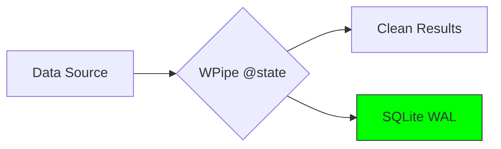

# 💎 WPipe vs. Dagster: ¿Es "Asset-Based" siempre lo mejor?

Dagster ha hecho un gran trabajo con su enfoque basado en activos (Assets), pero ¿a qué coste? Para muchos proyectos, la infraestructura necesaria para correr Dagster es simplemente demasiado pesada. 🏋️‍♂️

**WPipe** ofrece una alternativa "Code-First" que prioriza la ligereza y la resiliencia sin necesidad de complejos IO Managers.

### ⚔️ Battle Card: WPipe vs. Dagster

| Feature | WPipe | Dagster |
| :--- | :---: | :---: |
| **RAM Usage** | **< 50MB** | > 500MB |
| **Setup** | instantáneo | moderado |
| **Resilience** | SQLite WAL | DB / IO Managers |
| **Edge Ready** | ✅ Sí | ❌ Difícil |

### 🛠️ Simplicidad con `@state`

En lugar de definir complejos grafos de activos, en WPipe te enfocas en el estado de tu pipeline:

```python
from wpipe import state, to_obj

@state(name="DataAnalysis", version="v1.0")
@to_obj
def analyze(data: dict):
    # Procesa tus datos con total confianza
    return {"score": sum(data.values()) / len(data)}
```

### 📊 Documentación Visual Directa



Con **+117k descargas**, WPipe demuestra que puedes tener una orquestación profesional con una fracción de los recursos.

¿Prefieres la complejidad de los activos o la simplicidad del estado? 👇

#Dagster #WPipe #DataEngineering #Python #Efficiency #Microservices
