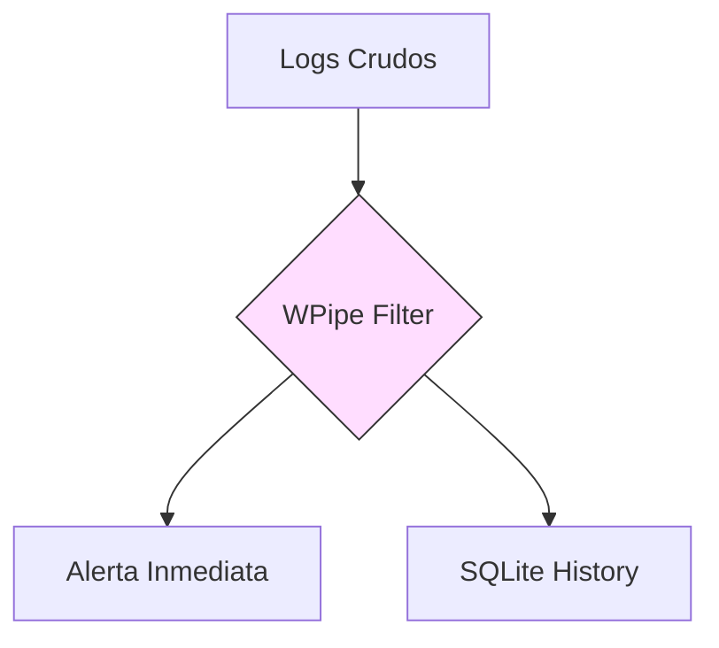

# 🚀 Libertad de Infraestructura: Por qué WPipe gana al "Edge" frente a Dagster

Dagster es excelente para la observabilidad de datos, pero intentar correrlo en un entorno de recursos limitados (Edge) es una pesadilla de dependencias y consumo de memoria. 📉

**WPipe** ha sido diseñado desde cero para ser agnóstico a la infraestructura. ¿Quieres correrlo en un servidor cloud masivo? Perfecto. ¿En una Raspberry Pi al borde de un sensor? También.

### ⚔️ Battle Card: Flexibilidad

| Feature | WPipe | Dagster |
| :--- | :---: | :---: |
| **Footprint de Memoria** | **< 50MB** | > 500MB |
| **Resiliencia** | SQLite Local WAL | PostgreSQL / Cloud |
| **Curva de Aprendizaje** | Baja (Pythonic) | Media/Alta |
| **Auto-Docs** | Mermaid integrados | Dagster UI (Dagit) |

### 🛠️ Codifica más, configura menos

Con el decorador `@state`, tu lógica de negocio es la protagonista, no la configuración del orquestador.

```python
from wpipe import state

@state(name="FilterLogs", version="v1.2")
def filter_critical(logs: list):
    # Sin necesidad de definir entradas/salidas complejas de Dagster
    return [log for log in logs if log['level'] == 'CRITICAL']
```

### 📈 Flujo Transparente



Únete a los **+117k usuarios** que ya han optimizado sus tuberías de datos. La eficiencia no es solo ahorrar dinero, es salvar tiempo.

¿Te quedas con el gigante Dagster o prefieres la agilidad de WPipe? ⚡

#Python #EdgeComputing #WPipe #Dagster #OpenSource #DataOps
