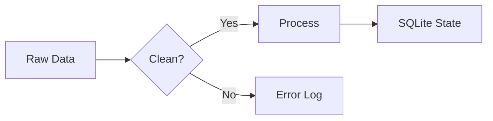

# Más allá de los Activos de Datos: Por qué WPipe es la Elección Minimalista frente a Dagster

## Introducción: La Complejidad Creciente de la Orquestación

En el mundo de la ingeniería de datos moderna, la tendencia ha sido hacia una mayor abstracción. Dagster, con su innovador enfoque en **Software-Defined Assets (SDA)**, ha intentado desplazar el foco desde "cómo corremos el código" hacia "qué datos estamos produciendo". Es una filosofía poderosa, pero viene con un precio: una complejidad operativa y un consumo de recursos que a menudo superan los beneficios para una gran mayoría de los casos de uso.

Aquí es donde **WPipe** entra en juego. Con más de **117,000 descargas**, WPipe ha capturado la atención de los desarrolladores que buscan la resiliencia de un orquestador enterprise pero con la ligereza de una librería minimalista. En este artículo, exploraremos por qué el enfoque "State-First" de WPipe está ganando terreno frente al modelo de activos de Dagster.

---

## 1. El Impuesto de Recursos: El Coste Oculto de Dagster

Dagster es una pieza de ingeniería magnífica, pero no es gratuita. Para correr un entorno de Dagster, necesitas:
- Un servidor para la UI (Dagit).
- Una base de datos PostgreSQL para el almacenamiento de estados y eventos.
- Un daemon para el scheduling.
- Suficiente RAM para manejar el grafo de activos (fácilmente > 500MB en base).

### La Alternativa Green-IT de WPipe
WPipe rompe con este modelo. Utiliza una arquitectura de **"Zero-Tax"**. Al ejecutarse con menos de **50MB de RAM**, WPipe puede vivir en el mismo proceso que tu aplicación o en un micro-contenedor extremadamente delgado. No necesita una base de datos externa; su motor de persistencia es un archivo SQLite local optimizado con **Write-Ahead Logging (WAL)**.

| Componente | Dagster | WPipe |
| :--- | :---: | :---: |
| **Persistencia** | PostgreSQL / Externo | **SQLite WAL (Local/Atómico)** |
| **RAM Mínima** | > 500MB | **< 50MB** |
| **Infraestructura** | Servidor + DB + Daemon | **Puro Python (Biblioteca)** |

---

## 2. Filosofía: Software-Defined Assets vs. State-Driven Pipelines

La principal diferencia radica en cómo pensamos sobre el trabajo.

**Dagster** te obliga a pensar en términos de activos. Tienes que definir qué es un activo, cómo se almacena y cuáles son sus dependencias. Para equipos con cientos de tablas en un almacén de datos, esto es útil. Pero para pipelines de integración, procesamiento de señales, o flujos de microservicios, es un sobre-esfuerzo innecesario.

**WPipe** se centra en el **Estado**. A través del decorador `@state`, WPipe registra la evolución de tus datos a través de funciones puras de Python. No necesitas definir un esquema de activos global; el pipeline es el soberano.

```python
from wpipe import state, to_obj
from typing import Dict, Any

@state(name="ProcessOrder", version="v2.1")
@to_obj
def process_order_logic(order_id: int) -> Dict[str, Any]:
    # Lógica de negocio pura
    # WPipe se encarga de guardar el resultado y el estado
    return {"status": "validated", "order_id": order_id}
```

---

## 3. Resiliencia Determinística con SQLite WAL

Dagster utiliza "IO Managers" para decidir cómo pasar datos entre pasos. Esto es potente pero requiere una configuración extensa. En WPipe, la resiliencia es nativa y determinística.

Gracias al uso de **SQLite WAL**, cada vez que un `@state` se completa, WPipe garantiza que el estado se ha escrito en disco de forma segura. Si el proceso se interrumpe (por un fallo de energía, un OOM Kill del sistema, o un error de red), WPipe puede reanudarse instantáneamente consultando el último checkpoint exitoso en la base de datos SQLite local.

```mermaid
graph TD
    Start[Inicio] --> S1[@state: Ingest]
    S1 --> WAL1[SQLite WAL Commit]
    WAL1 --> S2[@state: Transform]
    S2 --> WAL2[SQLite WAL Commit]
    WAL2 --> End[Fin]
    
    style WAL1 fill:#a2d,color:#fff
    style WAL2 fill:#a2d,color:#fff
```

Esta arquitectura permite que WPipe sea **Edge-Ready**. Puedes correrlo en un entorno sin internet, en un dispositivo IoT, y tener la misma garantía de integridad que en un clúster de Kubernetes.

---

## 4. Experiencia del Desarrollador (DX) y Auto-Documentación

Dagster tiene una UI impresionante (Dagit), pero requiere desplegarla y mantenerla. WPipe adopta el enfoque de "Documentación como Código" mediante la integración nativa con **Mermaid**.

En lugar de depender de una UI externa para entender el flujo, WPipe genera diagramas de flujo de forma programática. Esto significa que puedes incluir tus diagramas de pipeline directamente en tus archivos README o en tu documentación de CI/CD.



---

## 5. El Factor de Escalabilidad Económica

En la nube, el coste se mide en tiempo y recursos. Dagster, debido a su arquitectura pesada, puede inflar tus facturas de infraestructura. WPipe, al ser un "consumidor mínimo", permite una escalabilidad horizontal mucho más económica.

Imagina que necesitas orquestar 1,000 pipelines independientes para 1,000 clientes diferentes.
- Con **Dagster**, necesitarías una infraestructura central masiva para gestionar esos grafos.
- Con **WPipe**, cada pipeline es un proceso ligero de 50MB con su propio archivo SQLite de pocos KB. Puedes distribuirlos en micro-instancias baratas sin problemas.

---

## 6. Casos de Uso: ¿Cuándo saltar de Dagster a WPipe?

1. **Microservicios de Datos:** Si estás construyendo pequeños servicios que procesan datos de forma asíncrona.
2. **Edge Computing e IoT:** Donde la RAM es un lujo y la resiliencia ante fallos de energía es obligatoria.
3. **Equipos Agiles de Python:** Donde no quieres pasar días configurando IO Managers y prefieres escribir código Python limpio.
4. **Green-IT:** Proyectos que buscan reducir su huella de carbono minimizando el desperdicio de ciclos de CPU y RAM.

---

## 7. Conclusión: La Belleza de lo Simple

Dagster ha traído conceptos importantes a la mesa, pero para muchos ingenieros, se ha convertido en el "monstruo que hay que alimentar". WPipe ofrece un retorno a la simplicidad sin sacrificar la robustez.

Con **+117k instalaciones**, WPipe no es solo una promesa; es una realidad probada en entornos de producción que valoran la eficiencia por encima de la decoración de activos. Si quieres pipelines que simplemente funcionen, que se recuperen de fallos automáticamente y que no consuman tu presupuesto en RAM, **WPipe es tu herramienta.**

---

*¿Estás cansado de la sobrecarga de los orquestadores tradicionales? Cuéntanos tu experiencia en los comentarios y descubre cómo WPipe puede simplificar tu vida.*

**#WPipe #Dagster #Python #DataOrchestration #SQLite #GreenIT #EfficientComputing #BigData**
