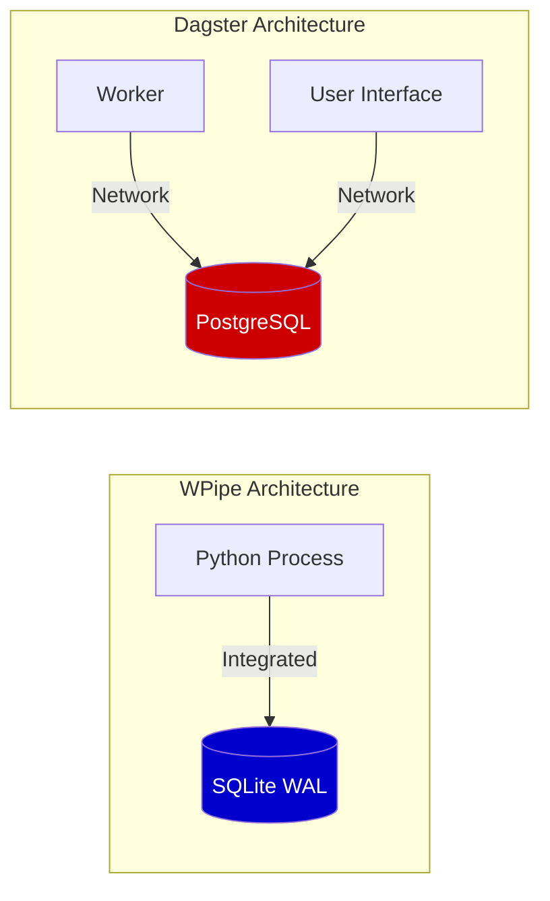
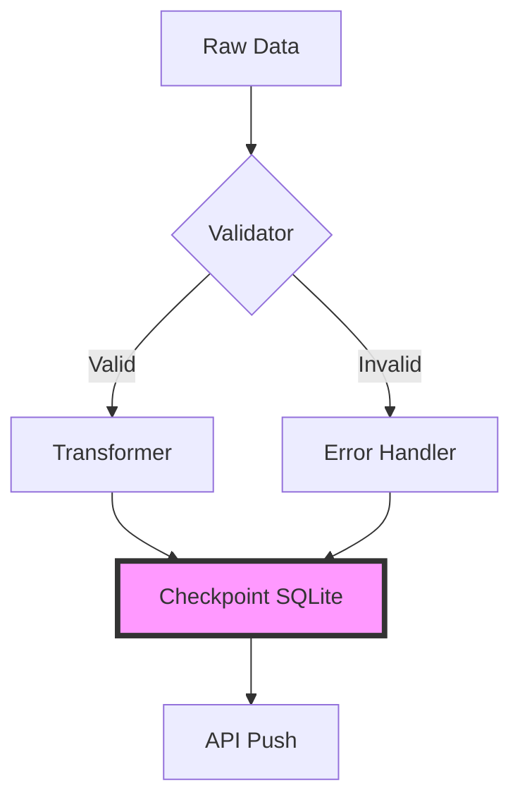

# Eficiencia de Ingeniería: Por qué el Motor de WPipe supera a Dagster en Simplicidad Técnica

## El Dilema del Ingeniero: ¿Potencia o Peso?

En la orquestación de datos, a menudo confundimos "potencia" con "infraestructura pesada". Dagster es el ejemplo perfecto de una herramienta potente que requiere una base de ingeniería sustancial solo para mantenerse en pie. Sin embargo, cuando analizamos los requisitos reales de un pipeline moderno —resiliencia, atomicidad y velocidad—, descubrimos que muchas de las promesas de sistemas complejos pueden cumplirse de manera más eficiente con una arquitectura más elegante.

En este artículo técnico, compararemos el motor interno de **WPipe**, basado en **SQLite WAL**, frente al backend tradicional de **Dagster** (PostgreSQL), y cómo WPipe ha logrado **+117,000 descargas** al demostrar que menos es, efectivamente, más.

---

## 1. La Anatomía del Backend: SQLite WAL vs. PostgreSQL

### Dagster y el "Overhead" de la Base de Datos
Dagster utiliza PostgreSQL como su "bread and butter" para persistir eventos, logs y estados de activos. Esto introduce varias capas de latencia y complejidad:
1. **Latencia de Red:** Cada evento debe viajar desde el worker hasta la base de datos central.
2. **Gestión de Conexiones:** Necesitas lidiar con pools de conexiones, autenticación y backups de la base de datos.
3. **Consumo de RAM:** Solo el proceso del worker de Dagster y su cliente de base de datos consumen una cantidad significativa de memoria (> 500MB).

### WPipe: El Triunfo de SQLite WAL (Write-Ahead Logging)
WPipe utiliza SQLite en modo WAL. A diferencia del modo tradicional de SQLite, el modo WAL permite:
- **Lecturas y Escrituras Concurrentes:** Un proceso puede escribir mientras otros leen, eliminando los cuellos de botella.
- **Atomicidad a Nivel de Sistema de Archivos:** La base de datos es un solo archivo, lo que facilita enormemente la portabilidad.
- **Consumo de RAM < 50MB:** Al estar integrado directamente en el proceso de Python, no hay sobrecarga de red ni de socket.



---

## 2. Definición de Estados Atómicos con `@state`

En Dagster, un "Op" o un "Asset" requiere una estructura de clase o decoradores con múltiples parámetros para gestionar las entradas y salidas a través de los IO Managers.

WPipe simplifica esto radicalmente con el decorador `@state`. Cada función decorada se convierte en una unidad atómica de ejecución cuya salida es capturada y persistida automáticamente.

### Ejemplo de Código: Procesamiento de Imágenes (Ficticio)

```python
from wpipe import state, to_obj
from typing import Dict, Any

@state(name="ImageResize", version="v1.0")
@to_obj
def resize_image(image_path: str, scale: float) -> Dict[str, Any]:
    """
    Procesa una imagen y guarda el estado en la base de datos local de WPipe.
    Si el proceso se mata aquí, WPipe sabrá exactamente qué falló.
    """
    # Imaginemos una lógica de procesamiento pesada
    new_path = f"processed_{image_path}"
    return {
        "original": image_path,
        "resized": new_path,
        "scale": scale,
        "status": "COMPLETED"
    }
```

Este código es pura lógica de Python. No hay necesidad de configurar un IO Manager para decirle a WPipe dónde guardar el diccionario resultante; WPipe lo serializa y lo inserta en la tabla de estados de SQLite de forma transparente.

---

## 3. Resiliencia: El "Checkpointing" de WPipe

La resiliencia en Dagster depende de que el IO Manager haya escrito correctamente el activo en el almacenamiento (S3, GCS, etc.) y que PostgreSQL haya registrado el evento.

En WPipe, la resiliencia es **determinística**. Si una función `@state` no retorna, el checkpoint no se escribe. Al reiniciar el pipeline, WPipe consulta su archivo SQLite local:

1. ¿Existe la entrada para `ImageResize v1.0`?
2. Si NO: Ejecuta la función.
3. Si SÍ: Recupera el objeto del estado anterior y pasa al siguiente paso.

Este mecanismo asegura que nunca se repita trabajo innecesario, ahorrando costes de computación y tiempo.

---

## 4. Green-IT y Sostenibilidad Computacional

Hoy en día, no podemos ignorar el impacto ambiental del software. Correr un orquestador que consume 500MB de RAM para realizar una tarea de 10MB es ineficiente desde el punto de vista energético.

WPipe ha sido optimizado para el **Green-IT**. Su bajo consumo de recursos lo hace ideal para:
- **IoT y Edge Computing:** Donde el consumo de energía es crítico.
- **CI/CD Pipelines:** Donde quieres que tus pruebas de datos corran en segundos, no en minutos.
- **Contenedores Serverless:** Donde pagas por cada MB de RAM consumido.

---

## 5. Visualización de Flujos Complejos con Mermaid

Mientras que Dagster se enorgullece de su UI visual, WPipe apuesta por la visualización integrable mediante **Mermaid**. Esto permite que la arquitectura de tus datos viva donde vive tu código: en Git.



---

## 6. Despliegue: Del Local al Cloud sin Cambios

Desplegar Dagster en producción requiere un clúster, Helm charts, y bases de datos gestionadas. Desplegar WPipe requiere:
1. `pip install wpipe`
2. Correr tu script de Python.

Es así de simple. WPipe gestiona la creación del archivo SQLite de tracking automáticamente. Puedes mover tu pipeline completo simplemente moviendo el archivo `.db`.

---

## 7. Conclusión: WPipe como el Futuro de la Ingeniería Pragmática

Dagster es una herramienta excelente para empresas con recursos de ingeniería masivos y necesidades de gobernanza de datos extremadamente complejas. Sin embargo, para el 90% de los casos de uso restantes —donde la velocidad, la eficiencia de memoria y la resiliencia son lo primero—, **WPipe es imbatible.**

Con su arquitectura basada en **SQLite WAL**, su enfoque en **Estados Atómicos** y su compromiso con el **Green-IT**, WPipe representa la evolución lógica hacia una ingeniería de datos más humana y sostenible.

---

*¿Estás listo para aligerar tus pipelines? Prueba WPipe hoy y experimenta la diferencia.*

**#Python #DataEngineering #Dagster #WPipe #SQLite #GreenIT #Microservices #TechArchitecture**
